## Playing Atari and MuJoCo with Deep Reinforcement Learning

---

### Introduction {#introduction .unnumbered}

Reinforcement Learning (RL) has emerged as a dominant framework for enabling autonomous agents to master complex decision-making tasks through interaction with their environment (Sutton and Barto, 2018). This final project presents a systematic evaluation of Deep Reinforcement Learning (Deep RL) algorithms across two fundamental domains: discrete control from high-dimensional visual inputs (Atari 2600) and continuous control for robotic locomotion (MuJoCo).

The primary objective is to implement, analyze, and contrast the two prevailing paradigms in Deep RL:

1.  **Value-Based Methods (Discrete):** I explore **Deep Q-Networks (DQN)** (Mnih et al., 2015) and its advanced variants (Double (Van Hasselt, Guez, and Silver, 2016), Dueling (Wang et al., 2016), Rainbow (Hessel et al., 2018)). The focus is on addressing the instability of Q-learning in high-dimensional state spaces and improving sample efficiency in environments like `Breakout` and `Pong`.

2.  **Policy-Based Methods (Continuous):** I investigate **Proximal Policy Optimization (PPO)** (Schulman et al., 2017), a state-of-the-art on-policy algorithm. I analyze how trust-region constraints and generalized advantage estimation (GAE (Schulman et al., 2015)) enable stable learning in complex physical systems like `Hopper`, `HalfCheetah`, and `Ant`.

Beyond mere performance benchmarking, this report places significant emphasis on the **learning dynamics** and **implementation details** that underpin these algorithms. I delve into critical factors often glossed over in theory, such as observation normalization, reward scaling, and hyperparameter sensitivity. Through rigorous experimentation, I am going to decouple the contribution of algorithmic innovations from engineering "tricks", providing a transparent view of what makes these agents learn effectively.

# Discrete Control

### Problem Modeling and Environment Setup

In this section, I am going to introduce the problem modeling and environment setup for the discrete control tasks. I selected two classic Atari 2600 games: `ALE/Breakout-v5` and `ALE/Pong-v5`.

#### ALE/Breakout-v5

The first environment I chose is the `ALE/Breakout-v5` environment provided by the Arcade Learning Environment (ALE) (Bellemare et al., 2013) via Gymnasium (Towers et al., 2023). The goal is to control a paddle to bounce a ball and destroy a wall of bricks. The problem is modeled as a Markov Decision Process (MDP) (Sutton and Barto, 2018) defined by a tuple $\langle \mathcal{S}, \mathcal{A}, \mathcal{P}, \mathcal{R}, \gamma \rangle$:

- $\mathcal{S}$ **is the state space.** The raw observation from the environment is an RGB image of pixel size $210 \times 160 \times 3$. To reduce computational complexity and capture temporal information (velocity and direction of the ball), I employ standard preprocessing techniques used in Deep Q-Networks. The raw frames are converted to grayscale, resized to $84 \times 84$, and stacked. Thus, a state $s_t$ represents a stack of the 4 most recent frames: $$s_t \in \mathbb{R}^{4 \times 84 \times 84}$$

- $\mathcal{A}$ **is the discrete action space.** The agent controls the paddle movement. The action space consists of 4 discrete actions: $$\mathcal{A} = \{ \text{NOOP}, \text{FIRE}, \text{RIGHT}, \text{LEFT} \}$$

- $\mathcal{P}$ **is the state transition probability.** The transitions are deterministic, governed by the physics engine of the Atari emulator. The next state $s_{t+1}$ depends solely on the current state $s_t$ and the chosen action $a_t$.

- $\mathcal{R}$ **is the reward function.** The agent receives a positive reward when the ball hits a brick. The rewards vary depending on the color of the brick row (1, 4, or 7 points). To stabilize training, the rewards are clipped to the range $[-1, 1]$ during optimization, though the raw score is used for evaluation.

- $\gamma$ **is the discount factor.** I set $\gamma = 0.99$, encouraging the agent to value long-term survival and score accumulation.

#### ALE/Pong-v5

In addition to `Breakout`, I also evaluated the algorithms on the `ALE/Pong-v5` environment. The goal is to control a paddle to hit a ball back and forth against an AI opponent, aiming to be the first to reach 21 points.

- $\mathcal{S}$ **is the state space.** Similar to `Breakout`, the raw RGB frames ($210 \times 160 \times 3$) are preprocessed into grayscale, resized to $84 \times 84$, and stacked to capture motion. The state $s_t$ is a stack of the 4 most recent frames: $$s_t \in \mathbb{R}^{4 \times 84 \times 84}$$

- $\mathcal{A}$ **is the discrete action space.** The action space consists of 6 discrete actions: $$\mathcal{A} = \{ \text{NOOP}, \text{FIRE}, \text{RIGHT}, \text{LEFT}, \text{RIGHTFIRE}, \text{LEFTFIRE} \}$$ Essentially, the agent moves the paddle up or down (mapped to RIGHT/LEFT in ALE terminology).

- $\mathcal{P}$ **is the state transition probability.** Similar to `Breakout`, the physics are deterministic. However, the transition also implicitly depends on the opponent's behavior, which is a fixed AI programmed into the game logic.

- $\mathcal{R}$ **is the reward function.** The reward is $+1$ when the agent wins a rally (the opponent misses the ball) and $-1$ when the agent loses a rally. The episode ends when one player reaches 21 points.

- $\gamma$ **is the discount factor.** I set $\gamma = 0.99$.

### Algorithms: Deep Q-Networks

In the discrete control task, I implemented the Deep Q-Network (DQN) (Mnih et al., 2015) and explored three advanced variants to improve stability and sample efficiency: Double DQN (Van Hasselt, Guez, and Silver, 2016), Dueling DQN (Wang et al., 2016), and a simplified "Rainbow" agent (Hessel et al., 2018) combining both techniques.

#### Vanilla Deep Q-Network (DQN)

DQN adapts Q-learning to high-dimensional state spaces by approximating the optimal action-value function $Q^*(s, a)$ with a deep neural network $Q(s, a; \theta)$, parameterized by weights $\theta$. To ensure training stability, DQN employs two key mechanisms:

1.  **Experience Replay:** Transitions $(s_t, a_t, r_t, s_{t+1})$ are stored in a cyclic buffer $\mathcal{D}$. Training batches are sampled uniformly, breaking the temporal correlation of sequential data.

2.  **Target Network:** A separate network with parameters $\theta^-$ is used to compute the Temporal Difference (TD) target. These parameters are frozen and updated to match the online network $\theta$ every $C$ steps.

The loss function minimized at iteration $i$ is the Expectation of the TD error: $$L_i(\theta_i) = \mathbb{E}_{(s,a,r,s') \sim \mathcal{D}} \left[ \left( y_i^{DQN} - Q(s, a; \theta_i) \right)^2 \right]$$ where the target $y_i^{DQN}$ is computed via the Bellman optimality equation: $$y_i^{DQN} = r + \gamma \max_{a' \in \mathcal{A}} Q(s', a'; \theta_i^-)$$

The algorithm is summarized in Algorithm 1.

#### Double DQN (DDQN)

The standard DQN creates an overestimation bias because the maximization operator ($\max_{a'}$) in the target calculation tends to select overestimated values. Double DQN addresses this by decoupling action selection from value estimation. The online network $\theta$ selects the best action, while the target network $\theta^-$ estimates its value: $$y_i^{DDQN} = r + \gamma Q(s', \underset{a' \in \mathcal{A}}{\text{argmax }} Q(s', a'; \theta_i); \theta_i^-)$$ The algorithm is summarized in Algorithm 2.

#### Dueling DQN

In many states, the value of the state itself is more important than the value of any specific action, e.g., when the ball is far from the paddle in `Breakout`. Dueling DQN modifies the network architecture to explicitly separate these estimators. The feature extractor output is split into two streams:

- **Value Stream $V(s; \theta, \beta)$:** Estimates the scalar value of the state.

- **Advantage Stream $A(s, a; \theta, \alpha)$:** Estimates the advantage of each action.

To ensure identifiability, the final Q-value is aggregated by subtracting the mean advantage: $$Q(s, a; \theta, \alpha, \beta) = V(s; \theta, \beta) + \left( A(s, a; \theta, \alpha) - \frac{1}{|\mathcal{A}|} \sum_{a'} A(s, a'; \theta, \alpha) \right)$$

#### Rainbow

In this project, I define the "Rainbow" variant as the combination of the Double Q-learning objective and the Dueling Network architecture. This agent benefits from reduced overestimation bias and improved generalization across states.

#### Implementation Details

My implementation follows the standard "Nature DQN" architecture adapted for the Gymnasium API.

###### Preprocessing and Inputs.

The raw Atari frames are preprocessed to reduce computational complexity:

- **Grayscale & Resizing:** Frames are converted to grayscale and resized to $84 \times 84$.

- **Frame Stacking:** The input state $s_t$ consists of the 4 most recent frames stacked along the channel dimension (shape $4 \times 84 \times 84$) to capture motion information, e.g., velocity and direction of the ball.

- **Normalization:** Pixel values are divided by $255.0$ before being fed into the network.

- **Reward Scale:** During training, rewards are clipped to $\text{sign}(r)$ to stabilize gradients. This is particularly important for `Breakout` where rewards can vary; for `Pong`, rewards are naturally limited to $\{-1, 0, +1\}$.

- **Termination Condition:** For `Breakout`, losing a life is treated as a terminal state during training to encourage the agent to value each life. For `Pong`, episodes terminate only when a player reaches 21 points. Evaluation always follows the standard game rules without artificial termination.

- **Environment Wrappers:** `Breakout` utilizes a `FireResetWrapper` to ensure the ball is launched immediately upon reset.

- **Play before Learning:** To diversify initial states, the first 10000 steps are filled with random actions before training begins.

- **Metric Validity:** Crucially, the `RecordEpisodeStatistics` wrapper is applied *before* any preprocessing or reward clipping. This ensures that the logged returns represent the true game score (e.g., reaching 21 in `Pong` or 400+ in `Breakout`), rather than the modified reward stream seen by the agent.

###### Evaluation Protocol.

To ensure fair comparison, the evaluation environment is constructed with specific modifications:

- In `Breakout`, `terminal_on_life_loss` is disabled, allowing the agent to play through all lives.

- Reward clipping is disabled to measure the true cumulative return.

- The epsilon for exploration is set to $\epsilon_{min} = 0.00$ to maintain a deterministic policy during evaluation.

###### Training Configuration.

It is crucial to note the differences in the training budget and parallelization setup for the two environments:

- **Total Steps:** The `Breakout` agents were trained for **5 million** steps to ensure convergence given the task's complexity. In contrast, `Pong` agents were trained for only **2 million** steps, as the task is significantly easier to master.

- **Parallelization ($N$):** To accelerate data collection, I utilized vectorized environments. For `Breakout`, I set $num\_envs=16$, whereas for `Pong`, I used $num\_envs=8$.

- **Update Frequency:** The relationship between data collection and network updates is governed by `num_envs` and `train_freq`, where I set `train_freq` = 4 for both environments. Specifically, in each training loop iteration, the agent performs $U = \max(1, \lfloor \texttt{num\_envs} / \texttt{train\_freq} \rfloor)$ gradient updates. This logic ensures that the number of gradient steps scales appropriately with the degree of parallelization.

###### Network Architecture.

The shared backbone consists of three convolutional layers:

1.  Conv2d (32 filters, kernel $8\times8$, stride 4) + ReLU

2.  Conv2d (64 filters, kernel $4\times4$, stride 2) + ReLU

3.  Conv2d (64 filters, kernel $3\times3$, stride 1) + ReLU

The output is flattened and fed into a fully connected layer with hidden dimension $H$. For the Dueling variant, this layer splits into the Value (output dim 1) and Advantage (output dim $|\mathcal{A}|$) heads.

###### Optimization

I utilize the `Adam` optimizer (Kingma and Ba, 2014) with a series of learning rates. To improve robustness against outliers, I use the `SmoothL1Loss` (Huber Loss) (Huber, 1964) instead of MSE. To prevent exploding gradients, the gradient norm is clipped to 10.0. The exploration strategy is $\epsilon$-greedy, with $\epsilon$ linearly decaying from 1.0 to 0.01 over the first 2 million **training** steps (after the first 10000 steps of random actions).

### Experiments: DQNs on Breakout-v5

#### Hyperparameter Sensitivity Analysis {#sec:hyperparameter}

I conducted a comprehensive grid search across four DQN variants (Vanilla, Double, Dueling, Rainbow) and three key hyperparameters: Learning Rate (LR), Target Update Frequency ($C$), and Hidden Dimension ($H$). All agents were trained for 5 million steps. Table 1 summarizes the average score over the last 10% of training steps, revealing several critical insights regarding training stability and performance.

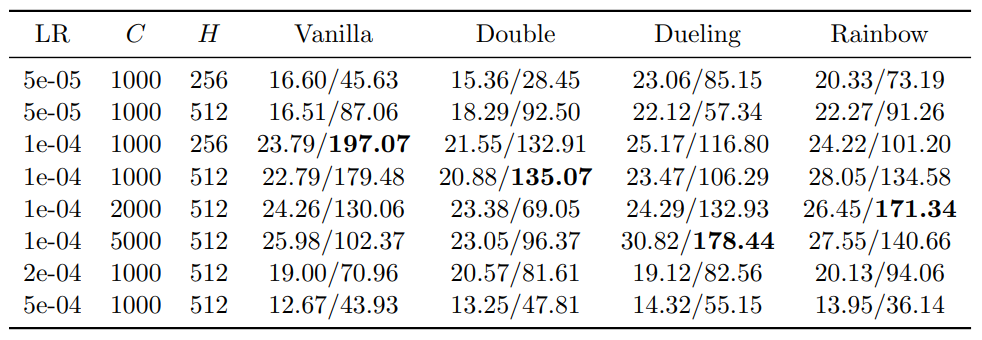{#tab:dqn_results_breakout}
Training and evaluation results of different DQN variants under various hyperparameter settings. The subsequent columns show the training and evaluation performance of each DQN variant in the format **Train/Eval**. For each hyperparameter configuration, the highest evaluation score among the four variants is highlighted in **bold**.

###### Interpretation of Performance Metrics.

Before analyzing the hyperparameters, it is essential to address the significant disparity between the reported **Training** and **Evaluation** scores, e.g., $23.79$ vs. $197.07$, where the evaluation was conducted over **5 episodes** and averaged and the training score was averaged over $N$ environments. This gap is structural and stems from three specific implementation details designed to stabilize training:

1.  **Reward Scale:** During training, rewards are clipped to $\text{sign}(r)$ (i.e., $+1$ per brick), whereas evaluation uses the raw Atari scoring system (up to $+7$ per brick).

2.  **Termination Condition:** Training episodes terminate immediately upon losing a life to discourage dangerous behaviors. Evaluation episodes play through all **5** lives, naturally resulting in much higher cumulative scores.

###### Analysis.

Firstly, the agent demonstrates high sensitivity to the learning rate. Across all variants, $LR=1 \times 10^{-4}$ consistently yields the best performance, i.e., the "Sweet Spot\".

- *Low LR ($5 \times 10^{-5}$):* Resulted in slow convergence. While stable, the agents failed to reach high scores within the 5M step budget.

- *High LR ($5 \times 10^{-4}$):* Resulted in catastrophic failure (Eval scores $\approx 40$). At this magnitude, the Q-values likely diverged, preventing the policy from learning meaningful behaviors.

Secondly, the interaction between update frequency and network architecture is notable.

- **Vanilla & Double DQN** performed robustly at a faster frequency $C=1000$.

- **Dueling & Rainbow** benefited significantly from slower updates $C=2000$ or $5000$. For instance, Dueling DQN achieved its global maximum $178.44$ at $C=5000$, and Rainbow peaked $171.34$ at $C=2000$. This suggests that complex architectures with separate value/advantage streams require more stationary targets to stabilize the optimization landscape.

Moreover, increasing the network capacity from $256$ to $512$ did not guarantee improvement. Surprisingly, **Vanilla DQN** achieved its highest score ($197.07$) with the lighter network ($H=256$), suggesting that for the standard architecture, a larger model might introduce overfitting or optimization difficulties given the limited data diversity of a single game. However, **Rainbow** generally preferred the larger capacity ($H=512$), utilizing the extra parameters effectively to combine the benefits of Double and Dueling mechanisms.

###### Summary.

While Vanilla DQN proved surprisingly strong with a smaller network, the advanced variants (Dueling and Rainbow) demonstrated superior potential when tuned with slower target updates. The configuration $LR=1 \times 10^{-4}$ is universally optimal, serving as a reliable baseline for this environment.

#### Comparative Performance Analysis

To quantify the improvements offered by the algorithmic enhancements, I compared the evaluation learning curves of the four variants using their respective optimal hyperparameter configurations derived from [3.1](#sec:hyperparameter){reference-type="ref+label" reference="sec:hyperparameter"}.

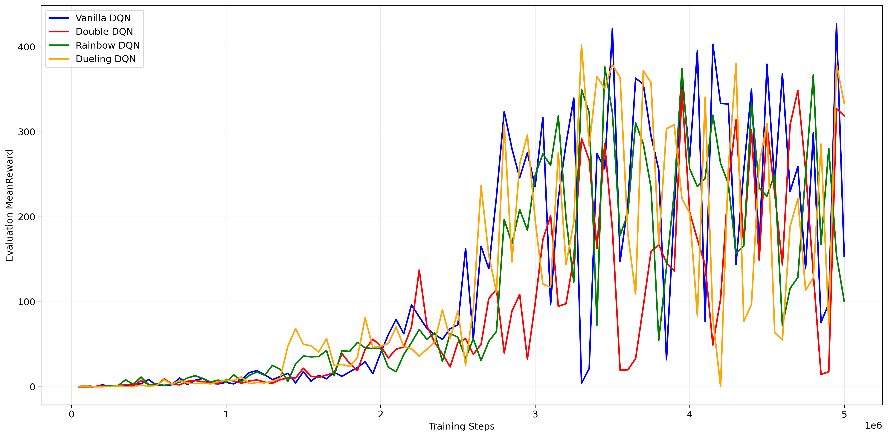{#fig:dqn_eval_comparison width="90%"}

As shown in [1](#fig:dqn_eval_comparison){reference-type="ref+label" reference="fig:dqn_eval_comparison"}, all four algorithms successfully solve the task, reaching scores between 300 and 400.

- **Convergence Speed:** The variants incorporating the Dueling architecture demonstrate a more consistent upward trend in the early-to-mid training phase.

- **Stability:** Notably, the **Vanilla DQN** (Blue) exhibits high variance in the late stages, with performance oscillating wildly between 400 and near-zero. This instability suggests that while the simple architecture can reach high scores, it is prone to catastrophic forgetting or policy degradation. In contrast, the **Rainbow** agent maintains a more robust performance profile, benefiting from the combined stability of Double Q-learning and Dueling networks.

#### Internal Dynamics: Loss and Gradient Stability

To investigate the optimization landscape, I analyzed the training Loss and the $L_2$ norm of the gradients $\|\nabla_\theta L\|_2$. These metrics provide insight into how "hard" the optimizer has to work to fit the target values.

<figure id="fig:dqn_dynamics">
<figure id="fig:dqn_loss">
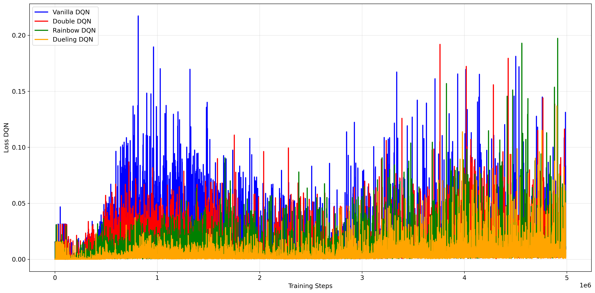
<figcaption>Training Loss (Huber)</figcaption>
</figure>
<figure id="fig:dqn_grad">
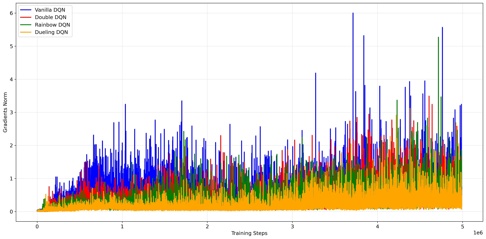
<figcaption>Gradient Norm (<em>L</em>2)</figcaption>
</figure>
<figcaption>Optimization dynamics. (a) The Dueling architecture achieves significantly lower loss values. (b) Consequently, the gradient norms for Dueling DQN are much smaller and more stable than Vanilla DQN.</figcaption>
</figure>

###### Architecture Efficiency.

A striking pattern emerges in [4](#fig:dqn_dynamics){reference-type="ref+label" reference="fig:dqn_dynamics"} is that the **Dueling DQN** consistently maintains the lowest loss and gradient norms throughout the entire training process.

- **Loss Reduction:** The Dueling architecture explicitly models the state value $V(s)$. In `Breakout`, many pixel changes (background noise or ball movement in non-critical areas) do not affect the optimal action advantage. By isolating $V(s)$, the network can fit the Bellman target more efficiently, resulting in smaller TD errors compared to Vanilla DQN, which must update the entire $Q(s, a)$ for every action.

- **Gradient Stability:** As a direct result of the lower loss, the gradient norms for Dueling DQN are significantly smaller ($\sim 0.5$) compared to Vanilla DQN ($\sim 2.0 - 4.0$). This smoother optimization landscape explains the improved stability observed in the evaluation curves, as the network weights are less likely to suffer from destructive updates caused by exploding gradients.

#### Q-Value Analysis: The Overestimation Bias

A theoretical weakness of Vanilla DQN is the maximization bias in the target calculation, which tends to overestimate action values. [5](#fig:dqn_q_values){reference-type="ref+label" reference="fig:dqn_q_values"} compares the average predicted Q-values during training.

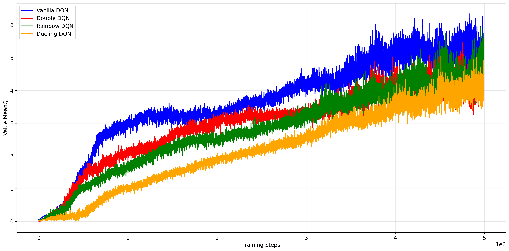{#fig:dqn_q_values width="90%"}

The plot confirms the theoretical prediction:

- **Vanilla DQN** exhibits the most aggressive Q-value growth, peaking above 6.0. Given that the clipped reward is 1, this implies the agent expects a discounted sum of 6 future bricks.

- **Dueling DQN** maintains the most conservative estimates, staying below 4.0 for most of the training.

- **Mitigation:** Both Double DQN and Rainbow successfully reduce the estimates compared to Vanilla, lying in between the two extremes. This confirms that the Double Q-learning objective effectively mitigates overestimation, preventing the agent from becoming "over-optimistic" about risky states.

#### Visual Interpretability: Saliency Maps

To verify that the agent has learned meaningful visual features rather than overfitting to noise, I generated Saliency Maps using the final model of the Vanilla DQN agent. The Saliency Map $S$ is computed by taking the gradient of the max Q-value with respect to the input state pixels $s$: $$\begin{aligned}
    S = \left| \frac{\partial \max_a Q(s,a)}{\partial s} \right|
\end{aligned}$$ High gradient values (hotspots) indicate pixels that, if changed, would most drastically alter the agent's expected return.

{#fig:saliency_map width="80%"}

As visualized in [6](#fig:saliency_map){reference-type="ref+label" reference="fig:saliency_map"}, the attention mechanism is highly localized.

1.  **Ball Monitoring**: The strongest gradients (Red/Yellow) are concentrated at the position of the ball, and the surrounding gradients information can model the ball's movement, indicating that the agent has learned to focus on the ball's position.

2.  **Scoring Point Modeling**: There is also some attention distribution at the location of the bricks that were knocked down, revealing that the model has learned how to score points and how to get high scores.

3.  **Target Identification:** There are also some gradients clustered around the dense formation of bricks that the ball is about to hit. This indicates the network is actively calculating which bricks are breakable.

4.  **Paddle Tracking:** There is also visible activation near the paddle at the bottom, confirming that the agent monitors its own position relative to the ball.

5.  **Noise Filtering:** The empty black space and the score digits at the top receive almost no attention, proving that the Convolutional Neural Network has successfully learned to ignore irrelevant background information.

###### Late-Stage Behavior: The "Tunneling" Loop.

An interesting behavioral anomaly was observed when I visualized the agent's behavior during final evaluation. Although the agent achieves high scores ($>300$), it often fails to clear the entire screen. Instead, it learns to exploit a specific strategy: digging a vertical "tunnel" through the wall of bricks to trap the ball in the upper space. While this yields a large burst of points, the agent struggles to recover once the ball returns to the lower area. It tends to get stuck in a repetitive **loop** of hitting the remaining side bricks without effectively targeting the final few scattered blocks. This suggests that the policy has converged to a strong local optimum (the "tunneling" strategy) but lacks the sophisticated planning required to systematically clear the board, a known limitation of reactive agents like DQN without explicit hierarchical planning.

Overall, the visualizations confirm that the DQN agent has learned to attend to critical game elements (ball, paddle, target bricks) while filtering out irrelevant noise, demonstrating effective visual feature extraction aligned with gameplay objectives.

### Experiments: DQNs on Pong-v5

I also applied the Deep Q-Networks to the **Pong** environment to verify the generalizability of the algorithms and the hyperparameter findings.

#### Hyperparameter Sensitivity Analysis {#hyperparameter-sensitivity-analysis}

Similar to the `Breakout` experiment, I conducted a grid search on `ALE/Pong-v5` to analyze how the agent performs under different configurations. The results are summarized in [2](#tab:dqn_results_pong){reference-type="ref+label" reference="tab:dqn_results_pong"}.

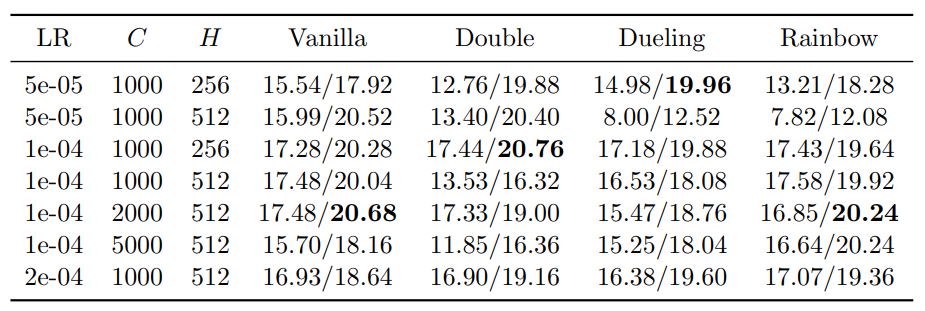{#tab:dqn_results_pong}

DQN Parameter Analysis Results on `Pong`. The table shows **Train/Eval** scores. The maximum possible score in `Pong` is 21 (winning all rallies).

###### Analysis.

The results on `Pong` reveal an interesting contrast to `Breakout`:

- **Ease of Convergence:** Across most hyperparameter settings, the evaluation scores are very high ($\approx 18-21$), indicating that `Pong` is a significantly easier task for the agent to master compared to `Breakout`. The zero-sum nature and the direct feedback loop likely facilitate faster learning.

- **Robustness to Hyperparameters:** The agent is remarkably robust. While `Breakout` showed drastic performance drops with suboptimal parameters, `Pong` agents generally maintain a winning rate ($>0$) even in less ideal configurations.

- **The "Sweet Spot" Validated:** Despite the easier task, the configuration $LR=1 \times 10^{-4}$ with update frequency $C=2000$ or $5000$ still yields the most consistent near-perfect scores.

- **Instability of Complex Models at Low LR:** Notably, the Dueling and Rainbow variants performed poorly (Eval $\approx 12$) when $LR=5 \times 10^{-5}$ and $H=512$. This suggests that for larger networks, a too-small learning rate may lead to under-fitting or getting stuck in local optima, even in simple environments.

#### Comparative Performance Analysis

To visualize the learning dynamics, I plotted the learning curves of the four DQN variants using their optimal hyperparameter configurations which are highlighted in [2](#tab:dqn_results_pong){reference-type="ref+label" reference="tab:dqn_results_pong"}. [9](#fig:pong_comparison){reference-type="ref+label" reference="fig:pong_comparison"} presents both the Training Episode Reward (noisy, exploration-heavy) and the Evaluation Mean Reward (deterministic).

<figure id="fig:pong_comparison">
<figure id="fig:pong_train">
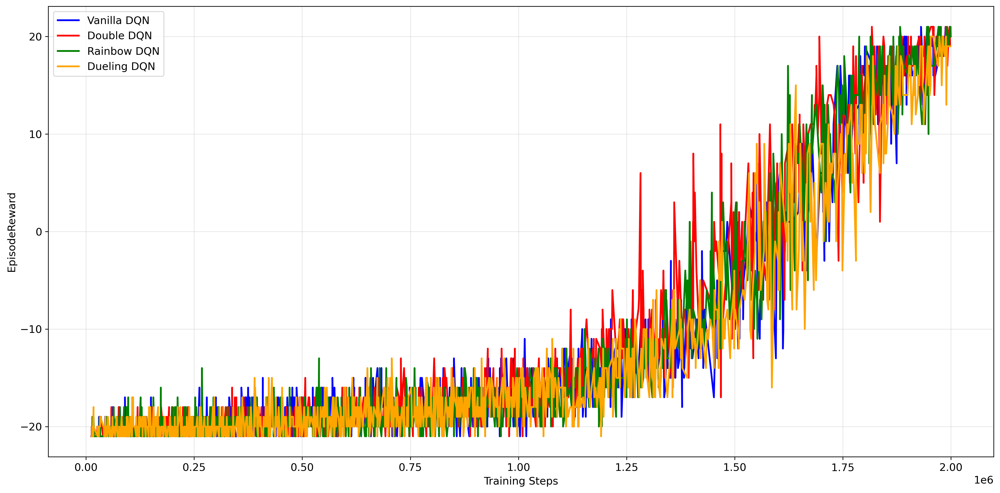
<figcaption>Training Episode Reward</figcaption>
</figure>
<figure id="fig:pong_eval">
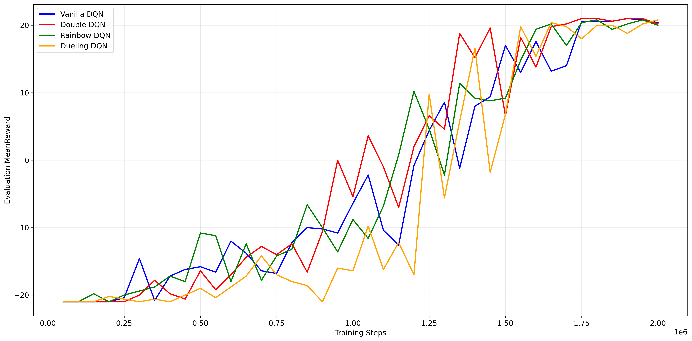
<figcaption>Evaluation Mean Reward</figcaption>
</figure>
<figcaption>Learning curves on <code>Pong</code>. (a) Training rewards remain noisy and suppressed due to the exploration noise (<em>ϵ</em>-decay). (b) Evaluation rewards show that the agents actually mastered the game ( ≈ 21) much earlier, with Double DQN (Red) showing the fastest initial ascent.</figcaption>
</figure>

###### The Exploration Gap.

A striking phenomenon observed in `Pong` is the significant disparity between training and evaluation performance. While the Evaluation Reward quickly converges to the maximum possible score of $+21$ around 1.5M steps, the Training Reward remains highly volatile and often negative. This is attributed to the $\epsilon$-greedy exploration strategy, where I let $\epsilon$ decay linearly over the entire **2M** steps. In a precision-demanding game like `Pong`, even a small probability of a random action can lead to missing the ball, resulting in an immediate $-1$ penalty. This "Exploration Cost" masks the true competence of the agent during training.

###### Algorithmic Comparison.

Comparing the variants in [8](#fig:pong_eval){reference-type="ref+label" reference="fig:pong_eval"}:

- **Convergence Speed:** All algorithms solve the environment effectively. However, **Double DQN** exhibits a slightly faster initial takeoff, crossing the 0-score threshold (winning more than losing) earlier than Vanilla DQN.

- **Stability:** Once converged (after 1.75M steps), all variants, including Vanilla DQN, stably maintain perfect scores, further confirming that `Pong` is less prone to the instability issues seen in `Breakout`.

#### Internal Optimization Dynamics

To further understand the stability of the learning process in `Pong`, I analyzed the temporal evolution of the Loss function and the Gradient Norms ($L_2$). [12](#fig:pong_dynamics){reference-type="ref+label" reference="fig:pong_dynamics"} visualizes these metrics.

<figure id="fig:pong_dynamics">
<figure id="fig:pong_loss">
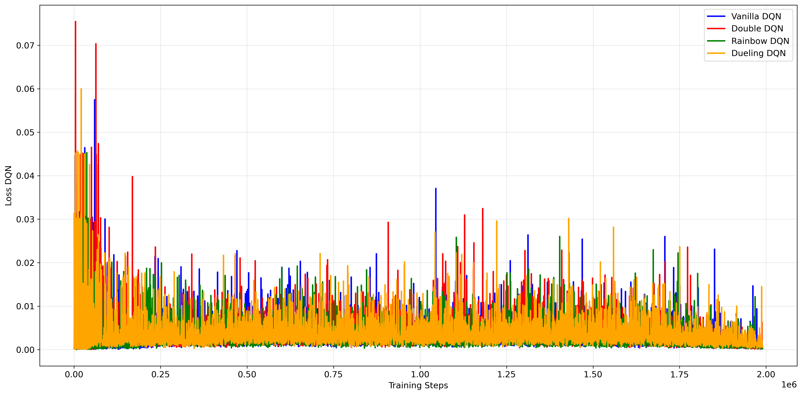
<figcaption>Loss Function (Huber)</figcaption>
</figure>
<figure id="fig:pong_grad">
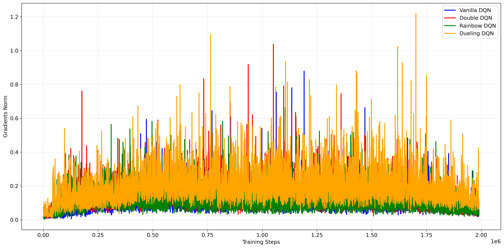
<figcaption>Gradient Norm (<em>L</em>2)</figcaption>
</figure>
<figcaption>Optimization dynamics in <code>Pong</code>. Both loss and gradient magnitudes are significantly smaller than those observed in <code>Breakout</code>, reflecting the simpler nature of the task.</figcaption>
</figure>

###### Smoother Optimization Landscape.

A comparative analysis with the `Breakout` experiment reveals a significant difference in the magnitude of the optimization metrics.

- **Lower Gradient Norms:** In `Breakout`, the gradient norms frequently oscillated between $2.0$ and $4.0$ for Vanilla DQN. In contrast, for `Pong`, the gradient norms generally remain below $0.5$ with occasional spikes to $1.2$ for Dueling DQN.

- **Reduced Loss Scale:** Similarly, the TD-error (Loss) in `Pong` is an order of magnitude smaller.

This significant reduction in gradient variance suggests that the function approximation landscape for `Pong` is much smoother. The mapping from pixels to the optimal value function is likely less complex, allowing the optimizer to descend towards the minimum without the violent fluctuations seen in the more chaotic `Breakout` environment. This stability explains why most hyperparameter configurations in `Pong` were able to reach the maximum score, whereas `Breakout` required careful tuning.

#### Q-Value Analysis: Learning Dynamics in Zero-Sum Games

I tracked the evolution of the average predicted Q-values throughout the training process, as shown in [13](#fig:pong_q_values){reference-type="ref+label" reference="fig:pong_q_values"}.

{#fig:pong_q_values width="90%"}

Two key observations distinguish the learning dynamics in `Pong` from `Breakout`:

1.  **Overestimation Mitigation:** Consistent with the `Breakout` results, **Vanilla DQN** exhibits the highest Q-values, while **Double DQN** and **Rainbow** maintain more conservative estimates. This reconfirms that the advanced algorithms effectively reduce maximization bias.

2.  **The "Lose-to-Win" Trajectory:** Unlike `Breakout`, where Q-values rise monotonically, the Q-values in `Pong` exhibit a distinct "V-shape" trajectory:

    - **Phase 1 (The Dip):** In the first 0.5M steps, Q-values drop significantly, reaching negative values (approx $-1.0$). This reflects the agent's initial incompetence. In `Pong`, missing a ball results in a $-1$ reward. A random agent loses frequently, so the Q-function correctly learns to predict a negative expected return.

    - **Phase 2 (The Ascent):** As the agent improves (correlated with the rise in evaluation rewards), the Q-values begin to recover, eventually becoming positive as the agent learns to consistently defeat the opponent.

3.  **Magnitude Disparity:** A final observation is the scale of the Q-values. The estimates in `Pong` peak around $1.5$, which is significantly lower than the values observed in `Breakout`. This aligns with the reward structures: `Breakout` offers the potential for high cumulative scores by breaking many bricks in sequence, whereas `Pong` is a series of short rallies with rewards strictly bounded by $\{-1, +1\}$, resulting in lower discounted returns.

This trajectory highlights the zero-sum nature of `Pong` compared to the positive-sum nature of `Breakout`.

#### Visual Interpretability: Saliency Maps

Similar to the `Breakout` analysis, I computed the Saliency Map for the best-performing Rainbow agent in `Pong` to visualize its attention mechanism. [14](#fig:saliency_map_pong){reference-type="ref+label" reference="fig:saliency_map_pong"} displays the raw observation and the corresponding gradient heatmap.

{#fig:saliency_map_pong width="80%"}

The heatmap reveals that the Rainbow DQN agent has learned to focus on the most game-critical elements:

- **Ball Tracking:** The highest gradient intensity coincides with the ball's trajectory. This confirms the agent monitors the ball's position and velocity to calculate its interception point.

- **Paddle Awareness:** There is significant activation around both the agent's paddle and the opponent's paddle. This suggests the agent is not playing "blindly" but is reactive to the opponent's positioning, likely to predict return angles.

- **Background Suppression:** The black background and the scoreboard receive negligible attention (Blue/Dark Blue), indicating effective noise filtering by the convolutional layers.

This visual evidence supports the conclusion that the high scores are a result of learning the correct physics-based strategy rather than exploiting bugs or noise in the emulator.

### Summary

In this chapter, I conducted a comprehensive study of Deep Q-Networks on discrete control tasks, ranging from the classic Vanilla DQN to advanced variants like Rainbow. The experiments on `Breakout` and `Pong` yielded several critical insights:

- **Algorithmic Improvements:** The proposed enhancements to the original DQN architecture demonstrated clear benefits. **Double DQN** successfully mitigated Q-value overestimation, particularly in the early stages of learning. **Dueling DQN** significantly improved sample efficiency and stability by decoupling state-value estimation from action advantages, leading to smoother optimization landscapes. **Rainbow DQN**, by combining these improvements, consistently achieved top-tier performance.

- **Task Complexity & Hyperparameters:** The contrast between `Breakout` and `Pong` highlighted the importance of hyperparameter tuning relative to task difficulty. While `Pong` was robust to a wide range of configurations, `Breakout` proved highly sensitive to learning rates and update frequencies. This underscores that there is no "one-size-fits-all" configuration in RL; hyperparameters must be adapted to the specific dynamics of the environment.

- **Interpretability:** Through Q-value analysis and Saliency Maps, I verified that the agents are not merely memorizing patterns but are learning meaningful representations of the game state. The "V-shape" Q-value trajectory in `Pong` further demonstrated the agent's ability to correctly model the long-term discounted returns in a zero-sum setting.

These findings confirm the efficacy of value-based methods in high-dimensional visual control tasks while emphasizing the need for careful algorithmic selection and tuning based on the environment's characteristics.

# Continuous Control

### Problem Modeling and Environment Setup

In this section, I am going to introduce the problem modeling and environment setup for the continuous control tasks. I selected three MuJoCo environments: `HalfCheetah-v4`, `Hopper-v4`, and `Ant-v4`.

#### HalfCheetah-v4

The first environment I chose is the `HalfCheetah-v4` environment based on the MuJoCo physics engine (Todorov, Erez, and Tassa, 2012). The goal is to make a 2D cheetah robot run forward as fast as possible. Like discrete control tasks, the problem is also modeled as a MDP (Sutton and Barto, 2018) defined by a tuple $\langle \mathcal{S}, \mathcal{A}, \mathcal{P}, \mathcal{R}, \gamma \rangle$:

- $\mathcal{S}$ **is the continuous state space.** The state vector $s$ has a dimension of 17. It consists of the positional values (excluding the x-coordinate) and the velocities of the robot's body parts (torso and joints): $$s \in \mathbb{R}^{17}$$

- $\mathcal{A}$ **is the continuous action space.** The agent controls the torque applied to the 6 distinct joints (bighs, shins, and feet). The action $a$ is a vector clipped to the range: $$a \in [-1.0, 1.0]^6$$

- $\mathcal{P}$ **is the state transition probability.** The environment dynamics are deterministic and governed by the MuJoCo physics engine. Given the current state $s_t$ and action $a_t$, the next state $s_{t+1}$ is computed via numerical integration of the physical equations of motion.

- $\mathcal{R}$ **is the reward function.** The objective is to maximize forward velocity while minimizing control effort. The reward at time step $t$ is defined as: $$r_t = v_{fwd} - 0.1 \cdot \|a_t\|^2$$ where $v_{fwd}$ is the forward velocity and $\|a_t\|^2$ represents the control cost i.e., penalty for large actions.

- $\gamma$ **is the discount factor.** I set $\gamma = 0.99$, promoting long-term speed and efficiency in movement.

#### Hopper-v4

I also evaluated the PPO algorithm on the `Hopper-v4` environment. The goal is to make a one-legged robot hop forward as fast as possible without falling over.

- $\mathcal{S}$ **is the continuous state space.** The state vector $s$ has a dimension of 11. It includes the positions (excluding x) and velocities of the torso, thigh, leg, and foot. $$s \in \mathbb{R}^{11}$$

- $\mathcal{A}$ **is the continuous action space.** The agent controls the torques applied to the 3 joints (thigh, leg, foot). The action $a$ is clipped to: $$a \in [-1.0, 1.0]^3$$

- $\mathcal{P}$ **is the state transition probability.** Similar to `HalfCheetah`, the transitions are deterministic based on the physics simulation. However, the contact dynamics (foot hitting the floor) introduce non-linearities that make the transition function complex.

- $\mathcal{R}$ **is the reward function.** The reward consists of three parts: a healthy reward (for not falling), a forward velocity reward, and a control cost penalty. $$r_t = v_{fwd} + 1 - 10^{-3} \cdot \|a_t\|^2$$

- $\gamma$ **is the discount factor.** I set $\gamma = 0.99$.

#### Ant-v4

Moreover, I tested the algorithm on the `Ant-v4` environment, which is significantly more complex due to its high-dimensional state and action spaces. The goal is to make a four-legged robot walk forward.

- $\mathcal{S}$ **is the continuous state space.** The state vector $s$ has a dimension of 27. It includes the positions and velocities of the torso and the four legs (8 joints). $$s \in \mathbb{R}^{27}$$

- $\mathcal{A}$ **is the continuous action space.** The agent controls the torques applied to the 8 distinct joints (2 per leg). $$a \in [-1.0, 1.0]^8$$

- $\mathcal{P}$ **is the state transition probability.** The transitions are deterministic but highly complex due to the multi-contact dynamics of the four legs. Stability is a key challenge in the state transition, as the agent can easily flip over, terminating the episode (if the healthy constraint is violated).

- $\mathcal{R}$ **is the reward function.** The reward includes a healthy bonus, a forward velocity reward, and a penalty for large control actions. $$r_t = v_{fwd} + 1 - 0.5 \cdot \|a_t\|^2$$

- $\gamma$ **is the discount factor.** I set $\gamma = 0.99$.

### Algorithms

For the continuous `HalfCheetah` environment, I implemented Proximal Policy Optimization (PPO) (Schulman et al., 2017). PPO is an on-policy Actor-Critic algorithm that improves training stability by limiting the size of policy updates.

#### Overview

PPO maintains a policy $\pi_\theta$ (Actor) and a value function $V_\phi$ (Critic). Unlike A3C, PPO allows for multiple epochs of minibatch updates on collected trajectories. It introduces a "Trust Region" constraint via a clipped surrogate objective to prevent destructive policy updates.

###### Clipped Surrogate Objective.

Let $r_t(\theta) = \frac{\pi_\theta(a_t | s_t)}{\pi_{\theta_{old}}(a_t | s_t)}$ denote the probability ratio between the current and old policies. Standard policy gradient methods maximize $\mathbb{E}[r_t(\theta) \hat{A}_t]$, which can lead to destructively large updates. PPO acts on the lower bound of the unclipped and clipped objectives: $$L^{CLIP}(\theta) = \mathbb{E}_t \left[ \min \left( r_t(\theta) \hat{A}_t, \text{clip}(r_t(\theta), 1-\epsilon, 1+\epsilon) \hat{A}_t \right) \right]$$ where $\epsilon$ is a hyperparameter regulating the max divergence, I set $\epsilon = 0.2$ in `HalfCheetah` and `Ant`, and $\epsilon=0.1` in `Hopper` by default. This objective performs a pessimistic update: it ignores the change in probability ratio if the objective improves beyond the clipped range, but penalizes it if it worsens.

###### Value Function Objective.

In addition to the policy objective, PPO learns a state-value function $V_\phi(s)$ to reduce the variance of policy gradient estimates. A common choice is to minimize the squared error between the predicted value and the empirical return: $$L^{VF}_t(\phi) = \left( V_\phi(s_t) - \hat{R}_t \right)^2$$ where $\hat{R}_t$ denotes the Monte Carlo return or the Generalized Advantage Estimation (GAE) (Schulman et al., 2015) target.

###### Entropy Bonus.

To encourage sufficient exploration and avoid premature convergence to deterministic policies, PPO augments the objective with an entropy regularization term: $$H(\pi_\theta(s_t)) = - \mathbb{E}_{a \sim \pi_\theta} \left[ \log \pi_\theta(a \mid s_t) \right]$$ Maximizing the policy entropy promotes stochasticity in action selection, which is particularly important in the early stages of training and in environments with sparse rewards.

###### Generalized Objective.

Combining the clipped surrogate policy objective, the value function loss, and the entropy bonus, the final optimization objective of PPO is defined as: $$J^{PPO}(\theta, \phi) =
    \mathbb{E}_t \Big[
        L^{CLIP}_t(\theta)
        - c_1 L^{VF}_t(\phi)
        + c_2 H(\pi_\theta)
    \Big]$$ where $c_1$ and $c_2$ balance the contributions of value estimation accuracy and exploration, respectively. This composite objective enables PPO to perform multiple epochs of minibatch updates on the same data while maintaining stable and conservative policy improvements.

#### Implementation Details

My implementation incorporates several critical techniques to adapt PPO for the continuous environments. The algorithm is shown in Algorithm 3. The architecture and optimization pipeline are detailed below.

###### Network Architecture.

I employ a Gaussian policy where the Actor and Critic are modeled as separate Multi-Layer Perceptrons (MLPs). Both networks utilize two hidden layers with $H$ units each and `Tanh` activation functions, where the hidden dimension is chosen between $H=256$ and $H=512$ based on computational budget.

- **Actor ($\pi_\theta$):** Outputs the mean $\mu(s)$ of the action distribution. The standard deviation is parameterized as a learnable, state-independent parameter vector $\log \sigma$ (initialized to 0), ensuring that exploration variance is optimized globally rather than per-state. The final action is sampled from $\mathcal{N}(\mu(s), \sigma)$ and squashed via the environment wrapper, though the network outputs raw values.

- **Critic ($V_\phi$):** Outputs a scalar state-value estimate.

###### Vectorized Environment and Preprocessing.

To stabilize training and improve sample efficiency, I utilize parallel environments with $N=16$ workers using `gym.vector.AsyncVectorEnv` (Towers et al., 2023). The input pipeline includes several critical transformations tailored to each environment:

1.  **Observation Normalization:** Inputs are normalized to zero mean and unit variance using a running average (`NormalizeObservation`). To prevent outliers, observations are further clipped to $[-10, 10]$ for `HalfCheetah`. Crucially, during evaluation, the running mean and variance ($\mu, \sigma^2$) from the training environment are **frozen and shared** with the evaluation environment. This prevents distribution shift, ensuring the agent sees data consistent with its training experience. However, for `HalfCheetah`, I do not apply observation normalization as when I realized this may be crucial during evaluation, the training is already finished, but the agent performs well enough without it.

2.  **Reward Normalization (Ant-v4):** For `Ant-v4`, the raw rewards can be extremely large (up to 6000), which destabilizes the Critic's loss. I apply `NormalizeReward` followed by clipping to $[-10, 10]$ to keep the value targets within a manageable range. This is *not* applied during evaluation, where raw scores are reported.

3.  **Action Clipping:** While the policy outputs valid ranges, a wrapper explicitly enforces the action bounds of $[-1, 1]$ to ensure physical validity in the MuJoCo simulator.

###### Generalized Advantage Estimation (GAE).

Instead of simple $n$-step returns, I utilize GAE($\lambda$) to balance bias and variance in advantage estimation. The advantage $\hat{A}_t$ is computed recursively: $$\hat{A}_t = \delta_t + (\gamma \lambda) \hat{A}_{t+1}, \quad \text{where } \delta_t = r_t + \gamma V(s_{t+1}) - V(s_t)$$ I set the discount factor $\gamma = 0.99$ and the GAE parameter $\lambda = 0.95$. Crucially, before each policy update, the computed advantages are normalized, i.e., subtracted by mean and divided by standard deviation across the entire batch. This normalization significantly stabilizes the gradient scale and convergence speed.

###### Optimization and Loss Scaling.

I collect trajectories of length $T_{horizon} = 2048$ steps across all workers. The optimization is performed over $K=10$ epochs with a mini-batch size of 64. The total objective function combines three components: $$L^{Total} = -L^{CLIP}(\theta) + c_1 L^{VF}(\phi) - c_2 H(\pi_\theta)$$

- **Value Loss ($L^{VF}$):** Unlike the standard Mean Squared Error (MSE), I utilize the `SmoothL1Loss` (Huber Loss) (Huber, 1964) for the critic to make value updates less sensitive to large outliers. The coefficient is set to $c_1 = 0.5$.

- **Entropy Bonus ($H$):** An entropy coefficient of $c_2 = 0.01$ is applied to prevent premature convergence to a deterministic policy.

To accommodate the different learning dynamics of policy and value functions, I utilize a single `Adam` optimizer (Kingma and Ba, 2014) but with distinct parameter groups and learning rates $lr\_a$ and $lr\_c$. More importantly, I set the number of steps to **2M** to ensure sufficient training time for convergence.

###### Gradient and Reward Handling.

To prevent exploding gradients, I clip the global gradient norm to **0.5**. Regarding rewards, unlike the DQN implementation where rewards are clipped, there are some PPO agents that use the raw environment rewards for return calculation in my implementation like mentioned above.

### Experiments: PPO on HalfCheetah-v4

In this section, I perform a systematic hyperparameter search to identify the optimal configuration for the PPO algorithm on the `HalfCheetah-v4` environment. Furthermore, I analyze the training dynamics, algorithmic stability, and the learned locomotor behavior.

#### Hyperparameter Tuning and Sensitivity

To evaluate the impact of network capacity and learning rates, I conducted a grid search over two key dimensions: (1) the Hidden Dimension ($HD \in \{256, 512\}$) of the MLP, and (2) the learning rate pairs for the Actor $lr\_a$ and Critic $lr\_c$. Each configuration was executed with 2 random seeds (42, 101) for 2 million timesteps and evaluated every 50000 steps.

###### Metric Definition.

The performance is evaluated using the *Final Mean Return*, calculated by averaging the episodic returns over the last 10% of training steps and the last 10% evaluation episodes, where evaluation is performed for **5 episodes** and averaged. Table 2 summarizes the results.

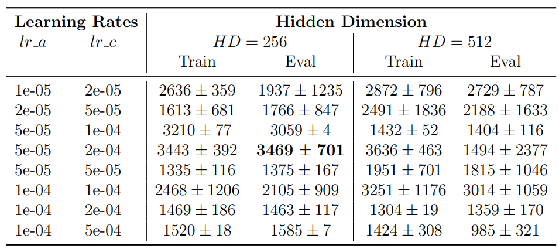{#tab:grid_search_halfcheetah}

Hyperparameter Grid Search Results on HalfCheetah-v4. Train and Eval performance are reported side-by-side (**Mean** $\pm$ **Std** over two seeds). The best evaluation performance is highlighted in **bold**.

###### Analysis.

Several clear trends can be observed from the hyperparameter grid search results. First, PPO exhibits pronounced sensitivity to the choice of learning rates, particularly for the critic. Configurations with relatively larger critic learning rates like $lr\_c = 5\times10^{-4}$ consistently lead to degraded evaluation performance, despite sometimes achieving stable training returns. This suggests that overly aggressive critic updates can harm value estimation accuracy and subsequently destabilize policy optimization.

Second, moderate actor learning rates around $lr\_a = 5\times10^{-5}$ yield the most reliable performance across both hidden dimensions. In particular, the configuration $(lr\_a = 5\times10^{-5},\, lr\_c = 2\times10^{-4})$ with $HD=256$ achieves the best evaluation performance, indicating a favorable balance between policy improvement speed and value function stability. In contrast, smaller learning rate pairs tend to converge more slowly and exhibit higher variance across random seeds.

Regarding network capacity, increasing the hidden dimension from $256$ to $512$ did not consistently improve evaluation performance. While larger models occasionally achieve higher training returns, they often suffer from substantial performance degradation and variance at evaluation time. This train--eval gap suggests that higher-capacity networks are more prone to overfitting or optimization instability under limited data and without same regularization information between training and evaluation environments.

###### Summary.

Overall, these results highlight that PPO performance is governed more by learning rate selection than by model capacity. Careful tuning of the actor--critic learning rate ratio is essential for stable and generalizable performance, whereas increasing network size alone provides limited benefit and may even degrade robustness.

#### Training Performance and Convergence {#sec:training_performance_convergence}

Based on the grid search analysis, I selected three representative configurations to further investigate the training dynamics and generalization capabilities. These configurations are denoted as follows in the subsequent figures:

- **Optimal (Red):** $HD=256, lr\_a=5\times 10^{-5}, lr\_c=2\times 10^{-5}$. This represents the best-performing setting from [3](#tab:grid_search_halfcheetah){reference-type="ref+label" reference="tab:grid_search_halfcheetah"}.

- **Baseline (Blue):** $HD=256, lr\_a=1\times 10^{-4}, lr\_c=1\times 10^{-4}$. A standard setting with equal learning rates.

- **Large Net (Green):** $HD=512, lr\_a=5\times 10^{-5}, lr\_c=2\times 10^{-5}$. The high-capacity counterpart to the Optimal setting.

[17](#fig:learning_curves){reference-type="ref+label" reference="fig:learning_curves"} presents the learning curves without smoothing for both Training Episode Reward and Evaluation Episode Reward averaged over $N = 16$ environments.

<figure id="fig:learning_curves">
<figure id="fig:train_reward">
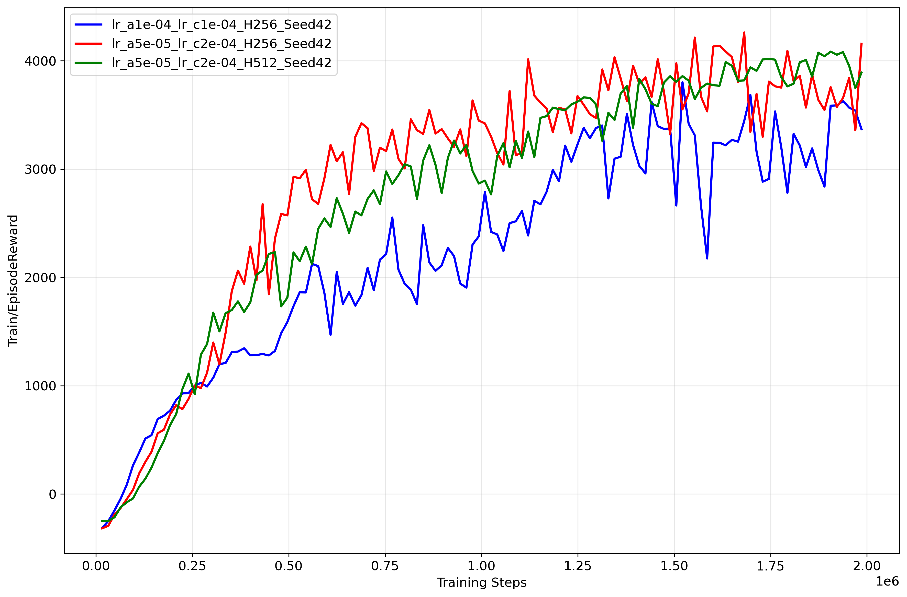
<figcaption>Training Episode Reward</figcaption>
</figure>
<figure id="fig:eval_reward">
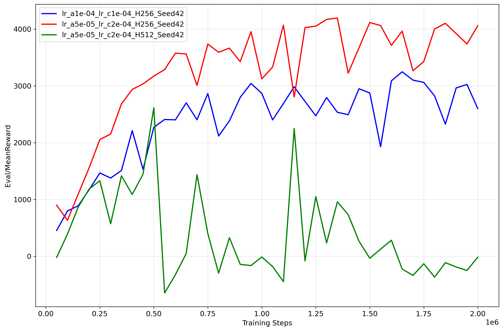
<figcaption>Evaluation Episode Reward</figcaption>
</figure>
<figcaption>Learning curves of PPO on <code>HalfCheetah-v4</code>. Curves are plotted without smoothing to reveal true training dynamics.</figcaption>
</figure>

###### Sample Efficiency and Convergence Speed.

As shown in [15](#fig:train_reward){reference-type="ref+label" reference="fig:train_reward"}, the **Optimal (Red)** configuration demonstrates the fastest convergence rate. It achieves a reward of 3000 within approximately 0.5 million steps, whereas the **Baseline (Blue)** configuration requires significantly more samples to reach the same level, eventually plateauing at a lower final return. This confirms that a slightly lower actor learning rate combined with a higher critic learning rate facilitates more efficient policy updates.

###### Generalization Gap and Overfitting.

A critical observation arises when comparing the Training Reward ([15](#fig:train_reward){reference-type="ref+label" reference="fig:train_reward"}) with the Evaluation Reward ([16](#fig:eval_reward){reference-type="ref+label" reference="fig:eval_reward"}) for the **Large Net (Green)** configuration. In the training phase, the Green curve performs exceptionally well, matching and eventually surpassing the Red curve with a score near 4000. However, in the evaluation phase---where the agent runs deterministically or in a separate environment instance---its performance collapses, even hovering below 0. This massive discrepancy indicates severe **overfitting** since I did not apply the same regularization techniques during evaluation as during training in `HalfCheetah`. The 512-unit network likely memorized the specific trajectories or noise patterns in the training buffer but failed to learn a robust, generalizable locomotor policy. In contrast, the Optimal (Red) curve shows consistent performance across both training and evaluation, indicating that the smaller network ($HD=256$) may generalize better for this task.

#### Internal Optimization Dynamics

To further investigate the optimization stability and the overfitting phenomenon observed in the large capacity network, I analyzed the trajectories of the three component losses: Value Function Loss ($L^{VF}$), Entropy ($H$), and Policy Loss ($L^{CLIP}$). [21](#fig:loss_analysis){reference-type="ref+label" reference="fig:loss_analysis"} presents the evolution of these metrics during training.

<figure id="fig:loss_analysis">
<figure id="fig:loss_value">
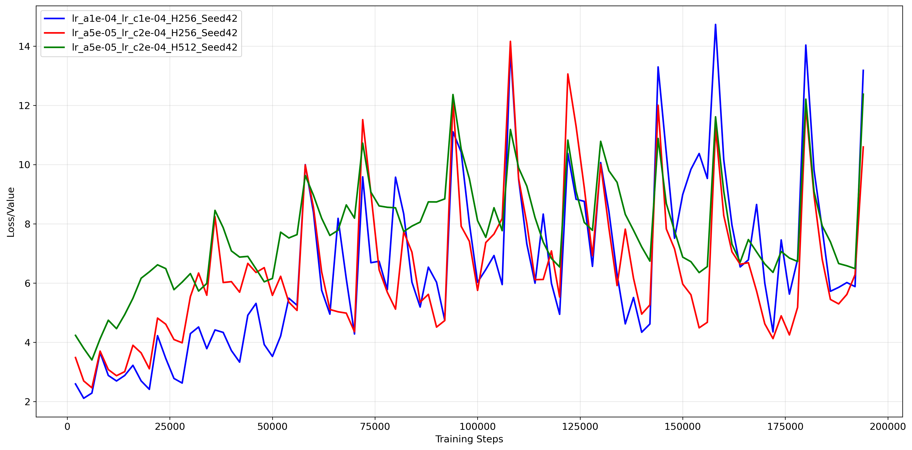
<figcaption>Value Function Loss (Huber)</figcaption>
</figure>
<figure id="fig:loss_policy">
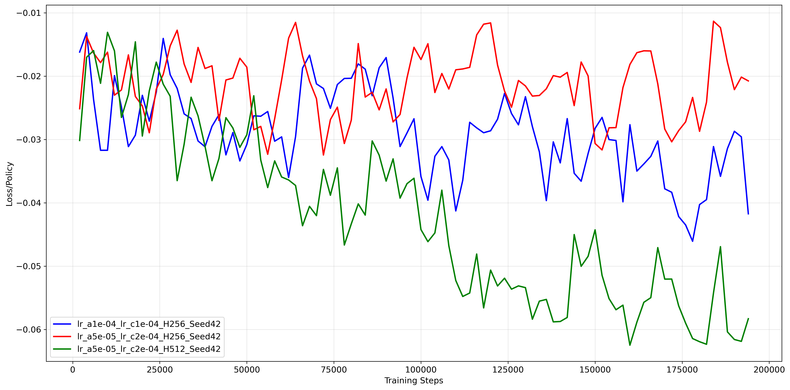
<figcaption>Policy Loss</figcaption>
</figure>
<figure id="fig:loss_entropy">
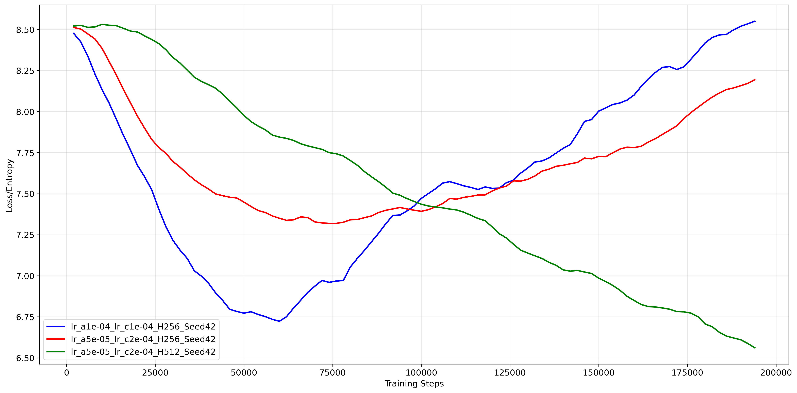
<figcaption>Entropy</figcaption>
</figure>
<figcaption>Evolution of PPO loss components. Note that the Policy Loss is negative because PPO maximizes the objective, and optimizers minimize the loss.</figcaption>
</figure>

###### Critic Non-Stationarity ([18](#fig:loss_value){reference-type="ref+label" reference="fig:loss_value"}). {#critic-non-stationarity-figloss_value.}

A counter-intuitive trend is observed in the Value Loss: it generally trends *upwards* and exhibits high variance for all configurations. This is not a sign of divergence, but rather a consequence of the increasing scale of the episodic returns. As the agent learns to run faster, the true returns grow from $\sim0$ to $>3000$. Consequently, the magnitude of the regression target $V_{target}$ increases, leading to a larger absolute Huber Loss even if the relative error remains constant. The significant spikes correspond to the agent discovering new states or behaviors that the Critic has not yet generalized to, highlighting the inherent non-stationarity of the RL regression task.

###### Policy Optimization Aggressiveness ([19](#fig:loss_policy){reference-type="ref+label" reference="fig:loss_policy"}). {#policy-optimization-aggressiveness-figloss_policy.}

The Policy Loss which PPO minimizes is consistently negative. The **Large Net (Green)** consistently achieves a "lower" loss compared to the Optimal setting. Mathematically, a lower policy loss implies the agent is finding transitions with very large positive advantages and drastically increasing their probability. While this looks efficient during training, combined with the entropy collapse, it suggests the large network is exploiting specific, brittle trajectories in the training buffer, i.e., "reward hacking" via memorization, rather than learning a generalized control law. The **Optimal (Red)** agent maintains a more conservative policy loss, reflecting the stable, monotonic improvement seen in its learning curve.

###### Entropy and Policy Collapse ([20](#fig:loss_entropy){reference-type="ref+label" reference="fig:loss_entropy"}). {#entropy-and-policy-collapse-figloss_entropy.}

The Entropy curve provides the strongest evidence for the overfitting hypothesis regarding the **Large Net (Green)** configuration discussed in [3.2](#sec:training_performance_convergence){reference-type="ref+label" reference="sec:training_performance_convergence"}.

- **Optimal (Red) & Baseline (Blue):** These configurations show a "U-shaped" entropy trend. Initially, entropy drops as the agent learns a basic gait. However, around step 75k, entropy begins to recover and rise. This suggests the agent, parameterized by a state-independent $\log \sigma$, learns to maintain a healthy level of exploration variance, preventing premature convergence to a suboptimal deterministic policy.

- **Large Net (Green):** In sharp contrast, the entropy for the large network collapses monotonically, dropping significantly lower than the others and reaching $\sim 6.5$. This indicates that the 512-unit network became extremely confident (low variance) in its actions. Combined with the poor evaluation performance, this confirms that the agent **overfitted** to the training environment's dynamics, losing the stochasticity required for robust generalization.

#### Algorithmic Stability: PPO Internals

To understand the underlying stability of the optimization process, I analyzed the *Probability Ratio* $r_t(\theta) = \frac{\pi_\theta(a|s)}{\pi_{old}(a|s)}$ recorded during training. PPO relies on clipping this ratio to the range $[1-\epsilon, 1+\epsilon]$ (where $\epsilon=0.2$) to ensure the new policy remains within a "Trust Region" of the old policy.

[22](#fig:ratio_stats){reference-type="ref+label" reference="fig:ratio_stats"} visualizes the maximum ratio ($\max r_t$) observed in each batch update. The dots represent raw data points in each environment per update, while the solid lines represent the average.

{#fig:ratio_stats width="\\linewidth"}

###### Trust Region Adherence.

The **Optimal (Red)** curve maintains the most stable ratio profile. Its mean value stays consistently low (around 1.5), and the scatter points are tightly clustered. This indicates that the policy updates are effectively bounded, respecting the PPO clipping mechanism without taking excessively large steps.

###### Instability of High Learning Rates.

In contrast, the **Baseline (Blue)** configuration, which utilizes a higher actor learning rate ($1\times 10^{-4}$), exhibits significantly higher variance. The scatter plot reveals numerous spikes where the ratio exceeds 4.0, with some outliers reaching nearly 10.0. Although PPO clips the objective function, these extreme ratio values imply that the underlying gradient updates are aggressive, attempting to push the policy far away from $\pi_{old}$. This behavior effectively wastes sample efficiency, as the clipped objective gradients become zero or incoherent when the ratio is too far out of bounds. This instability explains why the Blue curve learns slower than the Red curve in [3.2](#sec:training_performance_convergence){reference-type="ref+label" reference="sec:training_performance_convergence"}, despite having a larger learning rate.

###### Summary on Stability.

The analysis confirms that stability in the PPO update step is directly correlated with final performance. The configuration that maintains the probability ratio closest to the clipping threshold ($1+\epsilon = 1.2$) without extreme violations yields the most robust and efficient learning.

#### Behavioral Analysis: Gait Visualization

While numerical rewards indicate task success, they do not reveal *how* the agent solves the control problem. To interpret the learned policy, I visualize the action outputs of the best-performing agent (Final Model of the **Optimal** Configuration) over a single evaluation episode.

[23](#fig:gait){reference-type="ref+label" reference="fig:gait"} plots the torque sequences applied to two key joints: the **Back Thigh** and the **Front Thigh**. These joints are the primary drivers for propulsion in the `HalfCheetah` morphology.

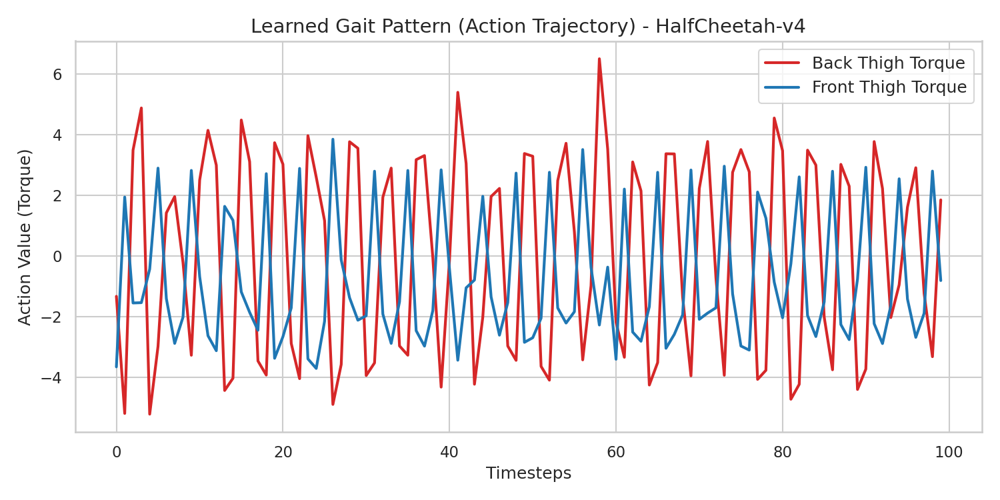{#fig:gait width="\\linewidth"}

###### Locomotor Patterns.

The visualization reveals three critical characteristics of the learned behavior:

1.  **Rhythmic Periodicity:** The action curves exhibit a clear, high-frequency sinusoidal pattern. This confirms that the agent has successfully learned a stable periodic gait, essential for continuous running, rather than converging to a chaotic or stationary local optimum.

2.  **Phase Coordination:** A distinct phase shift (time lag) exists between the Back Thigh and Front Thigh trajectories. As shown in Figure [23](#fig:gait){reference-type="ref" reference="fig:gait"}, when the back legs exert maximum positive torque (pushing off), the front legs are often in a different phase of the cycle. This inter-limb coordination mimics the "galloping" gait seen in quadrupedal animals, allowing the agent to maintain balance while maximizing forward momentum.

3.  **Control Smoothness:** Despite the high-frequency nature of running, the action transitions are relatively smooth and continuous. This suggests that the Gaussian policy learned by PPO, combined with the entropy regularization, successfully found a control law that avoids erratic high-frequency noise, leading to energy-efficient locomotion.

In summary, the behavioral analysis confirms that the high rewards observed in [3.2](#sec:training_performance_convergence){reference-type="ref+label" reference="sec:training_performance_convergence"} correspond to a physically plausible and robust running strategy.

#### Ablation Study: The Necessity of Clipping

A core contribution of PPO is the "Trust Region" enforced via the clipped surrogate objective. To empirically validate the necessity of this mechanism, I conducted an ablation study using the optimal hyperparameter configuration ($lr\_a=5 \times 10^{-5}, lr\_c=2 \times 10^{-5}, HD=256$).

I varied the clipping parameter $\epsilon \in \{0.1, 0.2, 0.5, 10.0\}$. Notably, setting $\epsilon=10.0$ effectively disables the clipping mechanism, simulating an *Unconstrained* or Vanilla Policy Gradient approach, as the probability ratio naturally rarely exceeds this threshold without pathological updates.

<figure id="fig:ablation_curves">
<figure id="fig:ablation_eval">
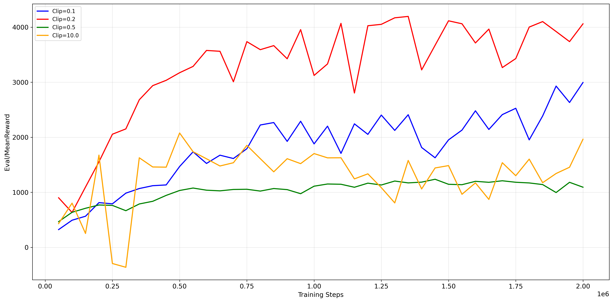
<figcaption>Evaluation Episode Reward</figcaption>
</figure>
<figure id="fig:ablation_ratio">
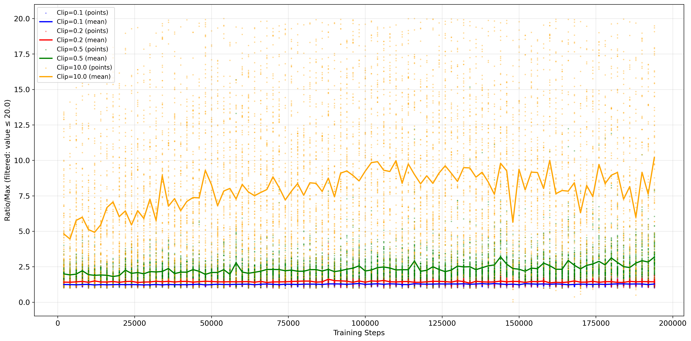
<figcaption>Ratio/Max (Filtered  ≤ 20)</figcaption>
</figure>
<figcaption>Ablation study on the PPO Clipping range <em>ϵ</em>. (a) The learning curves show that <em>ϵ</em> = 0.2 yields the best performance. (b) The Ratio statistics (with extreme outliers  &gt; 20 removed) reveal the massive instability in the Unconstrained setting.</figcaption>
</figure>

###### Performance Comparison.

[26](#fig:ablation_curves){reference-type="ref+label" reference="fig:ablation_curves"} and Table 4 summarize the results.

- **Optimal Balance ($\epsilon=0.2$, Red):** This setting achieves the highest Training ($3443$) and Evaluation ($3469$) returns with monotonic improvement, confirming it as the optimal "Trust Region" size for this task.

- **Over-Constraint ($\epsilon=0.1$, Blue):** While stable, the stricter constraint limits the step size of policy updates. The agent learns linearly but significantly slower than the optimal setting, failing to reach the performance plateau within the 2 million step budget.

- **Instability of Large Clips ($\epsilon=0.5$ & $10.0$):** Relaxing the constraint leads to severe degradation. The $\epsilon=0.5$ (Green) setting collapses early, likely getting stuck in a suboptimal local, deterministic policy. The **Unconstrained ($\epsilon=10.0$, Orange)** setting exhibits characteristic instability: while it manages to acquire some reward, it suffers from high variance and fails to converge to a high-performing policy.

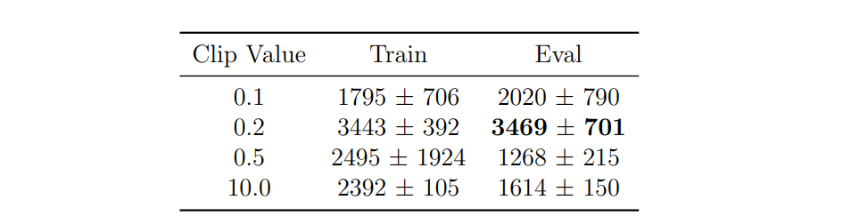{#tab:ablation_stats}
PPO Clip Ablation Analysis on `HalfCheetah-v4`. Mean $\pm$ Std over two seeds. The best evaluation performance is highlighted in **bold**.

###### Mechanism Analysis: The Exploding Ratio.

The failure of the unconstrained settings is mathematically explained by the *Probability Ratio* statistics shown in [25](#fig:ablation_ratio){reference-type="ref+label" reference="fig:ablation_ratio"}.

- For the **Optimal (Red)** agent, the maximum ratio is tightly controlled, oscillating around $1.5$. This indicates that the new policy $\pi_\theta$ never deviates excessively from $\pi_{old}$, ensuring the validity of the local advantage approximation.

- For the **Unconstrained (Orange)** agent, the ratio explodes. The mean max-ratio frequently hovers between $8.0$ and $10.0$. Critically, the raw logs contained outliers exceeding $20,000$ (filtered from the plot for visualization). These "Destructive Updates" push the policy parameters far into unknown regions of the optimization landscape based on a single batch of data, erasing previous progress and preventing stable convergence.

###### Summary.

This ablation study conclusively demonstrates that the success of PPO relies heavily on the clipping mechanism. The standard value of $\epsilon=0.2$ provides a necessary safeguard against catastrophic interference, balancing sample efficiency with optimization stability.

### Experiments: PPO on Hopper-v4

Following the analysis of `HalfCheetah`, I extended the evaluation of PPO to the `Hopper-v4` environment. `Hopper` presents a fundamentally different challenge: it is an "unstable" system where the agent must actively maintain balance. Unlike `HalfCheetah`, where the episode continues for a fixed duration regardless of the robot's pose, `Hopper` episodes terminate early if the robot falls (torso height $< 0.7$ or extreme angles). This introduces a critical "survival" constraint that significantly alters the learning dynamics.

#### Hyperparameter Sensitivity Analysis {#hyperparameter-sensitivity-analysis-1}

I conducted a grid search over the same hyperparameter space as `HalfCheetah` to assess the transferability of the optimal configuration. The results are summarized in [5](#tab:grid_search_hopper){reference-type="ref+label" reference="tab:grid_search_hopper"}.

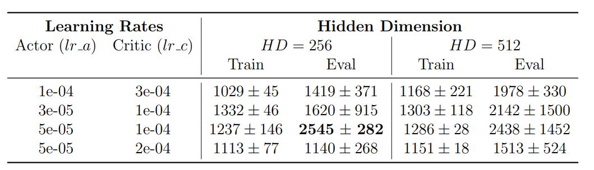{#tab:grid_search_hopper}

Hyperparameter Grid Search Results on `Hopper-v4`. Train and Eval performance are reported side-by-side (**Mean** $\pm$ **Std** over two seeds). The best evaluation performance is highlighted in **bold**.

###### Analysis.

The results highlight a distinct sensitivity profile compared to `HalfCheetah`:

- **Lower Critic Tolerance:** The configuration that performed best in `HalfCheetah` ($lr\_a=5\text{e-}5, lr\_c=2\text{e-}4$) yields poor results in `Hopper` (Eval $\approx 1140$). Reducing the critic learning rate to $1\text{e-}4$ while keeping actor fixed drastically improves performance to $\approx 2545$. This suggests that `Hopper`'s value function, which includes the risk of sudden termination, is more susceptible to destabilization from aggressive updates.

- **Impact of Network Capacity:** Similar to `HalfCheetah`, the smaller network generally offers more stable performance. The larger network exhibits massive variance (e.g., standard deviation of $\pm 1452$), indicating that it struggles to generalize the "balancing" policy across different seeds.

#### Learning Dynamics: Survival vs. Speed

To analyze the training process, I selected three representative configurations with varying network sizes and learning rates. [27](#fig:hopper_learning_curve){reference-type="ref+label" reference="fig:hopper_learning_curve"} displays the Evaluation Mean Reward. Notably, I have omitted the Training Episode Reward plot from this report. Unlike `HalfCheetah`, where training curves are relatively smooth, `Hopper`'s training curves are dominated by extreme high-frequency volatility. This is because the termination condition is binary: a single stochastic exploration step can cause the robot to lose balance and fall, terminating the episode immediately with low reward. Thus, the deterministic Evaluation Reward provides a much clearer signal of the learned policy's true competence.

{#fig:hopper_learning_curve width="80%"}

The evaluation curves reveal several critical insights into the "Survival vs. Speed" trade-off:

1.  **Phase Transition (The "Jump\"):** All successful agents exhibit a step-function-like improvement. For the first 0.1M to 0.2M steps, the reward is low ($\approx 0-300$), indicating the agent is struggling just to stand (Survival Phase). Suddenly, the reward spikes to $>1000$ (Hopping Phase). This confirms that the policy must cross a minimum stability threshold before it can safely optimize for velocity.

2.  **Instability and Recovery (Blue Curve):** The Blue line ($HD=256$) demonstrates the fragility of the control policy. After initially solving the task (reaching $\approx 2700$ at 0.4M steps), the performance collapses back to near zero, indicating the agent "forgot" how to balance while trying to improve speed. However, it successfully recovers after 0.7M steps. This "Unlearning" phenomenon is common in PPO when the policy update pushes the agent into a state space where the value estimates are inaccurate.

3.  **High Capacity Potential (Green Curve):** The Green line ($HD=512, lr\_a=5\text{e-}5, lr\_c=5\text{e-}4$) achieves the highest asymptotic performance in this run, consistently staying above $3300$. While the grid search table ([5](#tab:grid_search_hopper){reference-type="ref+label" reference="tab:grid_search_hopper"}) indicated that $HD=512$ has higher variance on average, this specific trajectory shows that when it succeeds, the larger capacity allows for a more fine-grained control strategy that sustains higher speeds than the smaller network.

#### Internal Optimization Dynamics

To further dissect the instability observed in `Hopper`, I analyzed the component losses. The results are presented in [31](#fig:hopper_loss_analysis){reference-type="ref+label" reference="fig:hopper_loss_analysis"}.

<figure id="fig:hopper_loss_analysis">
<figure id="fig:hopper_loss_value">
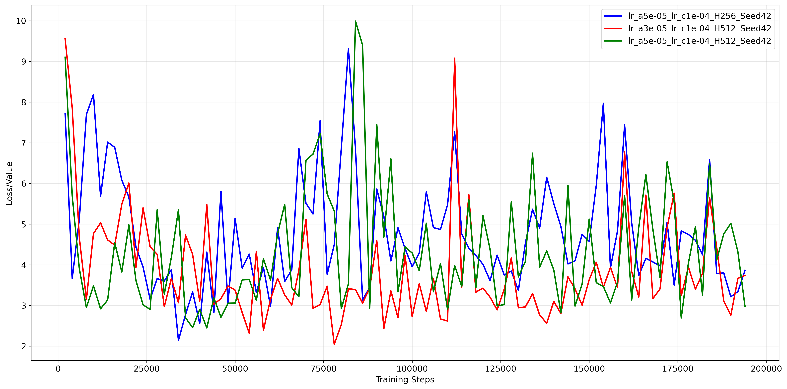
<figcaption>Value Function Loss</figcaption>
</figure>
<figure id="fig:hopper_loss_policy">
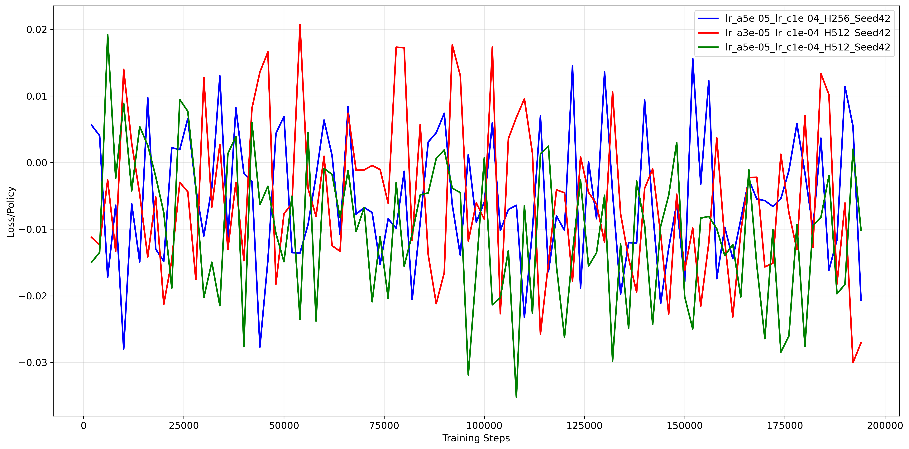
<figcaption>Policy Loss</figcaption>
</figure>
<figure id="fig:hopper_loss_entropy">
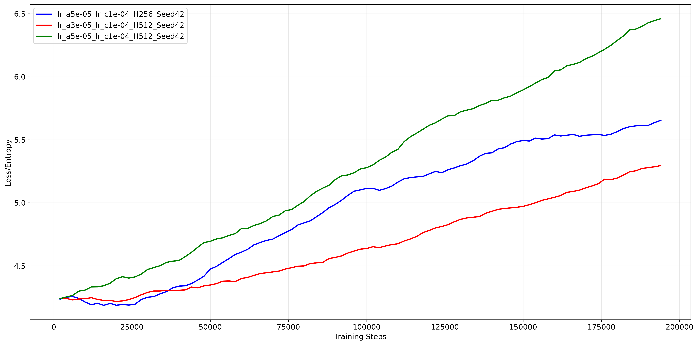
<figcaption>Entropy</figcaption>
</figure>
<figcaption>Optimization dynamics in <code>Hopper-v4</code>. The profiles differ significantly from <code>HalfCheetah</code>, particularly in Policy Loss volatility and Entropy trajectory.</figcaption>
</figure>

###### Value Loss Similarity.

As shown in [28](#fig:hopper_loss_value){reference-type="ref+label" reference="fig:hopper_loss_value"}, the Value Loss exhibits behavior very similar to `HalfCheetah`: it is characterized by frequent high-magnitude spikes and a general upward trend as rewards increase. This confirms that the Critic faces a similar regression challenge in both environments---adapting to a non-stationary target as the policy improves.

###### Policy Loss Volatility.

[29](#fig:hopper_loss_policy){reference-type="ref+label" reference="fig:hopper_loss_policy"} reveals a striking difference. In `HalfCheetah`, the policy loss was consistently negative and smooth, indicating steady improvement. In `Hopper`, the policy loss oscillates violently around zero, frequently crossing into positive values. A positive policy loss typically occurs when the "advantageous" actions in the current batch are being discouraged by the clipping mechanism or when the advantage estimates themselves are highly noisy. This high volatility reflects the precarious nature of the task: a small update can lead to a policy that falls immediately, causing massive shifts in advantage estimates and gradient directions between batches, this also reveals that why the training episode reward is so volatile.

###### Entropy: Monotonic Expansion.

The Entropy trajectory is fundamentally different from the "V-shape" seen in `HalfCheetah`.

- **Continuous Rise:** Instead of dropping initially, the entropy increases almost monotonically from the start (from $\sim 4.2$ to $\sim 6.5$).

- **Interpretation:** This suggests that the optimal policy for `Hopper` requires a high degree of stochasticity or that the agent is "widening" its action distribution to maintain robustness against perturbations. Unlike `HalfCheetah` where the agent converges to a specific gait, the `Hopper` agent might benefit from a broader action variance to react to potential falls.

- **Scale:** The absolute entropy values ($4.0 - 6.5$) are lower than in `HalfCheetah` ($6.5 - 8.5$), implying that the viable action space for `Hopper` is naturally more constrained---there are fewer "safe" actions that keep the robot upright.

#### Algorithmic Stability: Ratio Analysis

Moreover, I analyzed the stability of the policy updates by examining the maximum Probability Ratio $r_t(\theta)$ recorded during training, as shown in [32](#fig:hopper_ratio){reference-type="ref+label" reference="fig:hopper_ratio"}.

{#fig:hopper_ratio width="\\linewidth"}

###### Tighter Constraints for Unstable Dynamics.

A comparative analysis with `HalfCheetah` reveals a significant difference in the magnitude of the probability ratios. In `HalfCheetah` where $\epsilon=0.2$, the ratios frequently reached values between $1.5$ and $4.0$ (see [22](#fig:ratio_stats){reference-type="ref+label" reference="fig:ratio_stats"}). In `Hopper-v4`, as visualized in [32](#fig:hopper_ratio){reference-type="ref+label" reference="fig:hopper_ratio"}, the mean ratio stays very close to $1.0$ (mostly $< 1.3$), and even the outliers rarely exceed $2.5$.

This behavior is by design and necessity:

- **Stricter Clipping ($\epsilon=0.1$):** For `Hopper`, I reduced the clipping parameter to $0.1$. My preliminary experiments with $\epsilon=0.2$ (the standard value used in `HalfCheetah`) resulted in training collapse.

- **Fragility of the Gait:** `Hopper` is a single-legged robot with a high center of mass. Unlike the stable, quadruped-like `HalfCheetah`, `Hopper` is dynamically unstable. A large policy update (which $\epsilon=0.2$ would allow) can easily push the policy parameters into a region where the robot loses balance immediately. Once the robot falls, the episode terminates, cutting off the stream of useful gradient information.

- **Conclusion:** The tighter ratio distribution confirms that for unstable environments, enforcing a smaller "Trust Region" is critical to prevent the policy from "falling off the cliff" of the optimization landscape.

#### Behavioral Analysis: Gait Visualization

To verify that the agent has learned a physically plausible locomotor strategy, I visualized the action outputs of the best-performing agent over a small evaluation episode. [33](#fig:hopper_gait){reference-type="ref+label" reference="fig:hopper_gait"} plots the torque sequences applied to the three active joints: Thigh, Leg, and Foot.

###### Importance of Observation Consistency.

Unlike `HalfCheetah`, which is a stable environment with a consistent observation space, `Hopper`'s unstable dynamics require strict normalization of observations. A critical methodological detail in this analysis is the handling of observation normalization. The policy network $\pi_\theta$ was trained on normalized state inputs $s_{norm} = (s_{raw} - \mu_{train}) / \sigma_{train}$. During evaluation, simply normalizing by the evaluation batch statistics would be insufficient and incorrect, as the distribution would differ from the training set. Therefore, I explicitly saved the running mean ($\mu_{train}$) and variance ($\sigma^2_{train}$) from the training phase and loaded them into the evaluation environment. This ensures that the agent perceives the state space exactly as it learned it, allowing for the accurate reproduction of the learned gait.

{#fig:hopper_gait width="\\linewidth"}

###### Locomotor Patterns.

The visualization reveals that the agent has mastered a complex, energy-efficient control strategy rather than a simple harmonic oscillation:

- **Functional Specialization of Joints:** The action profiles reveal distinct roles for different joints. The **Leg (Blue)** and **Foot (Green)** joints exhibit large-amplitude, synchronized swings (e.g., steps 50-80), acting as the primary drivers for propulsion (the "hop\"). In contrast, the **Thigh (Red)** joint remains relatively quiescent with low-amplitude adjustments during the stable phases (steps 20-50 and 85-120), likely acting as a stabilizer to maintain torso posture while the other joints generate lift.

- **Explosive vs. Passive Phases:** The gait is characterized by long "loading" or "stance" phases (e.g., steps 20-50) where torques change slowly, followed by rapid, high-magnitude "release" phases (steps 60-80). This "pulse-and-glide" behavior mimics biological hopping, where energy is stored in tendons and released explosively.

- **Active Stabilization:** The high-frequency oscillations observed in the Thigh joint during the transition periods (e.g., steps 60-70 and 130+) suggest active feedback control. As the robot transitions from air to ground, the policy makes rapid micro-adjustments to the thigh torque to prevent the torso from tipping over upon impact.

In summary, the PPO agent has learned a sophisticated synergy: using the leg and foot for power generation while reserving the thigh for fine-grained balance control.

### Experiments: PPO on Ant-v4

To further demonstrate the scalability of my PPO implementation, I conducted an additional experiment on the `Ant-v4` environment. This task is considerably more challenging than `HalfCheetah` and `Hopper` due to the higher degrees of freedom (8 actuators) and the complex coordination required for quadrupedal locomotion.

I performed an exhaustive grid search for this environment, but the results were not as expected. Due to the computational complexity and time constraints, I could not explore all possible combinations. [34](#fig:ant_learning_curve){reference-type="ref+label" reference="fig:ant_learning_curve"} presents the learning curve over 5 million timesteps of the best configuration I found: $lr\_a=5\text{e-}5, lr\_c=2\text{e-}4, H = 256$.

{#fig:ant_learning_curve width="80%"}

As shown in [34](#fig:ant_learning_curve){reference-type="ref+label" reference="fig:ant_learning_curve"}, the learning process for the high-dimensional `Ant` is markedly different from simpler agents:

- **Incubation Period (0 - 3M steps):** For the first 3 million steps, the agent struggles to gain significant rewards, hovering below 500. This "incubation period" reflects the immense difficulty of coordinating 8 joints simultaneously to discover a viable gait that prevents falling. Unlike `Hopper`, where the agent falls quickly, `Ant` can survive in a "non-walking" state, leading to a long plateau of low-quality local optima.

- **Phase Transition and Ascent (3M - 4.5M steps):** Around 3M steps, the agent discovers a stable walking pattern, triggering a phase of exponential policy improvement. The evaluation reward climbs vertically, breaking the **3500** mark at around 4.5M steps. This indicates that once the basic coordination primitive is found, PPO can rapidly optimize the gait for speed.

- **Late-Stage Volatility:** The curve exhibits significant fluctuations in the final phase, oscillating between 2000 and 3600. This suggests that while the agent can run fast, the high-speed gait is brittle. Small policy updates can temporarily disrupt the leg coordination, causing the robot to trip more frequently during evaluation episodes, resulting in high variance.

This experiment demonstrates that while standard PPO is robust enough to solve high-dimensional quadrupedal tasks, it requires significantly more sample complexity (5M+ steps) compared to simpler morphologies.

### Summary

In this chapter, I conducted a comprehensive evaluation of the Proximal Policy Optimization (PPO) algorithm across three distinct MuJoCo environments: `HalfCheetah-v4`, `Hopper-v4`, and `Ant-v4`. The experiments revealed several critical insights regarding the algorithm's behavior and implementation requirements:

1.  **Morphology-Dependent Sensitivity:** The optimal hyperparameter configuration is highly dependent on the physical stability of the robot.

    - For **Stable Systems** (`HalfCheetah`, `Ant`), the standard clipping range $\epsilon=0.2$ and balanced learning rates like $lr \approx 1\times 10^{-4}$ work well.

    - For **Unstable Systems** (`Hopper`), stricter constraints ($\epsilon=0.1$) and conservative Critic updates are essential to prevent the policy from collapsing into a "falling" local optimum.

2.  **Sample Efficiency vs. Complexity:** While PPO solves simpler tasks like `HalfCheetah` in under 1 million steps, high-dimensional tasks like `Ant` require a significantly longer "incubation period" (over 2.5 million steps) to coordinate multiple joints before rapid learning can occur. This highlights the non-linear relationship between state-space dimensionality and sample complexity.

3.  **Critical Implementation Details:** The success of PPO relies heavily on auxiliary mechanisms. **Observation Normalization** is mandatory for `Hopper` and `Ant` to standardize inputs. Furthermore, for environments with large reward scales like `Ant`, **Reward Normalization** is crucial to prevent value function divergence. Finally, ensuring that normalization statistics are shared between training and evaluation environments is necessary to measure true performance.

Overall, PPO proves to be a robust and versatile algorithm for continuous control, capable of learning complex locomotor behaviors ranging from bipedal hopping to quadrupedal galloping, provided that the "Trust Region" and normalization schemes are tuned to the specific dynamics of the environment.

### Conclusion {#conclusion .unnumbered}

This project conducted a systematic evaluation of Deep Reinforcement Learning algorithms across two fundamental domains: discrete control (Atari 2600) and continuous control (MuJoCo). By implementing and analyzing Deep Q-Networks (DQN) and Proximal Policy Optimization (PPO), I investigated the interplay between algorithmic architecture, hyperparameter sensitivity, and environmental dynamics. The core findings and implications of this study are summarized below.

#### Core Findings

###### 1. Architecture vs. Optimization in Discrete Control.

In the Atari domain, experimental results challenged the assumption that "bigger is better.\" While **Rainbow DQN** consistently outperformed baselines by combining multiple enhancements, the **Vanilla DQN** achieved surprisingly competitive scores on `Breakout` ($197.07$) using a smaller network capacity ($H=256$). Conversely, larger networks ($H=512$) often led to instability in simpler architectures, highlighting a risk of overfitting. The **Dueling** architecture proved to be the most critical structural improvement, significantly smoothing the optimization landscape (reducing gradient variance by $\sim 75\%$) by decoupling state-value estimation from action advantages.

###### 2. Morphology-Dependent Stability in Continuous Control.

For PPO, the physical morphology of the agent dictated the optimal training strategy. **Stable agents** (`HalfCheetah`, `Ant`) benefited from aggressive exploration and standard clipping ($\epsilon=0.2$). **Unstable agents** (`Hopper`) required strict trust-region constraints ($\epsilon=0.1$) to prevent "training collapse," where a single bad update could render the policy incapable of standing. Furthermore, high-dimensional tasks like `Ant-v4` exhibited a distinct "Incubation Period" (2.5M steps) where the agent learned internal coordination before any observable reward improvement, emphasizing the non-linear scaling of sample complexity with degrees of freedom.

###### 3. The "Hidden" Role of Implementation Details.

A recurring theme across all experiments was the disproportionate impact of auxiliary implementation details often omitted in theoretical descriptions.

- **Observation Normalization:** Saving and loading training statistics ($\mu, \sigma$) for evaluation was mandatory to avoid distribution shift, particularly for the sensitive `Hopper` gait.

- **Reward Scaling:** In `Ant-v4`, normalizing rewards was essential to keep value function targets within a learnable range.

- **Wrapper Order:** In Atari, the placement of the `RecordEpisodeStatistics` wrapper before frame skipping was crucial for accurate reporting.

#### Key Conclusions

1.  **Stability Precedes Performance:** The most successful agents were not necessarily those with the highest peak learning rates, but those with the most stable optimization gradients. Dueling DQN's separation of value streams and PPO's clipping mechanism both serve this primary function: stabilizing the learning signal against high-variance data.

2.  **The "Local Optimum" Trap:** Both algorithms demonstrated susceptibility to local optima. DQN agents in `Breakout` learned a "tunneling" strategy that yielded high scores but failed to clear the board. `Ant` agents spent millions of steps in a low-reward local optimum before discovering locomotion. This underscores that reactive policies (model-free) lack the long-horizon planning capability to escape deep local optima without explicit exploration mechanisms or curriculum learning.

3.  **Generalization is Finite:** Hyperparameters tuned for one environment (e.g., `Pong`) did not universally transfer to others (e.g., `Breakout`) without adjustment. While "default" settings provided a strong starting point, achieving state-of-the-art performance required task-specific tuning of the exploration-exploitation balance.

#### Limitations and Future Work

While this project successfully demonstrated the efficacy of DQN and PPO, several limitations highlight areas for further investigation:

1.  **Sample Efficiency and Model-Based RL:** Both algorithms required millions of environment interactions to converge. This high sample complexity makes them impractical for real-world robotics where data collection is expensive. Future work could explore **Model-Based RL** like Dreamer (Hafner et al., 2019) and MBPO (Janner et al., 2019), which learns an internal world model to simulate transitions, potentially reducing sample requirements by orders of magnitude.

2.  **Advanced Off-Policy Methods:** For continuous control, we relied on PPO (on-policy). While stable, it is often less sample-efficient than state-of-the-art off-policy methods. When I finished this project, I may try to implement **Soft Actor-Critic (SAC)** (Haarnoja et al., 2018), which combines off-policy efficiency with maximum entropy exploration, would likely yield better performance on complex morphologies like the `Ant` and `Humanoid`.

3.  **Automated Hyperparameter Tuning:** Our sensitivity analysis revealed that parameters like the clipping range $\epsilon$ are critical. However, these were tuned manually. Future experiments should incorporate **Population Based Training (PBT)** (Jaderberg et al., 2017) or automated HPO frameworks like Optuna (Akiba et al., 2019) to dynamically adapt hyperparameters during training, removing the reliance on manual trial-and-error.

4.  **Generalization and Robustness:** The agents were evaluated in the same deterministic environments used for training. To assess true intelligence, future work should test **generalization** by introducing domain randomization (Tobin et al., 2017) (varying friction, mass, or visual noise) or evaluating on procedurally generated environments to ensure the agent learns robust behaviors rather than memorizing specific trajectories.

In conclusion, this project demonstrates that while Deep RL algorithms are powerful general-purpose solvers, their success in practice relies heavily on a deep understanding of the specific environment's dynamics and the meticulous engineering of the training pipeline.

### References

- Akiba, Takuya, Shotaro Sano, Toshihiko Yanase, Takeru Ohta, and Masanori Koyama. 2019. "Optuna: A Next-Generation Hyperparameter Optimization Framework." In *Proceedings of the 25th ACM SIGKDD International Conference on Knowledge Discovery & Data Mining*, 2623--31.

- Bellemare, Marc G, Yavar Naddaf, Joel Veness, and Michael Bowling. 2013. "The Arcade Learning Environment: An Evaluation Platform for General Agents." *Journal of Artificial Intelligence Research* 47: 253--79.

- Haarnoja, Tuomas, Aurick Zhou, Pieter Abbeel, and Sergey Levine. 2018. "Soft Actor-Critic: Off-Policy Maximum Entropy Deep Reinforcement Learning with a Stochastic Actor." In *International Conference on Machine Learning*, 1861--70. PMLR.

- Hafner, Danijar, Timothy Lillicrap, Jimmy Ba, and Mohammad Norouzi. 2019. "Dream to Control: Learning Behaviors by Latent Imagination." *arXiv Preprint arXiv:1912.01603*.

- Hessel, Matteo, Joseph Modayil, Hado Van Hasselt, Tom Schaul, Georg Ostrovski, Will Dabney, Dan Horgan, Bilal Piot, Mohammad Azar, and David Silver. 2018. "Rainbow: Combining Improvements in Deep Reinforcement Learning." In *Proceedings of the AAAI Conference on Artificial Intelligence*. Vol. 32. 1.

- Huber, Peter J. 1964. "Robust Estimation of a Location Parameter." *The Annals of Mathematical Statistics* 35 (1): 73--101.

- Jaderberg, Max, Valentin Dalibard, Simon Osindero, Wojciech M Czarnecki, Jeff Donahue, Ali Razavi, Oriol Vinyals, et al. 2017. "Population Based Training of Neural Networks." *arXiv Preprint arXiv:1711.09846*.

- Janner, Michael, Justin Fu, Marvin Zhang, and Sergey Levine. 2019. "When to Trust Your Model: Model-Based Policy Optimization." In *Advances in Neural Information Processing Systems*. Vol. 32.

- Kingma, Diederik P, and Jimmy Ba. 2014. "Adam: A Method for Stochastic Optimization." *arXiv Preprint arXiv:1412.6980*.

- Mnih, Volodymyr, Koray Kavukcuoglu, David Silver, Andrei A Rusu, Joel Veness, Marc G Bellemare, Alex Graves, et al. 2015. "Human-Level Control Through Deep Reinforcement Learning." *Nature* 518 (7540): 529--33.

- Schulman, John, Philipp Moritz, Sergey Levine, Michael Jordan, and Pieter Abbeel. 2015. "High-Dimensional Continuous Control Using Generalized Advantage Estimation." *arXiv Preprint arXiv:1506.02438*.

- Schulman, John, Filip Wolski, Prafulla Dhariwal, Alec Radford, and Oleg Klimov. 2017. "Proximal Policy Optimization Algorithms." *arXiv Preprint arXiv:1707.06347*.

- Sutton, Richard S, and Andrew G Barto. 2018. *Reinforcement Learning: An Introduction*. 2nd ed. MIT Press.

- Tobin, Josh, Rachel Fong, Alex Ray, Jonas Schneider, Wojciech Zaremba, and Pieter Abbeel. 2017. "Domain Randomization for Transferring Deep Neural Networks from Simulation to the Real World." In *2017 IEEE/RSJ International Conference on Intelligent Robots and Systems (IROS)*, 23--30. IEEE.

- Todorov, Emanuel, Tom Erez, and Yuval Tassa. 2012. "MuJoCo: A Physics Engine for Model-Based Control." In *2012 IEEE/RSJ International Conference on Intelligent Robots and Systems*, 5026--33. IEEE.

- Towers, Mark, Jordan K Terry, Ariel Kwiatkowski, John U Balis, Gianluca de Cola, Tristan Deleu, Manuel Goulão, et al. 2023. "Gymnasium." *Zenodo*. <https://doi.org/10.5281/zenodo.8127025>.

- Van Hasselt, Hado, Arthur Guez, and David Silver. 2016. "Deep Reinforcement Learning with Double q-Learning." In *Proceedings of the AAAI Conference on Artificial Intelligence*. Vol. 30. 1.

- Wang, Ziyu, Tom Schaul, Matteo Hessel, Hado Hasselt, Marc Lanctot, and Nando Freitas. 2016. "Dueling Network Architectures for Deep Reinforcement Learning." In *International Conference on Machine Learning*, 1995--2003. PMLR.
