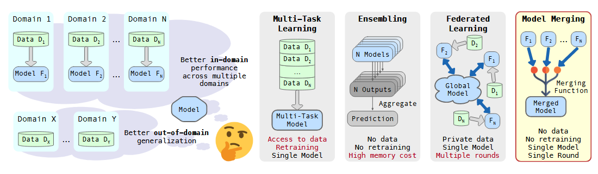
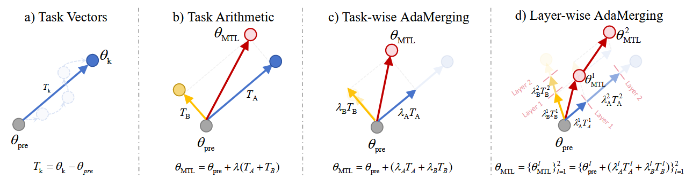
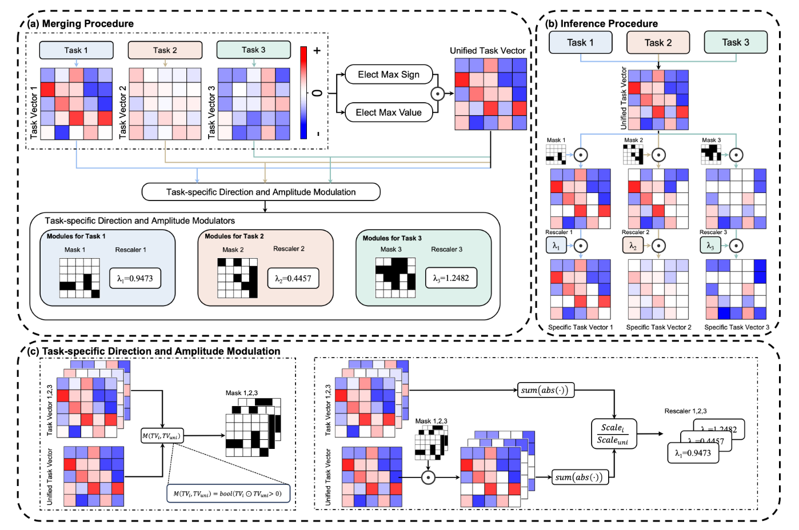
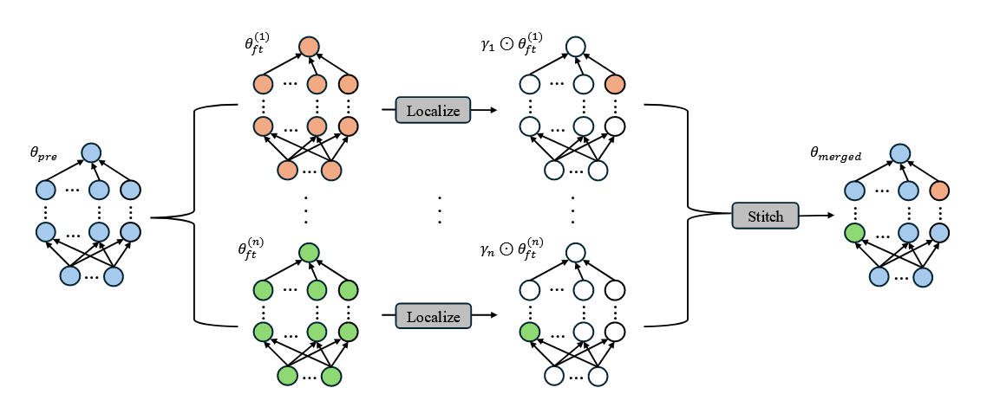
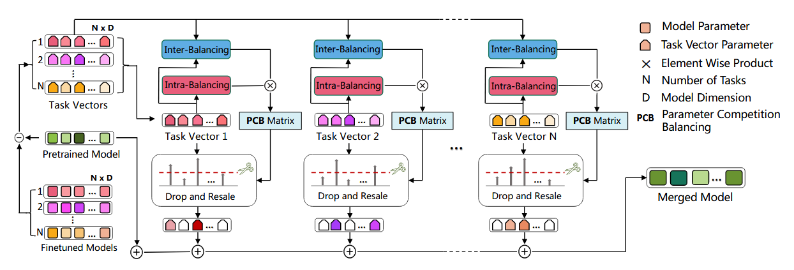
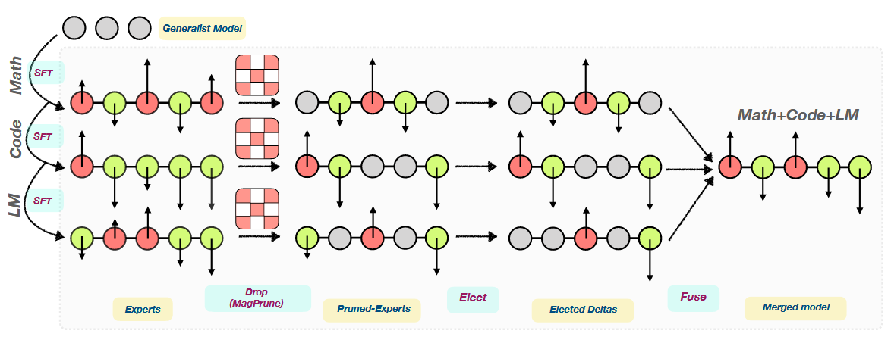
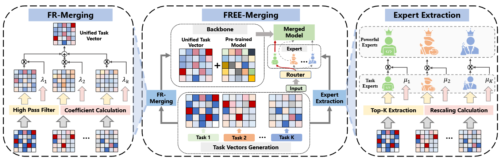
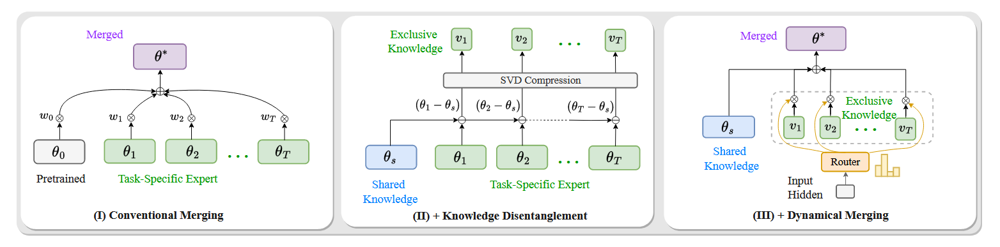

maketitle thanks aketitle

# Introduction

In the rapidly evolving landscape of deep learning, pre-trained models
have emerged as a central driving force in the field of machine
learning, demonstrating remarkable performance across a diverse range of
complex tasks. However, with the continuous growth in model scale and
the increasing specialization of application scenarios, the number of
fine-tuned models for specific tasks has also grown exponentially. This
trend presents a series of practical challenges. For instance, deploying
separate models for each particular task leads to high computational
costs, enormous storage requirements, and inefficiency in multi-task
processing. Traditional solutions, such as multi-task
learning[@MultitaskLearning], typically necessitate simultaneous access
to raw training data for all tasks, which is often infeasible in
real-world scenarios due to data privacy concerns or difficulties in
data integration.

To address these challenges, model merging techniques have emerged and
rapidly become a promising research direction in the field of machine
learning. The core philosophy of model merging lies in its ability to
effectively integrate the parameters or predictions of multiple
independently fine-tuned models into a single, unified model, without
the need for time-consuming additional training processes or access to
raw training data. This approach not only significantly enhances the
computational efficiency of multi-task learning but also demonstrates
substantial potential in areas such as continual learning and few-shot
learning, with its advantages becoming particularly pronounced when
dealing with large language models (LLMs) and foundation models.
Compared to traditional multi-task learning, model merging does not
require simultaneous access to all task training data, and compared to
model ensembling [@EnsemblelearningAsurvey], the merged model is cheaper
to run at inference time.

However, model merging is not without its inherent complexities. In
high-dimensional parameter spaces, potential conflicts and interference
among different models often lead to a decline in the performance of the
merged model. Consequently, effectively balancing parameter competition
among tasks and mitigating such interference has become a focal point of
research in this domain.

This overview aims to delve into the various model merging methods that
have emerged recently in the context of large models, covering
fine-tuning strategies such as fully fine-tuning (FFT) and
parameter-efficient fine-tuning (PEFT). Specially, we primarily focuses
on model merging methods for **fully fine-tuned (FFT)** large models,
while also discussing the applicability of **parameter-efficient
fine-tuning (PEFT)** strategies. We categorize existing model merging
methods into the following four main categories: (1) **Weighted Average
Strategies**, which fuse knowledge by applying different weighting
methods to each model's parameters, including Simple
Average[@wortsmanModelSoupsAveraging2022; @ilharco2022patchingopenvocabularymodelsinterpolating; @choshen2022fusingfinetunedmodelsbetter],
Fisher Average [@matenaMergingModelsFisherWeighted2022],
RegMean[@jinDatalessKnowledgeFusion2025], Task Arithmetic
[@ilharcoEditingModelsTask2023], AdaMerging
[@yangAdaMergingAdaptiveModel2024], etc. Notably, the \"Model soups\"
method [@wortsmanModelSoupsAveraging2022] falls into this category,
demonstrating that averaging weights of multiple fine-tuned models can
improve accuracy and robustness without increasing inference time. (2)
**Sparsification Strategies**, designed to reduce task interference and
optimize model structure by sparsely configuring the weights of each
model. This includes DELLA-Merging
[@deepDELLAMergingReducingInterference2024]
,TIES-Merging[@yadav2023tiesmergingresolvinginterferencemerging],
DARE[@yuLanguageModelsAre2024], Localize-and-Stitch
[@heLocalizeandStitchEfficientModel2025], FREE Merging
[@zhengFREEMergingFourierTransform2025], TALL masks and Consensus
method[@wangLocalizingTaskInformation2024]. (3) **Subspace-based
Methods**, which approach model merging from a deeper mathematical
perspective by performing subspace decomposition on model weights to
resolve potential issues and achieve better performance. Examples
include TSV-Merging[@gargiuloTaskSingularVectors2025], Isotropic
Merging[@marczakNoTaskLeft2025], Knots(especially with
PEFT)[@stoicaModelMergingSVD2024], AdaRank
[@leeAdaRankAdaptiveRank2025], which reduces the performance gap between
merged models and fine-tuned models to nearly 1%; and
STAR[@leeSTARSpectralTruncation2025]. Furthermore, PCB Merging
[@duParameterCompetitionBalancing2024] outperforms the strongest
baseline for T5-base and T5-Large models by 1.9% and 2.1% respectively.
Revisiting Weight Averaging for Model Merging(CART) also shows that the
performance gap with traditional multi-task learning can be narrowed to
within 1-3% [@choiRevisitingWeightAveraging2025]. (4) **MoE-based
Methods**, a novel class of model merging strategies inspired by the
Mixture-of-Experts (MoE) architecture in large models, offering new
insights for model merging. This category includes SMILE
[@tangSMILEZeroShotSparse2024], Twin-Merging
[@luTwinMergingDynamicIntegration2024], which demonstrates an average
improvement of 28.34% in absolute normalized score for discriminative
tasks, and WEMoE [@tangMergingMultiTaskModels2024].

By systematically organizing and analyzing these diverse methodologies,
we aim to gain a deeper understanding of the intrinsic connections and
distinctions among different model merging approaches, uncover their
underlying theoretical foundations, and explore how they effectively
address the challenges faced by large models in multi-task applications.
We believe this overview will provide researchers in the field of model
merging with a comprehensive and insightful framework, inspiring more
in-depth future explorations in this direction.

# Preliminary

Model merging integrates multiple deep neural network models, each
individually trained (i.e. fine-tuned) on distinct tasks starting from
the same pre-trained model, into a single merged model. Let
$\theta_0 \in \mathbb{R}^d$ denote the weights of the pre-trained
network, and $\theta_t \in \mathbb{R}^d$ denote the fine-tuned weights
for task $t$, with $t = 1, \dots, T$, where $d$ is the dimension of the
parameter space and $T$ is the total number of tasks. We will use the
notation $\theta_t^{(l)}$ to identify the weights of layer $l$ for task
$t$ and $L$ to denote the total number of layers in a network. The
objective of model merging is to find a merging function $f$, such that
the merged model:
$$\theta_M^{(l)} = f\left(\theta_0^{(l)}, \{\theta_t^{(l)}\}\right), \quad \forall l = 1, \dots, L$$
is able to perform all tasks on which the individual models $\theta_t$
are trained.

Following `Task Arithmetic`[@ilharcoEditingModelsTask2023] which defines
task vectors capturing the differences in model weights for individual
tasks, we denote the task vectors for task $t$ as
$$\tau_t = \theta_t - \theta_0.$$ Similarly, we define the layer-wise
`task matrix`[@marczakNoTaskLeft2025; @gargiuloTaskSingularVectors2025]
$\Delta_t^{(t)}$ as the difference between the weights of model
$\theta_t$ and the pre-trained model $\theta_0$ for layer $l$:
$$\Delta_t^{(l)} = \theta_t^{(l)} - \theta_0^{(l)}$$ In the rest of the
article, the $l$ superscript is omitted when not relevant to the
discussion, and all definitions refer to an arbitrary layer.

# Weighted Average Methods

Weighted average strategies form a foundational category in model
merging, aiming to combine the knowledge embedded in multiple
independently fine-tuned models by linearly interpolating their
parameters. Given a pre-trained model $\theta_0$ and $T$ task-specific
fine-tuned models $\theta_t$ for $t=1, \dots, T$, the general objective
is to find a merged model $\theta_M$ such that it retains the
capabilities of all individual tasks. This is typically achieved by
calculating a weighted sum of the fine-tuned parameters, or more
commonly, their task vectors (defined as
$\tau_t = \theta_t - \theta_0$). The core challenge within this family
of methods lies in determining the optimal set of weights or
coefficients to apply to each model or task vector, ensuring minimal
performance degradation and effective knowledge integration.

## Simple Average

**Simple Average**[@wortsmanModelSoupsAveraging2022] is the most
straightforward approach, often referred to as uniform averaging. In
this method, the parameters of the fine-tuned models are directly
averaged. If we consider the parameters of $T$ fine-tuned models as
$\theta_1, \dots, \theta_T$, the merged model $\theta_M$ is simply given
by $$\theta_M = \frac{1}{T} \sum_{t=1}^T \theta_t.$$ This method
implicitly assigns an equal weight of $1/T$ to each model, which is
equal to $$\theta_M = \theta_0 + \frac{1}{T}\sum_{i=1}^T \tau_i,$$ where
$\tau_i = \theta_i - \theta_0$, which is a special case of Task
Arithmetic[@ilharcoEditingModelsTask2023].

While conceptually simple and computationally inexpensive, it assumes
that all fine-tuned models contribute equally and are aligned in
parameter space, which is often not the case, leading to potential
performance drops due to task interference. The \"Model soups\" method
[@wortsmanModelSoupsAveraging2022] explores a refined version of weight
averaging, demonstrating that averaging weights of multiple models
fine-tuned with different hyperparameter configurations can
significantly improve accuracy and robustness without incurring
additional inference costs. For example, the ViT-G model achieved 90.94%
top-1 accuracy on ImageNet using this approach.

## Fisher Average

**Fisher Average** [@matenaMergingModelsFisherWeighted2022], or
Fisher-Weighted Averaging, addresses some limitations of simple
averaging by incorporating information about the \"importance\" of each
parameter. This method is rooted in Bayesian principles, i.e.
$$\theta_M = \mathop{\mathrm{arg\,max}}_\theta \sum_{i=1}^T \lambda_i \log p\left(\theta\mid\theta_i, F_i\right),
    \label{eq: fisher average problem}$$ where each model's posterior
distribution over its parameters is approximated as a Gaussian
distribution and the precision matrix of this Gaussian corresponds to
the Fisher Information matrix which is a
$\mid\theta\mid \times \mid\theta\mid$ positive semidefinite matrix
given by the formula
$$F_{\theta}=\mathbb{E}_{x}\left[\underset{y \sim p_\theta(y \mid x)}{\mathbb{E}} \nabla_\theta \log p_\theta(y \mid x) \nabla_\theta \log p_{\theta}(y \mid x)^{T}\right].$$
Moreover, [@matenaMergingModelsFisherWeighted2022] estimated the
diagonal of the Fisher matrix via
$$\hat{F}_\theta = \frac{1}{N}\sum_{i=1}^N\underset{y \sim p_\theta(y \mid x)}{\mathbb{E}}\left(\nabla_\theta \log p_\theta(y\mid x_i)\right)^2,$$
then Eq.
[\[eq: fisher average problem\]](#eq: fisher average problem){reference-type="ref"
reference="eq: fisher average problem"} has the close-form solution
$$\theta_M^{(j)} = \frac{\sum_{i=1}^T \lambda_i F_i^{(j)} \theta_i^{(j)}}{\sum_{i=1}^T \lambda_i F_i^{(j)}},$$
where $j = 1, \dots, \mid\theta\mid$.

Intuitively, we can think of Fisher merging as computing a weighted
average of the parameter values in each model where the weighting is
done according to each parameter's Fisher information. This procedure
essentially performs a non-uniform average that gives more emphasis to
parameters that are well-determined by the training data. The merging
process is formulated to approximately maximize the joint likelihood of
the posteriors of the models' parameters.

## RegMean

**RegMean** (Regularized Mean)[@jinDatalessKnowledgeFusion2025] can be
considered a refinement of simple averaging. It starts by inferring the
optimal solution of merging two linear regression models trained on
different data distributions and analyze its relationship to Simple
Average.

{#fig: RegMean width="100%"}

Consider two linear models $f_1(x) = W_1^\top x$ and
$f_2(x) = W_2^\top x$, where $x\in \mathbb{R}^m$ and
$W_1, W_2 \in \mathbb{R}^{m\times n}$, that are trained on two different
annotated datasets $\langle X_1, y_1\rangle, \langle X_2, y_2\rangle$,
where $X_1\in \mathbb{R}^{N_1\times m}$ and
$X_2\in \mathbb{R}^{N_2\times m}$. Each row in $X_i$ corresponds to a
training example. Its goal is to obtain a single merged model
$f_M(x) = W_M^\top x$ with outputs similar to $f_1$ on $X_1$ and $f_2$
on $X_2$. With $\ell^2$ distance as the metic, the optimization problem
can be formulated as
$$\underset{W}{\text{min}} \|W^\top X_1 - W_1^\top X_1\|^2 + \|W^\top X_2 - W_2^\top X_2\|^2.
    \label{eq: regmean problem}$$ And Eq.
[\[eq: regmean problem\]](#eq: regmean problem){reference-type="ref"
reference="eq: regmean problem"} has a close-form solution
$W_M = \left(X_1^\top X_1 + X_2^\top X_2\right)^{-1}(X_1^\top X_1 W_1 + X_2^\top X_2 W_2)$.
Then we extend this to $T$ tasks, and we have
$$W_M = \left(\sum_{i=1}^T X_i^\top X_i\right)^{-1}\sum_{i=1}^T\left(X_i^\top X_iW_i\right).
    \label{eq: regmean solution}$$

[@jinDatalessKnowledgeFusion2025] empirically found that directly
applying Eq.
[\[eq: regmean solution\]](#eq: regmean solution){reference-type="ref"
reference="eq: regmean solution"} for merging yields degenerated models
in case of some pre-trained LM architectures. They therefore decrease
the non-diagonal items of the inner product matrices by multiplying them
with a scalar $\alpha$ (set as 0.9 most of the times). This also
corresponds to adding a regularization term in the optimization
objective in Eq.
[\[eq: regmean problem\]](#eq: regmean problem){reference-type="ref"
reference="eq: regmean problem"} that penalizes the Euclidean distance
between the merged weights $W_M$ and individual model weights
$W_{1,\dots, T}$. We include a formal derivation and proof in Appendix
[10](#sec: Derivation for the complete formulation of RegMean){reference-type="ref"
reference="sec: Derivation for the complete formulation of RegMean"} and
the schematic diagram is in Fig. [1](#fig: RegMean){reference-type="ref"
reference="fig: RegMean"}.

Generally, regularized mean methods aim to improve upon basic averaging
by introducing a regularization term that penalizes deviations from a
central point or encourages certain properties in the merged model. This
regularization could be based on various criteria, such as minimizing
the variance among parameters or promoting sparsity. The goal is to find
a set of weights or a merged parameter set that is a compromise between
the individual models, guided by some notion of stability or
generalizability beyond a simple arithmetic mean.

## Task Arithmetic

**Task Arithmetic** [@ilharcoEditingModelsTask2023] provides a powerful
framework for combining model capabilities by operating on task vectors
$\tau_t = \theta_t - \theta_0$. This approach posits that the knowledge
learned for a specific task can be represented as a direction in the
model's weight space. Different arithmetic operations, such as addition
and negation, can then be performed on these task vectors to achieve
desired changes in the model's behavior. For instance, adding multiple
task vectors, scaled by certain coefficients, creates a new model
capable of performing all associated tasks. The merged model can be
represented as $$\theta_M = \theta_0 + \lambda\sum_{t=1}^T \tau_t,$$
where $\lambda$ is the scaling coefficient and is determined using
held-out validation sets. The fundamental idea is that movement in the
direction of a task vector improves performance on that task, and these
vectors can be combined to steer the model towards multi-task
proficiency [@ilharcoEditingModelsTask2023]. Task vectors has many more
functions in editing models, please refer to Fig.
[2](#fig: Task Arithmetic){reference-type="ref"
reference="fig: Task Arithmetic"}

{#fig: Task Arithmetic
width="100%"}

## AdaMerging

**AdaMerging** [@yangAdaMergingAdaptiveModel2024] extends the concept of
task arithmetic by adaptively learning the merging coefficients for
different tasks or layers (shown in Fig.
[3](#fig: AdaMerging){reference-type="ref"
reference="fig: AdaMerging"}), corresponding to **Task-wise
AdaMerging**: $$\theta_M = \theta_0 + \sum_{i=1}^T\lambda_i \tau_i$$ and
**Layer-wise AdaMerging**:
$$\theta_M^{(l)} = \theta_0^{(l)} + \sum_{i=1}^T \lambda_i^{(l)}\Phi(\tau_i^{(l)}).$$
Naturally, it can also adaptively merge the task vector $\Phi(\tau)$
after removing parameter redundant values and sign conflicts in
Ties-Merging[@yadav2023tiesmergingresolvinginterferencemerging], which
is named **AdaMerging++**.

{#fig: AdaMerging
width="100%"}

Unlike traditional task arithmetic, which might use predefined or
manually tuned coefficients, AdaMerging aims to autonomously learn these
weights without relying on the original training data. It leverages an
unsupervised objective, i.e. entropy minimization on unlabeled test
samples, to iteratively refine the merging coefficients, which is
denoted as follows:
$$\underset{\mathbf{\lambda_1}, \mathbf{\lambda_2}, \dots, \mathbf{\lambda_T}}{\text{min}}\sum_{i=1}^T\sum_{x\in\mathcal{B}_i}H(f_{\theta_M}(x)),$$
where $\mathcal{B}_i$ represents a batch of unlabeled test samples
sampled in task $i$.

This adaptive learning mechanism helps in mitigating potential conflicts
and complex correlations among multiple tasks which often cause
performance deterioration in direct addition methods. AdaMerging has
shown remarkable performance improvements, such as an 11% gain over
state-of-the-art task arithmetic merging schemes
[@yangAdaMergingAdaptiveModel2024].

## Uncertainty-Based Gradient Matching

**Uncertainty-Based Gradient Matching**
[@daheimModelMergingUncertaintyBased2024] improves upon existing merging
schemes by connecting the inaccuracy of weighted averaging to mismatches
in the gradients between individual models and a conceptual \"target\"
model, then reducing this mismatch using uncertainty estimates. This
method is rooted in Bayesian principles and derives a merging scheme
that approximates the maximum a posteriori (MAP) estimate of the joint
posterior over all datasets, i.e.
$$\hat{\theta}_{1:T} = \mathop{\mathrm{arg\,max}}_\theta \, q_\alpha(\theta \mid D_{1:T}),
    \label{eq: uncertainty gradient matching problem}$$ where
$q_\alpha(\theta\mid D_{1:T})$ is a Gaussian approximation to the
weighted posterior
$p_\alpha(\theta \mid D_{1:T}) \propto p(\theta) \prod_{t=1}^T e^{-\alpha_t \bar{\ell}_t(\theta)}$
obtained via Laplace's method. Here,
$p(\theta) = \mathcal{N}(\theta \mid \theta_{\text{LLM}}, H_0^{-1})$ is
a Gaussian prior centered at the pretrained model $\theta_{\text{LLM}}$,
and the likelihood terms are approximated using second-order Taylor
expansions around each fine-tuned model $\theta_t$:
$$\bar{\ell}_t(\theta) \approx \bar{\ell}_t(\theta_t) + \frac{1}{2} \|\theta - \theta_t\|^2_{H_t},$$
with $H_t = \nabla^2 \bar{\ell}_t(\theta_t)$ being the Hessian matrix of
the loss $\bar{\ell}_t$ at $\theta_t$. In practice,
[@daheimModelMergingUncertaintyBased2024] approximate the Hessians using
the diagonal of the Fisher information matrix, estimated as
$$\hat{F}_t = \frac{1}{N} \sum_{i=1}^N \underset{y \sim p_{\theta_t}(y \mid x_i)}{\mathbb{E}} \left( \nabla_{\theta_t} \log p_{\theta_t}(y \mid x_i) \right)^2.$$
Eq.
[\[eq: uncertainty gradient matching problem\]](#eq: uncertainty gradient matching problem){reference-type="ref"
reference="eq: uncertainty gradient matching problem"} then has the
closed-form solution
$$\hat{\theta}_M = \theta_{\text{LLM}} + \sum_{i=1}^T \alpha_i \left( \bar{H}^{-1} H_{0+i} \right) (\theta_i - \theta_0),$$
where $\bar{H} = H_0 + \sum_{i=1}^T \alpha_i H_i$ and
$H_{0+i} = H_0 + H_i$, and the detailed derivation is shown in Appendix
[11](#sec: Derivation for Uncertainty-Based Gradient Matching){reference-type="ref"
reference="sec: Derivation for Uncertainty-Based Gradient Matching"}.
Intuitively, this method can be seen as preconditioning task arithmetic
with Hessian-based scaling matrices that account for parameter
uncertainty, reducing gradient mismatches and emphasizing parameters
with lower uncertainty (higher Hessian values). The merging process
approximates the MAP of a Laplace-approximated posterior, providing a
principled way to fuse models while revealing implicit assumptions in
prior methods like Task Arithmetic and Fisher Averaging.

## NAN

**NAN** [@siNANTrainingFreeSolution2025] offers a training-free solution
for estimating model merging coefficients. Similar to RegMean, it starts
from a least square problem, and the close-form solution is
$W_M = \left(\sum_{i=1}^T X_i^\top X_i\right)^{-1}\sum_{i=1}^T\left(X_i^\top X_iW_i\right)$.
Considering the case where the input features are normalized,
$X_i^\top X_i$ becomes approximately proportional to the sample size
$n_i$. And we can assume the features are approximately isotropic:
$X_i^\top X_i \approx n_i \mathbf{I}_d$, where $\mathbf{I}_d$ is the
$d$-dimensional identity matrix. Recent findings suggest that the
variance of the learned weights is inversely correlated with the
training data volume, i.e. $n\propto \frac{1}{\text{Var}(\mathbf{W})}$.
Intuitively, models trained on larger datasets exhibit lower variance in
parameter updates, as the optimization process averages out stochastic
fluctuations over more samples. Assuming zero-mean updates, we have
$\operatorname{Var}(\mathbf{W}) \propto \|\mathbf{W}\|_F^2$, where the
Frobenius norm serves as a direct measure of magnitude. Finally, we have
the coefficient for the weight $\theta_i^{(l)}$ in task $i$ at layer $l$
as:
$$\alpha_i = \frac{1/\|\mathbf{W}_i\|_F}{\sum_{j=1}^T 1/\|\mathbf{W}_j\|_F}.$$
When merging a large number of models, the softmax-normalized
coefficients can become excessively small. To mitigate this issue, we
apply a global scaling factor $T/2$ to the merged weights. Then we get
the merged model:
$$\theta_M^{(l)} = \theta_0 + \frac{T}{2}\sum_{i=1}^T\alpha_i \tau_i.$$
As a training-free and plug-and-play method, NAN is highly scalable and
broadly applicable across various merging strategies, consistently
improving the performance of baseline methods. This makes it
particularly attractive for practical applications where retraining or
extensive hyperparameter tuning is not feasible.

# Sparsification Methods

Sparsification strategies in model merging focus on selectively
activating or retaining only the most critical parameters or components
within the merged model, aiming to reduce interference between tasks,
improve efficiency, and enhance performance. These methods recognize
that not all parameters contribute equally to the performance of a task,
and that keeping all parameters from all individual models can lead to
conflicts and redundancy. By introducing sparsity, these techniques seek
to distill the essential knowledge from each fine-tuned model while
minimizing detrimental interactions.

## TIES-Merging

**TIES-Merging (TRIM, ELECT SIGN &
MERGE)**[@yadav2023tiesmergingresolvinginterferencemerging] addresses
interference in model merging by explicitly handling redundancy and sign
conflicts in task-specific parameter updates. It builds on the concept
of task vectors, introduced in prior work like Task
Arithmetic[@ilharcoEditingModelsTask2023], to mitigate performance
degradation when combining multiple fine-tuned models.

Consider a pre-trained model with parameters $\theta_0$, fine-tuned on
$n$ tasks to yield task-specific models $\{\theta_t\}_{t=1}^T$ and the
task vector for each task $t$:
$\tau_t = \theta_t - \theta_0 \in \mathbb{R}^d$, capturing the parameter
updates during fine-tuning. Each $\tau_t$ can be decomposed into a sign
vector $\gamma_t = \operatorname{sgn}(\tau_t) \in \{-1, 0, +1\}^d$ and a
magnitude vector $\mu_t = |\tau_t| \in \mathbb{R}^d_{\geq 0}$, such that
$$\tau_t = \gamma_t \odot \mu_t,$$ where $\odot$ denotes element-wise
multiplication.

The goal is to merge these task vectors into a single merged task vector
$\tau_M$, producing a multitask model
$\theta_M = \theta_0 + \lambda \tau_M$, where $\lambda$ is a scaling
hyperparameter. TIES-Merging identifies two primary sources of
interference: (1) redundant parameters with small magnitudes that
obscure influential updates, and (2) sign conflicts where parameters
across models point in opposing directions, leading to destructive
averaging.

To resolve these, TIES-Merging proceeds in three steps:

\(1\) **Trim**: For each task vector $\tau_t$, retain only the top-$k\%$
parameters by magnitude (e.g., $k=20$), resetting the rest to zero to
eliminate redundant updates:
$\hat{\tau}_t = \text{keep\_topk\_reset\_rest\_to\_zero}(\tau_t, k)$.
This yields trimmed vectors
$\hat{\tau}_t = \hat{\gamma}_t \odot \hat{\mu}_t$.

\(2\) **Elect Sign**: Resolve sign conflicts by electing an aggregate
sign vector
$$\gamma_m = \operatorname{sgn}\left(\sum_{t=1}^n \hat{\tau}_t\right),$$
which selects the direction with the highest total magnitude across
models for each parameter.

\(3\) **Disjoint Merge**: For each parameter $p \in \{1, \dots, d\}$,
average only the values from models aligned with the elected sign: Let
$A_p = \{t \in [n] \mid \hat{\gamma}_t^p = \gamma_m^p\}$, then
$$\tau_m^p = \frac{1}{|A_p|} \sum_{t \in A_p} \hat{\tau}_t^p,$$ where
zeros are ignored.

[@yadav2023tiesmergingresolvinginterferencemerging] empirically
demonstrate that this process preserves influential updates and avoids
shrinkage in merged parameter magnitudes. Ablations show all steps are
crucial, with sign resolution being particularly vital, as flipping
signs of high-magnitude parameters causes catastrophic drops.

Generally, interference-resolving merging methods aim to enhance
multitask performance by disentangling conflicting parameter updates,
often through pruning redundancies and aligning directions. This
promotes robustness in merged models, enabling better in-domain and
out-of-domain generalization without additional training, and bridges
the gap toward multitask-trained baselines.

## EMR-Merging

**EMR-Merging (ELECT, MASK &
RESCALE-MERGING)**[@huangEMRMERGINGTuningFreeHighPerformance] introduces
a tuning-free paradigm for model merging that mitigates performance gaps
by combining a unified model with lightweight task-specific modulators,
rather than forcing a single merged model to handle all tasks. It
extends task vector-based approaches like Task
Arithmetic[@ilharcoEditingModelsTask2023] and
Ties-Merging[@yadav2023tiesmergingresolvinginterferencemerging],
addressing limitations where a single set of weights inadequately
approximates diverse fine-tuned models, especially with increasing task
counts or complexity.

Given a pre-trained model with parameters $\theta_0$, fine-tuned on $T$
tasks to produce task-specific models $\{\theta_i\}_{i=1}^T$, the task
vector for task $i$ is $\tau_i = \theta_i - \theta_0 \in \mathbb{R}^d$.
EMR-Merging aims to derive a unified task vector $\tau_{\text{uni}}$
shared across tasks, augmented by task-specific masks and rescalers that
align direction and magnitude without additional training or data. This
yields a multitask model via $\theta_M = \theta_0 + \hat{\tau}_t$, where
$\hat{\tau}_t$ is the modulated unified vector for task $t$.

The method proceeds in three steps:

\(1\) **Elect Unified Task Vector**: Compute an aggregate sign vector
$$\gamma_{\text{uni}} = \operatorname{sgn}\left(\sum_{i=1}^T \tau_i\right),$$
selecting the dominant direction per parameter. Then, form the magnitude
vector $\epsilon_{\text{uni}}$ by taking the maximum absolute value
across task vectors that align with $\gamma_{\text{uni}}$ for each
parameter. The unified vector is
$$\tau_{\text{uni}} = \gamma_{\text{uni}} \odot \epsilon_{\text{uni}},$$
preserving maximal amplitude while minimizing interference.

\(2\) **Task-Specific Masks**: For each task $i$, generate a binary mask
$$M_i = (\tau_i \odot \tau_{\text{uni}} > 0),$$ which zeros out
parameters with conflicting signs to align directions. Masks are $1$-bit
per parameter, making them extremely lightweight (e.g.,
$\sim$`<!-- -->`{=html}1/32 the size of a float32 model).

\(3\) **Task-Specific Rescalers**: Compute a scalar
$$\lambda_i = \frac{\sum |\tau_i|}{\sum |M_i \odot \tau_{\text{uni}}|},$$
which aims to match the average magnitude of the masked unified vector
to the original task vector. During inference for task $t$, modulate as
$$\hat{\tau}_t = \lambda_t \cdot M_t \odot \tau_{\text{uni}}.$$

{#fig: EMR-Merging
width="100%"}

[@huangEMRMERGINGTuningFreeHighPerformance] theoretically show that
masks and rescalers minimize the $\ell^2$ distance between the modulated
unified model and individual models (we provide detailed proofs in
Appendix
[16](#sec: Theoretical Analysis for EMR-Merging){reference-type="ref"
reference="sec: Theoretical Analysis for EMR-Merging"}). The framework
overview is in Fig. [4](#fig: EMR-Merging){reference-type="ref"
reference="fig: EMR-Merging"}.

The method is tuning-free, requiring no validation data (fixed
hyperparameters suffice), and modulators add negligible storage
($\sim$`<!-- -->`{=html}3% overhead for 8 tasks). This facilitates
scalable multi-task deployment, particularly for large models where full
retraining is prohibitive, and supports extensions to diverse modalities
and architectures.

## Localize-and-Stitch

**Localize-and-Stitch** [@heLocalizeandStitchEfficientModel2025]
introduces an efficient model merging strategy that addresses task
interference by selectively integrating sparse, task-specific regions
from finetuned models into a pretrained base model. Unlike global
merging methods that operate on all parameters, this approach operates
in two key steps:

\(1\) **Localization**: Identify sparse regions (approximately 1% of
total parameters) encapsulating essential task-specific skills.

\(2\) **Stitching**: Reintegrate these regions into the pretrained model
to create a merged model.

{#fig: localize-and-stitch
width="100%"}

The method is illustrated in Fig.
[5](#fig: localize-and-stitch){reference-type="ref"
reference="fig: localize-and-stitch"}. Formally, given a pretrained
model with parameters $\theta_0 \in \mathbb{R}^d$ and $T$ finetuned
models $\{\theta_i\}_{i=1}^T$, each finetuned on a specific task, the
task vector is defined as $\tau_i = \theta_i - \theta_0$. The
localization step aims to find a binary mask $\gamma_i \in \{0,1\}^d$
for each task $i$ that identifies a sparse set of parameters (with
sparsity level $s$, typically 1%) that retains most of the finetuned
performance. This is formulated as an optimization problem:
$$\gamma_i = \mathop{\mathrm{arg\,min}}_{\gamma \in \{0,1\}^d : \|\gamma\|_0 \leq s} \ell_i(\theta_0 + \gamma \odot \tau_i),
    \label{eq: localize}$$ where $\ell_i$ is the loss function for the
$i$-th task, and $\odot$ denotes the element-wise product. To make
optimization tractable, the binary mask is reparametrized using a
real-valued vector $S_i \in \mathbb{R}^d$, with
$\gamma_i = \operatorname{round}(\sigma(S_i))$, where $\sigma$ is the
sigmoid function. The optimization is relaxed with an $L_1$ penalty to
control sparsity:
$$S_i = \arg\min_{S \in \mathbb{R}^d} \ell_i(\theta_0 + \sigma(S) \odot \tau_i) + \lambda \|\sigma(S)\|_1,
    \label{eq: localize-relaxed}$$ where $\lambda$ is a regularization
coefficient. This process requires minimal validation data (e.g.,
8-shot) and is highly efficient, as demonstrated in
[@heLocalizeandStitchEfficientModel2025]. And if the validation data is
not avaliable, [@heLocalizeandStitchEfficientModel2025] use strategies
like [@yadav2023tiesmergingresolvinginterferencemerging] as:
$$\gamma_i[\mid \tau_i\mid > \operatorname{top-k}(\mid \tau_i\mid)] = 1, \quad \text{otherwise} \quad 0.$$
In the stitching step, the localized regions are integrated into the
pretrained model. To handle overlaps where multiple tasks activate the
same parameter positions, the masks are adjusted such that
$\gamma'_i[k] = \gamma_i[k] / \sum_{j=1}^T \gamma_j[k]$ for each
position $k$. The merged model is then constructed as:
$$\theta_M = \theta_0 + \sum_{i=1}^T (\gamma'_i \odot \tau_i).
    \label{eq: stitch}$$ This approach avoids tuning scaling factors,
unlike methods such as Task Arithmetic [@ilharcoEditingModelsTask2023],
simplifying the merging process and reducing computational overhead. And
it is highly interpretable, since overlaps in localized regions indicate
shared task-specific skills.

## Drop And REscale (DARE)

**DARE (Drop And REscale)** [@yuLanguageModelsAre2024] is a novel method
designed to reduce redundancy in delta parameters of Supervised
Fine-Tuned (SFT) language models and facilitate effective model merging
without retraining. Delta parameters, which is the same as a task
vector, is defined as $\tau_t = \theta_t - \theta_0  \in \mathbb{R}^d$,
represent the difference between the parameters of an SFT model and its
pretrained backbone for a task $t$. DARE leverages the observation that
SFT delta parameters are highly redundant, typically exhibiting small
value ranges (e.g., within 0.002), allowing significant sparsity without
compromising performance.

The DARE method operates in two steps:

\(1\) **Drop**, where a fraction $p$ of delta parameters is randomly set
to zero.

\(2\) **Rescale**, where the remaining parameters are scaled by a factor
of $1/(1-p)$ to preserve the expected embeddings.

Formally, for task vector $\tau_t$, DARE is defined as:
$$m_t \sim \text{Bernoulli}(p),$$
$$\tilde{\tau}_t = (1 - m_t) \odot \tau_t,$$
$$\hat{\tau}_t = \tilde{\tau}_t / (1 - p),
    \label{eq: dare}$$ where $\odot$ denotes the element-wise product,
and the resulting parameters are
$\hat{\theta}_t = \theta_0 + \hat{\tau}_t$. Theoretical analysis
demonstrates that DARE approximates the original embeddings by ensuring
the expected output of linear transformations remains unchanged when the
scaling factor is set to $1/(1-p)$, as detailed in Appendix
[17](#sec: Theoretical Analysis for DARE){reference-type="ref"
reference="sec: Theoretical Analysis for DARE"}.

For model merging, DARE serves as a plug-in to existing methods by first
sparsifying the delta parameters of multiple SFT models to mitigate
parameter interference. Given $T$ SFT models $\{\theta_i\}_{i=1}^T$
finetuned from the same pretrained backbone, DARE is applied to each to
obtain $\{\hat{\theta}_i\}_{i=1}^T$. These are then fused using
established merging techniques, such as Task Arithmetic
[@ilharcoEditingModelsTask2023], where the merged model is computed as:
$$\theta_M = \theta_0 + \lambda \sum_{i=1}^T (\hat{\theta}_i - \theta_0) = \theta_0 + \lambda\sum_{i=1}^T \hat{\tau}_i
    \label{eq: dare-merge}$$ with $\lambda$ as a scaling factor.

The method's efficiency, requiring only CPU-based operations, and its
ability to preserve pretrained knowledge while enabling diverse task
capabilities make it a versatile tool for model merging.

## Model Breadcrumbs

**Model Breadcrumbs** [@davariModelBreadcrumbsScaling2024] presents a
scalable approach for merging multiple fine-tuned models derived from
the same foundation model to create a multi-task model without
additional training or access to original data. By constructing sparse
\"breadcrumbs\"---masked task vectors that filter out noise and
interference---the method aggregates knowledge from auxiliary tasks
while minimizing perturbations. This enables efficient model updates in
a collaborative, open-source-like paradigm. The process is illustrated
in Fig. [6](#fig: model breadcrumbs){reference-type="ref"
reference="fig: model breadcrumbs"}.

{#fig: model breadcrumbs
width="100%"}

Given a pretrained foundation model with parameters
$\theta_0 \in \mathbb{R}^d$ and a fine-tuned model on task $t$ with
parameters $\theta_t \in \mathbb{R}^d$, the task vector
$\tau_t = \theta_t - \theta_0$ captures the weight differences,
including large outliers (significant deviations) and small
perturbations (negligible changes). To mitigate interference, a
layer-wise masking process is applied to sparsify $\tau_t$.

For each layer $l$, the weights are sorted by absolute magnitude,
denoted as $w^l_i$ where $i$ is the sorted index from lowest to highest.
The mask $m^{\beta, \gamma}_l$ is defined as:
$$m^{\beta, \gamma}_l[w^l_i] = 
    \begin{cases} 
        0 & \text{if } i \leq \beta \text{ or } i \geq \gamma, \\
        1 & \text{otherwise},
    \end{cases}
    \label{eq: mask}$$ where $\beta$ and $\gamma$ are thresholds for the
left (small values) and right (large values) tails of the magnitude
distribution, respectively. Aggregating masks across all layers yields
the final mask $m^{\beta, \gamma}_t$ for task $t$.

The masked task vector, or \"breadcrumb,\" is obtained by element-wise
multiplication: $m^{\beta, \gamma}_t \odot \tau_t$. For $T$ tasks, the
multi-task model is formed by averaging these masked vectors and adding
them to the pretrained model, often with a scaling factor $\lambda$:
$$\theta_M = \theta_0 + \lambda \cdot \sum_{i=1}^T \left( m^{\beta, \gamma}_i \odot \tau_t \right).
    \label{eq: breadcrumbs-merge}$$ This approach differs from methods
like Task Arithmetic [@ilharcoEditingModelsTask2023] by incorporating
sparsification to reduce noise accumulation and from TIES-Merging
[@yadav2023tiesmergingresolvinginterferencemerging] by masking both
small and large magnitudes layer-wise, rather than globally trimming low
magnitudes.

Model Breadcrumbs is highly scalable, which means hyperparameters
$\beta$ and $\gamma$ generalize across increasing numbers of tasks
without per-task tuning. And it is efficient, requiring no validation
sets or retraining. The method's ability to handle diverse tasks and
modalities highlights its potential for community-driven model updates.

## TALL-Masks and Consensus Merging

**TALL-Masks and Consensus Merging**
[@wangLocalizingTaskInformation2024] propose methods to localize
task-specific information in merged models, addressing performance
degradation in model merging due to task interference and irrelevant
weights. TALL-masks identify sparse, task-specific supports in task
vectors, enabling recovery of near-original performance from a
multi-task vector. Consensus Merging refines existing merging techniques
by eliminating selfish (task-exclusive) and catastrophic (globally
irrelevant but harmful) weights, enhancing multi-task performance. The
overall framework is illustrated in Fig.
[7](#fig: TALL-Mask and Consensus Merging){reference-type="ref"
reference="fig: TALL-Mask and Consensus Merging"}.

{#fig: TALL-Mask and Consensus Merging
width="100%"}

Formally, given a pretrained model $\theta_0 \in \mathbb{R}^d$ and
fine-tuned models $\{\theta_i\}_{i=1}^T$ for $T$ tasks, and the task
vectors $\tau_t = \theta_t - \theta_0$ for task $t$. The multi-task
vector is $\tau_{\text{MTL}} = \sum_{t=1}^T \tau_t$, and the merged
model is $\theta_M = \theta_0 + \alpha \tau_{\text{MTL}}$, where
$\alpha > 0$ is tuned on validation data.

For TALL-masks, a binary mask $m_t \in \{0,1\}^d$ is constructed to
approximate $\tau_t$ from $\tau_{\text{MTL}}$ by minimizing the $\ell_1$
distance: $$\begin{aligned}
        \mathbf{m}_t^* 
        & = \mathop{\mathrm{arg\,min}}_{\mathbf{m}_t \in \{0,1\}^d} \|m_t \odot \tau_{\text{MTL}} - \tau_t\|_1 \\
        & = \mathbbm{1} \{\left| \tau_t \right| \geq \left| \tau_{\text{MTL}} - \tau_t \right|\}, 
    \end{aligned}
    \label{eq: tall-optimization}$$ where $\odot$ is the Hadamard
product, and more detailed derivation are given in Appendix
[18](#sec: Derivation for TALL-Mask){reference-type="ref"
reference="sec: Derivation for TALL-Mask"}.

Furthermore, [@wangLocalizingTaskInformation2024] add a hyper-parameter
$\lambda_t$ to tune the amount of information for the mask to extract
from multi-task vector; the smaller $\lambda_t$, the more parameters get
selected by $\mathbf{m}_t$. Finally, construct the task-specific masks
based on:
$$\mathbf{m}_t = \mathbbm{1} \{\left|\tau_t\right| \geq \left|\tau_{\text{MTL}} - \tau_t\right| \cdot \lambda_t\},
    \label{eq: tall-mask}$$ with $\lambda_t$ tuned per task (e.g., from
{0.2, 0.3, 0.4, 0.5, 0.6}) to control sparsity. The approximated task
vector is $\hat{\tau}_t = \mathbf{m}_t \odot \tau_{\text{MTL}}$,
recovering $>99\%$ of single-task accuracy.

Consensus Merging uses these masks to form a consensus mask for
threshold $k \in \{0, \dots, T\}$ as:
$$\mathbf{m}_{\text{consensus}} = \mathbbm{1} \left\{\sum_{t\in[T]} \mathbf{m}_t \geq k\right\}.$$
By setting $k = 2$, we can retain weights relevant to at least two tasks
(general weights) and discarding selfish ($m_t = 1$ for only one $t$)
and catastrophic weights (relevant to none). The consensus task vector
is
$$\tau_{\text{consensus}} = m_{\text{consensus}} \odot \tau_{\text{MTL}},$$
and the merged model is
$\theta_M = \theta_0 + \alpha \tau_{\text{consensus}}$.

This method boosts baselines like Task Arithmetic
[@ilharcoEditingModelsTask2023] by reducing interference, achieving up
to 10% better normalized accuracy. And the mask intersections reveal
task relationships, with universal weights forming  20% of parameters.

## Concrete Subspace Learning

**Concrete Subspace Learning (CONtinuous relaxation of disCRETE subspace
learning)**[@tangConcreteSubspaceLearning2023] addresses the challenge
of task interference in multi-task model fusion by identifying a common
low-dimensional subspace within the parameter space of task-specific
models. It can be viewed as an enhancement to existing merging
techniques, such as Task Arithmetic[@ilharcoEditingModelsTask2023] and
AdaMerging[@yadav2023tiesmergingresolvinginterferencemerging], by
leveraging shared information in this subspace to mitigate conflicts
without significantly degrading performance.

Consider a pre-trained model $\theta_0 \in \mathbb{R}^d$ and a set of
$T$ fine-tuned models $\{\theta_i\}_{i=1}^T$ and the task vectors
$\tau_i = \theta_i - \theta_0$ for task $i$. To resolve interference,
Concrete Subspace Learning models the problem as a bi-level optimization
to meta-learn a shared mask $m \in [0,1]^d$ that identifies the
subspace:
$$\max_m \max_w \frac{1}{T} \sum_{i=1}^T \text{Score}\left(\mathcal{A}(\theta_0, \{\mathcal{M}(\tau_j, m)\}_{j=1}^T, w)\right),
    \label{eq: concrete bilevel}$$ where $\mathcal{A}$ is a model fusion
algorithm (e.g., Task Arithmetic or AdaMerging) with parameters $w$,
$M: \mathbb{R}^d \times \mathbb{R}^d \to \mathbb{R}^d$ is the Concrete
masking process, and $\text{Score}$ is a task-specific metric. At the
upper level, a shared Concrete mask $\mathbf{m}$ is learned to define
the subspace; at the inner level, fusion parameters $w$ are optimized to
maximize merged model performance.

{#fig: concrete subspace learning
width="100%"}

The mask $m$ is sampled from a Concrete distribution (a differentiable
relaxation of the Bernoulli distribution) parameterized by logits
$x \in \mathbb{R}^d$. For a task vector $\tau_i$, the masked version is
$\tau_i' = \tau_i \odot \mathbf{m}$ (element-wise product). To preserve
performance, the masked vector is rescaled:
$$\tau_i'' = \frac{\tau_i'}{\mathbb{E}_{m \sim \mathbf{m}}[m]} = \frac{\tau_i \odot \mathbf{m}}{\mathbb{E}_{m \sim \mathbf{m}}[m]},
    \label{eq: concrete rescale}$$ where the expectation is the mean of
mask entries. The masked and rescaled task vectors
$\{\tau_j''\}_{j=1}^T$ are then fused using $\mathcal{A}$ to obtain the
merged parameters.

[@tangConcreteSubspaceLearning2023] employ a meta-learning framework
with gradient-based optimization to solve
Eq. [\[eq: concrete bilevel\]](#eq: concrete bilevel){reference-type="ref"
reference="eq: concrete bilevel"}, using unlabeled test data for
test-time adaptation (e.g., via entropy loss minimization). This yields
variants like **Concrete Task Arithmetic** (masking before arithmetic
addition) and **Concrete AdaMerging** (masking before adaptive
weighting). Empirically, they found that without rescaling, sparse masks
degrade fine-tuned models, but the trick in
Eq. [\[eq: concrete rescale\]](#eq: concrete rescale){reference-type="ref"
reference="eq: concrete rescale"} maintains task-specific information. A
temperature parameter $\lambda$ controls the relaxation's sharpness,
with $\lambda \to 0$ approximating discrete masks. We include formal
derivations of the Concrete distribution, Gumbel-Max trick, and bi-level
optimization in Appendix
[19](#sec: Derivation for Concrete Subspace Learning){reference-type="ref"
reference="sec: Derivation for Concrete Subspace Learning"}, and the
schematic diagram is in Fig.
[8](#fig: concrete subspace learning){reference-type="ref"
reference="fig: concrete subspace learning"}.

Generally, subspace learning methods for model merging aim to project
task-specific parameters into a shared low-dimensional space, reducing
interference by focusing on collective parameter impacts rather than
individual attributes (e.g., magnitude or sign). This promotes a merged
model that balances multi-task performance and generalization, often
through meta-optimization or probabilistic masking, extending beyond
naive averaging or interpolation.

## Parameter Competition Balancing for Model Merging (PCB-Merging)

**PCB-Merging (Parameter Competition Balancing for Model
Merging)**[@duParameterCompetitionBalancing2024] tackles parameter
competition in model merging by balancing intra-task and inter-task
conflicts through a lightweight, training-free approach. It refines
task-vector-based merging by dropping low-importance parameters and
rescaling the rest, enhancing multi-task performance over uniform
averaging or simple task arithmetic. The schematic diagram is in Fig.
[9](#fig: PCB-Merging){reference-type="ref"
reference="fig: PCB-Merging"}.

{#fig: PCB-Merging
width="100%"}

Consider a pre-trained model with parameters $\theta_0\in \mathbb{R}^d$
and $T$ tasks and fine-tuned parameters $\{\theta_i\}_{i=1}^T$, yielding
task vector $\tau_i = \theta_i - \theta_0$ for task $i$. PCB-Merging
computes a parameter competition balancing (PCB) matrix
$\beta_i \in \mathbb{R}^d$ for each $\tau_i$ via intra-balancing
(self-awareness within tasks) and inter-balancing (cross-awareness
across tasks). Intra-balancing emphasizes important parameters:
$$\beta_{\text{intra},i} = \text{Softmax}(T \cdot \text{Norm}(\tau_i \odot \tau_i)),
    \label{eq: pcb intra}$$ where $\odot$ is element-wise product, Norm
normalizes, and $T$ regulates suppression as tasks increase.
Inter-balancing assesses similarities:
$$\beta_{\text{inter},i} = \sum_{j=1}^T \text{Softmax}(\text{Norm}(\tau_i \odot \tau_j)).
    \label{eq: pcb inter}$$ The combined
$\beta_i = \beta_{\text{intra},i} \odot \beta_{\text{inter},i}$. A mask
$m_i \in \{0,1\}^d$ drops low-scoring parameters based on ratio $r$
($0 < r \leq 1$): $$m_{i,d} = 
    \begin{cases} 
    1 & \text{if } \beta_{i,d} \geq \text{sorted}(\beta_i)[(1 - r) \times d] \\
    0 & \text{otherwise},
    \end{cases}
    \label{eq: pcb mask}$$ yielding $\hat{\beta}_i = m_i \odot \beta_i$.
The merged task vector is:
$$\tau_M = \frac{\sum_{i=1}^n (\hat{\beta}_i \odot \tau_i)}{\sum_{i=1}^n \hat{\beta}_i},
    \label{eq: pcb merge}$$ and $\theta_M = \theta_0 + \lambda \tau_M$,
where $\lambda$ is a scaling hyperparameter.

[@duParameterCompetitionBalancing2024] optionally use evolutionary
algorithms (e.g., CMA-ES) to search task-specific coefficients
$\{\lambda_i\}_{i=1}^n$ for further gains, replacing uniform $\lambda$
in Eq. [\[eq: pcb merge\]](#eq: pcb merge){reference-type="ref"
reference="eq: pcb merge"}. We include formal derivations of the
balancing process, mask construction, and evolutionary search in
Appendix [20](#sec: Derivation for PCB-Merging){reference-type="ref"
reference="sec: Derivation for PCB-Merging"}.

In short, parameter competition balancing methods improve merging by
explicitly addressing conflicts at the parameter level, using importance
scoring and similarity metrics to drop redundancies and rescale
contributions. This fosters self-aware (intra-task) and cross-aware
(inter-task) fusion, promoting robustness and efficiency beyond basic
vector operations or uniform weighting.

## Drop and RescaLe via Sampling with Magnitude (DELLA-Merging)

**DELLA-Merging (Drop and rEscaLe via sampLing with
mAgnitude)**[@deepDELLAMergingReducingInterference2024] mitigates
interference in merging homologous models by introducing magnitude-based
stochastic pruning of delta parameters, enhancing multi-task
capabilities without additional training. It extends prior methods like
Task Arithmetic[@ilharcoEditingModelsTask2023],
TIES-Merging[@yadav2023tiesmergingresolvinginterferencemerging], and
DARE[@yuLanguageModelsAre2024] by incorporating a novel pruning
technique, MAGPRUNE, which samples parameters inversely proportional to
their magnitudes. The framework is shown in Fig.
[10](#fig: DELLA-Merging){reference-type="ref"
reference="fig: DELLA-Merging"}.

{#fig: DELLA-Merging
width="100%"}

Given a pre-trained model $\theta_0 \in \mathbb{R}^d$ and $T$ fine-tuned
models $\{\theta_i\}_{i=1}^T$, each fine-tuned on a specific task and
the delta parameters (task vector) $\tau_t = \theta_t - \theta_0$.
DELLA-Merging comprises three steps: (1) Drop via MAGPRUNE to reduce
interference;

\(2\) Elect to select directionally consistent deltas;

\(3\) Fuse to average and rescale.

In MAGPRUNE, for delta parameters $\{\tau_1, \dots, \tau_T\}$ at a node
(processed row-wise), rank by magnitude:
$\{r_1, \dots, r_T\} = \text{rank}(\{|\tau_1|, \dots, |\tau_T|\})$, with
$r_i \in \{0, \dots, T-1\}$ (higher rank for larger magnitude). Assign
drop probabilities: $$\begin{aligned}
        \Delta_i = \frac{\epsilon}{T} \cdot r_i, \\
        p_{\min} = p - \frac{\epsilon}{2}, \\
        p_i = p_{\min} + \Delta_i,        
    \end{aligned}
    \label{eq: della magprune prob}$$ where $p$ is average drop rate,
$\epsilon$ controls spread.

Sample masks $\mathbf{m}_i \sim \text{Bernoulli}(p_i)$, drop:
$$\tilde{\tau}_i = (\mathbf{1} - \mathbf{m}_i) \odot \tau_i,$$ and
rescale $$\hat{\tau}_i = \tilde{\tau}_i / (1 - p_i),$$ the analysis
about rescale factor is the same as DARE[@yuLanguageModelsAre2024],
which is shown in Appendix
[17](#sec: Theoretical Analysis for DARE){reference-type="ref"
reference="sec: Theoretical Analysis for DARE"}.

In Elect, for position $k$, compute sign sum
$$S = \operatorname{sgn}(\sum_{t=1}^T \hat{\tau}_{t,k}),$$ and select
$$C = \{t \mid \text{sgn}(\hat{\tau}_{t,k}) = S\},$$ In Fuse, average
element-wisely:
$$\tau_k^{\text{avg}} = \frac{1}{|C|} \sum_{t \in C} \hat{\tau}_{t,k},$$
and form $$\theta_M = \theta_0 + \lambda \cdot \tau^{\text{avg}},$$
where $\lambda$ is a scaling factor.

[@deepDELLAMergingReducingInterference2024] show that DELLA subsumes
baselines:

\(1\) Uniform $p_i = p$ (i.e. $\epsilon=0$) yields
DARE[@yuLanguageModelsAre2024]'s random drop;

\(2\) $p_i = 1$ for bottom $n-K$ and $0$ for top $K$ yields
TIES[@yadav2023tiesmergingresolvinginterferencemerging]'s top-K;

\(3\) $p=0$ yields no drop (Task
Arithmetic[@ilharcoEditingModelsTask2023] variant).

DELLA aim to resolve task conflicts by selectively dropping and
rescaling delta parameters, focusing on magnitude or direction to
minimize interference. This enables efficient fusion of domain experts
into a generalist model, improving upon uniform or random operations by
preserving key task-specific changes.

# Subspace-based Methods

Subspace-based methods for model merging critically leverage the
intrinsic geometric structure of neural network parameter spaces. These
techniques delve into the high-dimensional parameter space to identify
and utilize specific subspaces where task-specific knowledge is
effectively represented or where models can be better aligned. While
foundational methods like **Isotropic Merging** [@marczakNoTaskLeft2025]
simplify this by implicitly approximating each model's posterior
distribution as an isotropic Gaussian, which leads to simple parameter
averaging, more advanced approaches often explicitly employ matrix
decomposition methods, such as Singular Value Decomposition (SVD) or
spectral analysis. The core objective across these methods is to
isolate, filter, or transform the most informative components of model
parameters or task vectors. By operating within these identified (often
lower-dimensional) subspaces, these methods aim to reduce interference
between disparate task knowledge and achieve more robust and performant
merged models.

## Task Singular Vectors Merging (TSV-Merging)

**TSV-Merging (Task Singular Vectors Merging)**
[@gargiuloTaskSingularVectors2025] introduces a structured approach to
model merging by analyzing task vectors at the layer level through
singular value decomposition (SVD), focusing on reducing task
interference via low-rank approximations and decorrelation. This method
leverages the inherent low-rank nature of per-layer task matrices to
compress and merge models efficiently. Formally, for a set of task
matrices $\{\Delta_i\}_{i=1}^T$ at a given layer, where
$\Delta_i = \theta_i^{(l)} - \theta_0^{(l)}$ represents the weight
difference for task $i$, the SVD is computed as
$\Delta_i = U_i \Sigma_i V_i^\top$. The singular vectors $U_i$ and $V_i$
are termed Task Singular Vectors (TSV), and the low-rank approximation
retains only the top-$k$ components:
$$\hat{\Delta}_i = \sum_{j=1}^k \sigma_j^i u_j^i (v_j^i)^\top = \hat{U}_i \hat{\Sigma}_i \hat{V}_i^\top,$$
where $\sigma_j^i$ are the singular values, $u_j^i$ and $v_j^i$ are the
corresponding left and right singular vectors, and $\hat{U}_i$,
$\hat{\Sigma}_i$, $\hat{V}_i^\top$ are the truncated SVD results. The
correlation between the number of tasks $T$ and the rank preserved $k$
is interesting, for more information, please refer to Appendix
[12.2](#subsec: Correlation between T and k){reference-type="ref"
reference="subsec: Correlation between T and k"}. For compression
(TSV-Compress or TSV-C), when the task $t$ is known, only the relevant
low-rank $\hat{\Delta}_t$ is used, achieving up to 10× compression while
preserving 99% accuracy. For merging without known tasks (TSV-Merge or
TSV-M), interference is quantified via Singular Task Interference (STI):
$$\operatorname{STI}(\{\Delta_i\}_{i=1}^T) = \lVert (U^\top U - I) \Sigma (V^\top V - I) \rVert_1,
    \label{eq: singular task interference}$$ where
$U = [U_1 \cdots U_T]$, $V = [V_1 \cdots V_T]^\top$, and $\Sigma$ is the
block-diagonal matrix of $\{\Sigma_i\}$.

To reduce STI, TSV-M applies whitening to decorrelate TSVs by solving an
orthogonal Procrustes problem for orthogonal matrices $\hat{U}_\bot$ and
$\hat{V}_\bot$:
$$\min_{\hat{U}_\bot} \lVert \hat{U}_\bot - \hat{U} \rVert_F \quad \text{s.t.} \quad \hat{U}_\bot^\top \hat{U}_\bot = I,$$
with closed-form solution via SVD $\hat{U} = PDQ^\top$ yielding
$\hat{U}_\bot = PQ^\top$, which is similar to $\hat{V}_\bot$. And it is
equvalant to the whitening process, more detailed derivation is in
Appendix
[12.1](#subsec: Equivalence between Whitening and Procrustes){reference-type="ref"
reference="subsec: Equivalence between Whitening and Procrustes"}.

The merged layer weights are then
$\theta_M^{(l)} = \theta_0^{(l)} + \alpha \hat{M}$, where
$\hat{M} = \hat{U}_\bot \hat{\Sigma} \hat{V}_\bot^\top$ and
$\hat{\Sigma}$ contains the top-$k$ singular values in each $\Sigma_i$.
Intuitively, TSV-M compresses task matrices and decorrelates their
singular vectors to minimize interference, outperforming prior methods
by explicitly addressing geometric overlaps in the weight space without
requiring validation data or labels.

## Isotropic Model Merging (Iso-C and Iso-CTS)

**Isotropic Model Merging** [@marczakNoTaskLeft2025] enhances model
merging by analyzing task matrices through singular value decomposition
(SVD) and ensuring balanced representation of task directions via
isotropic scaling and subspace enhancement. This approach addresses the
performance gap in merged models by focusing on subspace alignment
between task-specific and merged matrices. In order to empirically
quantify the overlap between subspaces, [@marczakNoTaskLeft2025]
proposed the Subspace Alignment Ratio (SAR) metric and defined SAR
between a task matrix $\Delta_i$ and a generic merged task matrix
$\Delta_M$ as
$$\operatorname{SAR}(\Delta_i, \Delta_M; k_M) = \frac{\|\Pi_{k_M,M}\Delta_i\|_F}{\|\Delta_i\|_F},$$
where $\Pi_{k_M,M} = U_{k_M,M}U_{k_M,M}^\top$ is the projection matrix
onto the subspace spanned by the top $k_M$ left-singular vectors of
$\Delta_M$. The columns of $U_{k_M,M}$ are obtained from the SVD
decomposition of $\Delta_M$, and the number of singular vectors used
($k_M$) is determined from the merged task matrix $\Delta_M$ by
minimizing the approximation error with $\epsilon = 0.05$:
$$\begin{aligned}
    k_M
    & = \min\{k: \|\Delta_M - \Pi_{k,M}\Delta_M\|_F \leq \epsilon\|\Delta_M\|_F\} \\
    & = \min \left\{k: \frac{\sum_{i=k+1}^r \sigma_i^2}{\sum_{i=1}^r \sigma_i^2} \leq \epsilon^2\right\}
    \end{aligned}$$ where
$\Sigma = \operatorname{diag}(\sigma_1, \sigma_2, \dots, \sigma_r)$
contains the singular values of $\Delta_M$, and the proof of equivalence
is in Appendix
[13.1](#subsec: Spectral skewness and the definition of k_M){reference-type="ref"
reference="subsec: Spectral skewness and the definition of k_M"}. SAR
correlates strongly with merged model performance, motivating isotropic
adjustments.

For Iso-C (Isotropic-Common), start with Task Arithmetic merged matrix
$\Delta_{\text{TA}} = \sum_{t=1}^T \Delta_t$, compute its SVD
$\Delta_{\text{TA}} = U \Sigma V^\top$, and replace $\Sigma$ with an
isotropic diagonal matrix $\tilde{\Sigma}$ where all entries are
$\overline{\sigma} = \frac{1}{r}\sum_{i=1}^{r}\sigma_i$ (with
$r = \min(m, n)$ the matrix rank):
$$\Delta_{\text{Iso-C}} = U \tilde{\Sigma} V^\top = \overline{\sigma}U V^\top.$$
For Iso-CTS (Isotropic-Common with Task-Specific), enhance the common
subspace by iteratively replacing the least significant singular vectors
of $\Delta_{\text{Iso-C}}$ with task-specific directions from individual
$\Delta_t$, prioritizing underrepresented tasks based on SAR. Firstly,
retain the top-$k$ singular vectors associated with the common
subspace(i.e. the subspace identified by $\Delta_{\text{TA}}$) $U^{1:k}$
and $V^{1:k}$. Next, project each task-specific matrix $\Delta_i$ onto
the subspace *orthogonal* to the common subspace:
$$\overline{\Delta}_t = \Delta_t - \hat{U}\hat{U}^\top \Delta_t.
    \label{eq: orthogonal}$$

Then compute the SVD of
$\overline{\Delta} = \overline{U}_t\overline{\Sigma}_t\overline{V}_t^\top$
and retain the top $s = \frac{r - k}{T}$ directions for each task $t$:
$\overline{U}^{1:k}$, $\overline{\Sigma}^{1:k}$ and
$\overline{V}^{1:k}$. The orthogonal projection Eq.
[\[eq: orthogonal\]](#eq: orthogonal){reference-type="ref"
reference="eq: orthogonal"} guarantees that both the left- and
right-singular vectors of $\overline{\Delta}_t$, representing
task-specific directions, are orthogonal to the subspace spanned by the
common directions (given by $U^{1:k}$).

Combine common and task-specific matrices:
$U_* = [U^{1:k} \mid \overline{U}_1^{1:s} \mid \dots \mid \overline{U}_T^{1:s}]$
and
$V_* = [V^{1:k} \mid \overline{V}_1^{1:s} \mid \dots \mid \overline{V}_T^{1:s}]$.
Moreover, orthogonalize $U_*$ and $V_*$ like in **TSV-merging**: compute
the SVD of $U_* = P_{U_*}\Sigma_{U_*}Q_{U_*}^\top$ and
$V_* = P_{V_*}\Sigma_{V_*}Q_{V_*}^\top$ and get the whitened matrices
like $$U_\bot = P_{U_*}Q_{U_*}^\top \quad V_\bot = P_{V_*}Q_{V_*}^\top$$

Last, isotropic scaling and reconstruct. Define the scaling factor as
$$\overline{\sigma} = \frac{1}{r}\left(\sum_{i=1}^k\sigma_i^{\text{cm}} + \sum_{i=1}^T\sum_{j=1}^s\sigma_{i,j}^{\text{ts}}\right),$$
and get the merged task matrix
$$\Delta_{\text{Iso-CTS}} = \overline{\sigma}U_\bot V_\bot^\top.$$
Finally, the merged model is:
$$\theta_M^{(l)} = \theta_0^{(l)} + \alpha\Delta_{\text{Iso}}^{(l)},$$
where $\Delta_{\text{Iso}}$ is $\Delta_{\text{Iso-C}}$ or
$\Delta_{\text{Iso-CTS}}$.

Intuitively, Iso-CTS flattens the singular value spectrum to balance
directions and incorporates task-specific subspaces to preserve unique
features, achieving state-of-the-art performance especially for large
numbers of tasks without additional training. More theoretical
properties are shown in Appenix
[13](#sec: Theoretical properties of Iso-C){reference-type="ref"
reference="sec: Theoretical properties of Iso-C"}.

## Centered Arithmetic with Rank-reduced Task Vectors (CART)

**STAR (Centered Arithmetic with Rank-reduced Task Vectors)**
[@choiRevisitingWeightAveraging2025] proposes a novel training-free
model merging approach that re-examines weight averaging through the
lens of task arithmetic, introducing centered task vectors and low-rank
approximations to mitigate task interference. Unlike traditional task
arithmetic, which defines task vectors as $\tau_t = \theta_t - \theta_0$
relative to a pre-trained initialization $\theta_0$, CART redefines task
vectors as $\overline{\tau}_t = \theta_t - \theta{\text{avg}}$, where
$\theta_{\text{avg}} = \frac{1}{T}\sum_{t=1}^T \theta_t$ is the average
of the fine-tuned model parameters across $T$ tasks. This centering
ensures that the task vectors sum to zero, reducing interference among
tasks, as demonstrated through spectral analysis and empirical results.

CART applies a low-rank approximation to these centered task matrices
using Singular Value Decomposition (SVD). Let a centered task matrix
$\overline{\Delta}_t$ undergo SVD, retaining only the top-$k$ singular
vectors to form a low-rank approximation
$\text{SVD}_k(\overline{\Delta}_t) = \sum_{i=1}^k \sigma_i u_i v_i^\top$.
The merged model parameters are then computed layer-wise as:
$$\theta_M^{(l)} = \theta_{\text{avg}}^{(l)} + \lambda \sum_{t=1}^T \text{SVD}_k(\theta_t^{(l)} - \theta_{\text{avg}}^{(l)}),$$
where $\lambda \in \mathbb{R}$ is a scaling hyperparameter. When
$k = r$, this reduces to standard weight averaging, and when $k = 0$,
the summation of task vectors becomes zero, resulting in
$\theta_{\text{avg}}^{(l)}$. The key innovation lies in selecting an
intermediate rank $k$ (empirically found to be around 8% of the full
rank), which yields a \"bell-curve\" performance pattern, peaking
significantly above traditional task arithmetic and its variants, such
as Ties-Merging [@yadav2023tiesmergingresolvinginterferencemerging] and
AdaMerging [@yangAdaMergingAdaptiveModel2024]. To quantify task
interference, CART introduces the Row Space Interference metric $I(k)$,
defined as:
$$I(k) := \sum_{i=1}^T \sum_{j=1, j \neq i}^T \left\| \left( \tilde{\Sigma}_i \tilde{V}_i \right)^\top \left( \tilde{\Sigma}_j \tilde{V}_j \right) \right\|_F,$$
where $\tilde{V}_t$ represents the top-$k$ right singular vectors of the
centered task matrix $\overline{\Delta}_t$, and $\tilde{\Sigma}_t$ is a
diagonal matrix of normalized singular values. Lower $I(k)$ values
indicate reduced interference, and empirical results show that centered
task matrices consistently exhibit lower $I(k)$ compared to original
task matrices across all ranks. Additionally, the Reconstruction Error
$R(k)$ is defined as:
$$R(k) := \sum_{i=1}^T \left\| \theta_i - \theta_{\text{avg}} - \text{SVD}_k(\theta_i - \theta_{\text{avg}}) \right\|_F^2,$$
which measures how well the low-rank approximation reconstructs the
centered task vectors. Analysis reveals that $R(k)$ decreases sharply in
the low-rank regime, while $I(k)$ increases gradually, explaining the
optimal performance at a specific rank. More detailed theoretical
derivations of these metrics are provided in Appendix
[14](#sec: CART interference analysis){reference-type="ref"
reference="sec: CART interference analysis"}.

## Spectral Truncation and Rescale (STAR)

**STAR (Spectral Truncation and Rescale)**
[@leeSTARSpectralTruncation2025] improves model merging by transforming
task matrices into their spectral spaces using singular value
decomposition (SVD), truncating small singular components to mitigate
merging conflicts, and rescaling the remaining singular values to
preserve the original nuclear norm of the matrices. This method
addresses the performance degradation in merged models as the number of
tasks increases by removing noisy or redundant dimensions in the
spectral domain, effectively reducing interference between task vectors
without requiring access to training data or additional fine-tuning. To
motivate the benefits of spectral truncation,
[@leeSTARSpectralTruncation2025] provides an upper bound on the conflict
measure $\lVert Bx \rVert$ for data points $x$ from task $A$'s manifold
when merging matrices $A$ and $B$ (corresponding to task vectors
$\delta_{T_1}$ and $\delta_{T_2}$), showing that truncation lowers this
bound and potentially reduces conflicts (proof in Appendix
[15](#sec: Bounding conflict in spectral truncation){reference-type="ref"
reference="sec: Bounding conflict in spectral truncation"}).

For each weight matrix $\Delta_i$ in layer $l$ of task $i$, compute its
SVD: $\Delta_i = U \Sigma V^\top$, where
$\Sigma = \operatorname{diag}(\sigma_1, \sigma_2, \dots, \sigma_r)$
contains the singular values sorted in descending order, and $r$ is the
matrix rank. Determine the truncation rank $r$ adaptively by retaining
the minimal number of singular values that capture at least $\eta\%$ of
the total spectral energy:
$$r = \arg\min_k \left\{ k : \frac{\sum_{i=1}^k \sigma_i}{\sum_{i=1}^R \sigma_i} \geq \frac{\eta}{100} \right\},$$
where $R = \min(m, n)$ is the full possible rank of the matrix (with
dimensions $m \times n$), and $\eta$ is a tunable hyperparameter
(typically set to 40 for robustness). This adaptive truncation removes
redundant dimensions associated with small singular values, which often
correspond to noise or minor details.

After truncation, rescale the retained singular values to restore the
original nuclear norm (trace norm) of the matrix, ensuring the \"size\"
of the task matrix is preserved and preventing performance loss on
individual tasks. The rescaled singular values are:
$$\sigma'_k = \frac{\sum_{i=1}^R \sigma_i}{\sum_{i=1}^r \sigma_i} \cdot \sigma_k, \quad \forall k \in [1, r].$$
Reconstruct the truncated and rescaled matrix as
$\Delta_{i,\text{out}} = \sum_{k=1}^r u_k \sigma'_k v_k^\top$. Finally,
merge the processed task vectors via simple averaging:
$$\Delta_M = \frac{1}{T} \sum_{i=1}^T \Delta_{i,\text{out}},$$ and
obtain the merged model parameters: $$\theta_M = \theta_0 + \Delta_M.$$
Intuitively, STAR leverages SVD to extract principal components while
discarding noise in a task- and layer-specific manner, with rescaling
compensating for the truncation to maintain the original matrix
strength.

## Adaptive Rank Pruning (AdaRank)

**AdaRank (Adaptive Rank Pruning)** [@leeAdaRankAdaptiveRank2025]
enhances model merging by adaptively selecting beneficial singular
directions from task vectors through test-time adaptation, dynamically
pruning components that cause cross-task interference to optimize
multi-task performance. This approach addresses limitations in prior
SVD-based methods, such as suboptimal top-$k$ truncation and fixed-rank
application across tasks and layers, which often lead to interference
and performance gaps compared to individual fine-tuned models. To
motivate the need for adaptive pruning, [@leeAdaRankAdaptiveRank2025]
empirically demonstrates that dominant singular components can increase
net multi-task loss by interfering with dissimilar tasks, and that task
vectors exhibit varying effective ranks across tasks and layers,
necessitating a flexible selection strategy over naive fixed truncation.

For each task matrix $\Delta_i = \theta_i - \theta_0$(neglecting the
index of layer) and task $i$, compute its SVD:
$\Delta_i = U_i \Sigma_i (V_i)^\top$, where
$\Sigma_i = \operatorname{diag}(\sigma_{i1}, \sigma_{i2}, \dots, \sigma_{ir})$
contains the singular values sorted in descending order, and $r$ is the
matrix rank. Introduce a binary mask vector
$B_i \in \{0, 1\}^{1 \times d}$ and task $i$, where each element
indicates whether the corresponding singular component is preserved
($1$) or pruned ($0$). The merged parameters in layer $l$ under the set
of masks $B = \{B_1, B_2, \dots, B_T\}$ are then given by:
$$\theta_M(B) = \theta_0 + \lambda \sum_{i=1}^T U_i \left( \operatorname{diag}(B_i) \odot \Sigma_i \right) (V_i)^\top,$$
where $\lambda$ is a adjustable or learnable layer-wise scaling
coefficient (optimized jointly with the masks), and $\odot$ denotes
element-wise multiplication. This formulation generalizes standard task
arithmetic (when all $B_i$ elements are $1$) and top-$k$ truncation
(when $B_{ir} = 1$ for $r \leq k$ and $0$ otherwise), allowing for
arbitrary pruning patterns to filter out interfering components.

To optimize the binary masks $B$ (collectively across all layers and
tasks) without access to training data or labels, employ test-time
adaptation using Shannon entropy minimization as a surrogate objective.
Minimize the sum of output entropies $H_i$ for each task:
$$\mathop{\mathrm{arg\,min}}_B \sum_{i=1}^T \mathbb{E}_{x_i \in D_i} \left[ H_i(f(\theta(B), x_i)) \right],$$
where $D_i$ is a small unlabeled test dataset for task $i$, and
$f(\theta(B), x_i)$ is the model output parameterized by the merged
parameters $\theta(B)$. Optimize $B$ using the Straight-Through
Estimator (STE), treating it as continuous during backward passes via a
sigmoid function while rounding to binary values in forward passes. Once
optimized, deploy the merged model by applying the learned masks in the
reconstruction formula, incurring no additional storage overhead.

Intuitively, AdaRank leverages SVD to decompose task vectors into
principal directions while using entropy-guided adaptation to prune
adversarial components in a task-specific and layer-specific manner,
mitigating interference and preserving essential information for
superior multi-task merging.

## Knowledge Orientation Through SVD(KnOTS)

**KnOTS(Knowledge Orientation Through SVD)**
[@stoicaModelMergingSVD2024] enhances merging of LoRA-finetuned models
by aligning their task updates through SVD on concatenated weight
deltas, transforming them into a shared subspace where existing merging
methods can be effectively applied without data or gradients. This
method addresses the challenge that LoRA models exhibit low alignment in
their updates compared to full-finetuned counterparts(measured by
centered kernel alignment), leading to poor direct merging performance,
while KnOTS significantly increases alignment.

For each task $i$ with task matrix
$\Delta_i = \theta_i - \theta_0 \in \mathbb{R}^{m \times n}$(neglecting
the index of layer) from $T$ LoRA models (rank $r \ll \min(m, n)$)
finetuned from shared pretrained weights $\theta_0$, concatenate
column-wise across tasks:
$[\Delta_1; \Delta_2; \dots; \Delta_T] \in \mathbb{R}^{m \times Tn}$.
Compute the SVD:
$$\mathrm{SVD}\left( [\Delta_1; \dots; \Delta_T] \right) = U \Sigma V^\top = U \Sigma [V_1; \dots; V_T]^\top,$$
where $U \in \mathbb{R}^{m \times k}$,
$\Sigma \in \operatorname{Diag}(\mathbb{R}^k)$, concatenated
$V^\top \in \mathbb{R}^{k \times Tn}$ splits into task-specific
$V_i \in \mathbb{R}^{k \times n}$, and $k \leq \min(O, Tn, Tr)$. The
shared $U\Sigma$ forms an aligned output basis with scales, while $V_i$
are input transformations aligned to this basis. Apply a merging method
(e.g., TIES with scaling $\alpha_i$) to the $V_i$ to obtain $V_M$:
$$V_M = \sum_{i=1}^n \alpha_i V_i,$$ after optional pruning/rescaling on
$\Sigma V_i$ for magnitude-based methods. Reconstruct the merged update:
$$\Delta_M = U \Sigma (V_M)^\top,$$ and add to $\theta_0$ for the merged
model.

Intuitively, KnOTS jointly decomposes LoRA updates to align their
functional subspaces by sharing output basis and scales while merging
input-aligned components, reducing interference and enabling robust
multi-task merging without additional training.

# MoE-based Methods

MoE-based (Mixture-of-Experts) methods for model merging draw
inspiration from the Mixture-of-Experts architectural paradigm, where
different \"expert\" subnetworks specialize in distinct tasks or data
characteristics. Applied to model merging, these strategies move beyond
static parameter averages or direct parameter modifications. Instead,
they introduce mechanisms to dynamically activate or weight specific
knowledge components (often derived from individual fine-tuned models or
their task-specific parameters) based on the input or task context. This
dynamic integration aims to mitigate task interference, improve
adaptability to heterogeneous data, and enhance overall performance by
selectively leveraging the most relevant \"expert\" knowledge for a
given input, thereby providing a more flexible and efficient solution
for creating multi-task models.

## Sparse Mixture of Low-Rank Experts(SMILE)

**SMILE (Sparse Mixture of Low-Rank
Experts)**[@tangSMILEZeroShotSparse2024] introduces a zero-shot approach
to construct a Mixture-of-Experts (MoE) model from multiple fine-tuned
foundation models without requiring additional data or training. Unlike
traditional merging methods that average parameters directly, SMILE
upscales source models into a sparse MoE architecture by leveraging
subspace analysis to mitigate parameter interference and preserve
task-specific knowledge.

{#fig: smile width="100%"}

The method begins with a subspace perspective on fine-tuning,
decomposing the weight updates of fine-tuned models using singular value
decomposition (SVD) to identify how pre-trained knowledge is preserved
while adapting to downstream tasks. Key observations include: (1)
fine-tuning largely retains the most important pre-trained subspaces but
utilizes less significant or unused dimensions for task adaptation; and
(2) parameter interference, which arises from conflicting updates across
tasks, is inherently challenging in the original parameter space but
becomes manageable by expanding model dimensions.

Formally, consider $T$ fine-tuned models with weight matrices
$W_i = W + \Delta W_i$ (where $W_0$ is the shared pre-trained weight)
and biases $b_i = b_0 + \Delta b_i$. Parameter interference is
formulated as an optimization problem to minimize the discrepancy
between a merged model's output and individual task outputs:

$$\min_{\lambda} \left\| y_M - y_i \right\|_2^2,
\label{eq:smile-interference}$$

where $y_M$ is a weighted combination of fine-tuned parts, and the error
is bounded by weight and bias terms (detailed derivation in Appendix
[21](#sec: smile-derivations){reference-type="ref"
reference="sec: smile-derivations"}). To resolve this, SMILE constructs
an MoE with a shared pre-trained component, a router, and low-rank
experts derived from low-rank approximations of $\Delta W_i$ via SVD:

$$\Delta W_i \approx U_i^{1:k} \Sigma_i^{1:k} (V_i^{1:k})^\top,
\label{eq:smile-lowrank}$$

where $k$ is the approximation rank. The router computes routing weights
based on the $\ell^2$ norm of input projections onto the top
$k_{\text{gate}}$ dimensions of $V_i^{1:k}$:

$$r_i = \left\| (V_i^{1: k_{\text{gate}}})^\top x \right\|_2, \quad p_i = \mathrm{softmax}_i(r_i),
\label{eq:smile-router}$$

followed by top-$K$ selection for sparse activation. The final output
combines the pre-trained part with dynamically weighted experts:
$$\begin{aligned}
        y & =(W x+b)+\sum_{i=1}^{T} \frac{\lambda_{i}}{\sum_{j=1}^{T} \lambda_{j}}\left(U_i^{1:k} \Sigma_i^{1:k} (V_i^{1:k})^\top x+\Delta b_i\right) \\
        \lambda_{i} & =\left\{\begin{array}{cc}
        p_{i}, & p_{i} \in \operatorname{TopK}\left(\left\{p_{j}\right\}_{j=1}^{T}, K\right) \\
        0, & \text { otherwise }
        \end{array}\right. \\
        p_{i} & =\operatorname{softmax}_{i}\left(r_i\right)=\operatorname{softmax}_{i}\left(\left\|(V_i^{1:k})^\top x\right\|_{2}\right) .
\end{aligned}$$

The architecture of SMILE is shown in Fig.
[11](#fig: smile){reference-type="ref" reference="fig: smile"} and the
derivation is in Appendix
[21](#sec: smile-derivations){reference-type="ref"
reference="sec: smile-derivations"}.

In general, SMILE exemplifies MoE-based merging by dynamically routing
inputs to low-rank task experts, offering a flexible, zero-shot
alternative that balances efficiency and multi-task capability while
addressing interference through dimensional expansion and subspace-aware
decomposition.

## FREE-Merging

**FREE-Merging (Fourier Transform for Efficient Model
Merging)**[@zhengFREEMergingFourierTransform2025] proposes a two-stage,
training-free approach to model merging that addresses task interference
in the frequency domain while balancing performance and deployment
costs. It consists of FR-Merging for optimizing the merged backbone and
lightweight task-specific experts for compensating information loss,
enabling a single model to handle multiple tasks with minimal overhead.
The workflow is in Fig. [12](#fig: free-merging){reference-type="ref"
reference="fig: free-merging"}.

{#fig: free-merging
width="100%"}

The method identifies that task interference, a primary cause of
performance degradation in merging, is particularly evident in the
frequency domain of model parameters. Low-frequency components, which
capture global structures and task-specific information, exhibit severe
misalignment across fine-tuned models, leading to interference during
merging. Existing spatial-domain methods fail to mitigate this
effectively. To address it, FR-Merging applies high-pass filtering to
task vectors to remove harmful low-frequency interference while
preserving high-frequency details and model redundancy.

Formally, for a task vector $v(x, y)$, FR-Merging transforms it as:
$$G(x, y) = \mathcal{F}^{-1} \left\{ H(\eta, \gamma) \cdot \mathcal{F}\{ v(x, y) \} \right\},
\label{eq:fr-merging-filter}$$ where $\mathcal{F}$ and
$\mathcal{F}^{-1}$ are the Fourier and inverse Fourier transforms, and
$H(\eta, \gamma)$ is the high-pass filter: $$H(\eta, \gamma) = 
\begin{cases} 
1, & \sqrt{\eta^2 + \gamma^2} \geq D_0 \\ 
0, & \sqrt{\eta^2 + \gamma^2} < D_0 
\end{cases},
\label{eq:fr-merging-highpass}$$ with $D_0$ as the cutoff frequency.
Merging coefficients $\lambda_i$ for task vectors $v_i$ are computed as:
$$\lambda_i = \mathbb{E}(v_i) \left( \sum_{j=1}^K \mathbb{E}(v_j) \right)^{-1},
\label{eq:fr-merging-lambda}$$ where $\mathbb{E}$ represents the
average, ensuring consistent outputs. This constructs a high-quality
backbone with reduced interference.

To recover inevitable information loss from filtering, FREE-Merging
introduces lightweight experts (about 1% of parameters) extracted from
the most changed parameters in task vectors, rescaled for efficiency.
For task vector $v_i$, the expert $e(v_i)$ is:
$$e(v_i) = \mu_i M(v_i, d), \quad \mu_i = -\frac{\mathbb{E}(M(v_i, d)) \cdot \log(d)}{\lambda_i \cdot \mathbb{E}(v_i)},
\label{eq:free-merging-expert}$$ where $M(v_i, d)$ selects the top-$d$
(percentage) parameters, and $\mu_i$ is the rescaling factor.

A router dynamically activates experts based on input, inspired by
Mixture-of-Experts (MoE), without increasing inference latency.
Theoretical support includes a \"no free lunch\" theorem proving that
merging requires additional information to retain full capabilities
(proof in Appendix
[22](#sec:free-merging-derivations){reference-type="ref"
reference="sec:free-merging-derivations"}).

Generally, FREE-Merging advances MoE-based merging by incorporating
frequency-domain filtering and dynamic experts, providing an efficient,
adaptable framework that minimizes task interference and resource
demands for multi-task model integration.

## Twin-Merging

**Twin-Merging** (Dynamic Integration of Modular Expertise in Model
Merging) [@luTwinMergingDynamicIntegration2024] addresses the challenges
of parameter interference and heterogeneous test data in model merging
by modularizing knowledge into shared and exclusive components and
dynamically integrating them via a routing mechanism. This two-stage
approach narrows the performance gap between merged models and
individual fine-tuned experts, enabling a single multitask model without
additional training. The framework of Twin-Merging is shown in Fig.
[13](#fig: Twin-Merging){reference-type="ref"
reference="fig: Twin-Merging"}

{#fig: Twin-Merging
width="100%"}

The method identifies that interference arises from mixed shared
(beneficial across tasks) and exclusive (task-specific) knowledge in
fine-tuned models. Directly merging exclusive knowledge can degrade
performance due to conflicts, while a static merged model struggles with
diverse inputs. Twin-Merging first modularizes knowledge: shared
knowledge is extracted by averaging task vectors and compressing via
SVD, then exclusive knowledge is isolated as the difference between task
experts and the shared model, also compressed for efficiency.

Formally, for $T$ task-specific models with weights $\theta_t$
(fine-tuned from pre-trained $\theta_0$), the shared expert $\theta_s$
is defined as:
$$\theta_s = \theta_0 + \lambda \sum_{t=1}^T (\theta_t - \theta_0),
\label{eq:twin-shared}$$ where $\lambda$ is a scaling factor. Exclusive
knowledge for task $t$ is $\Delta \theta_t = \theta_t - \theta_s$,
compressed using SVD:
$$\Delta \theta_t \approx \hat{U} \hat{\Sigma} \hat{V}^\top,
\label{eq:twin-svd}$$ retaining top-$k$ singular values for sparsity
(e.g., 99.9% reduction with minimal loss).

In the dynamic merging stage, a router selects and combines shared and
exclusive knowledge based on input $x$:
$$\theta^* = \theta_s + \sum_{t=1}^T g_t(x) \cdot \Delta \theta_t,
\label{eq:twin-dynamic}$$ where $g_t(x)$ are routing weights from a
lightweight MLP router trained briefly on synthetic data, which can be
expressed as follows:
$$\theta^* = \theta_s + \sum_{t=1}^T w_t * \operatorname{SVD}_r(\theta_t - \theta_s),$$
$$\{w_1, \dots, w_T\} = \mathrm{softmax}(\mathcal{R}\left(\operatorname{Emb}(x); \phi)\right),$$
here, $\operatorname{Emb}(x)$ represents the sequence of the last-layer
token embeddings from the shared expert $f(x; \theta_s)$.

In short, Twin-Merging enhances MoE-based merging by disentangling and
dynamically routing modular knowledge, offering a flexible,
training-free solution that mitigates interference and adapts to
multitask heterogeneity while maintaining efficiency.

## Representation Surgery

**Representation Surgery
(Surgery)**[@yangRepresentationSurgeryMultiTask2024] addresses the
critical issue of representation bias in model merging, where the merged
model's feature representations deviate significantly from those of
individual task-specific models, leading to degraded multi-task learning
(MTL) performance. This method introduces a lightweight, task-specific
module that corrects these biases post-merging, enhancing the merged
model's ability to retain the representational capabilities of
individual models without requiring raw training data. The schematic
diagram is shown in Fig.
[14](#fig: representation surgery){reference-type="ref"
reference="fig: representation surgery"}.

{#fig: representation surgery
width="100%"}

The approach is motivated by empirical observations that representation
bias---visualized via t-SNE as discrepancies between merged and
individual model representations---persists across tasks, architectures,
and merging methods like Weight Averaging, Task Arithmetic, and
Ties-Merging. This bias is a primary cause of poor MTL performance.
Surgery tackles this by appending a task-specific module that takes the
merged model's representation as input and filters out biases to align
it with the individual model's representation.

Formally, let $f_M(x; \theta_M)$ denote the merged model with parameters
$\theta_M$, producing representation $h_M = f_M(x)$. For task $t$, the
individual model $f_t(x; \theta_t)$ yields representation $h_t$. The
Surgery module for task $t$ $S_t(h_M; \phi_t)$, parameterized by
$\phi_t$, minimizes the representation bias:
$$\min_{\phi_t} \mathbb{E}_x \left\| S_t(h_M; \phi_t) - h_t \right\|_2^2,
\label{eq:surgery-objective}$$ where the expectation is over input $x$.
The optimization in Eq.
[\[eq:surgery-objective\]](#eq:surgery-objective){reference-type="ref"
reference="eq:surgery-objective"} aims to align the merged model's
representation $h_M$ with the individual model's $h_t$. Without raw
data, a surrogate objective uses proxy data (e.g., synthetic inputs or
pre-trained model outputs) to estimate $\mathbb{E}_x$. For a proxy
dataset $D_{\text{proxy}}$, the objective becomes:

$$\min_{\phi_t} \frac{1}{|D_{\text{proxy}}|} \sum_{x \in D_{\text{proxy}}} \left\| S_t(f_M(x; \theta_M); \phi_t) - f_t(x; \theta_t) \right\|_2^2.$$

The module $S_t$ is lightweight, typically a small MLP, adding minimal
parameters. And it is implemented as a two-layer MLP with ReLU
activation in [@yangRepresentationSurgeryMultiTask2024], parameterized
by $\phi_t = \{W_1, b_1, W_2, b_2\}$. For input $h_M \in \mathbb{R}^d$,
the output is:
$$S_t(h_M; \phi_t) = W_2 \cdot \text{ReLU}(W_1 h_M + b_1) + b_2,$$ where
$W_1 \in \mathbb{R}^{d' \times d}$, $W_2 \in \mathbb{R}^{d \times d'}$,
and $d' \ll d$ ensures lightweight design. Optimization uses gradient
descent on the surrogate loss.

Surgery is orthogonal to existing merging methods, enhancing schemes
like Task Arithmetic[@ilharcoEditingModelsTask2023] and
AdaMerging[@yangAdaMergingAdaptiveModel2024], and this orthogonality
stems from its post-processing nature. For any merged model
$\theta_M =  \mathcal{A}(\{\lambda_t\}_{t=1}^T, \{\theta_t\}_{t=1}^T)$,
Surgery applies $S_t$ to $h_M$ without altering $\theta_M$.

Generally speaking, Representation Surgery advances MoE-based merging by
introducing task-specific bias correction, offering a flexible,
data-free approach that mitigates representation discrepancies and
enhances MTL performance across diverse merging strategies.

## Weight-Ensembling Mixture of Experts (WEMoE)

**WEMoE (Weight-Ensembling Mixture of Experts)**
[@tangMergingMultiTaskModels2024] introduces a novel approach to model
merging by leveraging a Mixture-of-Experts (MoE) paradigm to dynamically
integrate shared and task-specific knowledge, addressing the limitations
of static merging methods. Unlike traditional approaches that seek a
fixed solution within the original parameter space, WEMoE upscales the
multilayer perceptron (MLP) components of Transformer layers into a
weight-ensembling MoE module, enabling input-conditioned knowledge
integration. This method mitigates parameter interference and enhances
adaptability to diverse tasks, achieving superior multi-task
performance. The framework of WEMoE is illustrated in
Figure [15](#fig:WEMoE){reference-type="ref" reference="fig:WEMoE"}.

{#fig:WEMoE width="100%"}

WEMoE tackles the challenge of parameter interference by separating
shared knowledge, encapsulated in the pre-trained model's parameters
$\theta_0$, from task-specific knowledge, represented by task vectors
$\tau_i = \theta_i - \theta_0$. The method merges most Transformer layer
parameters using Task Arithmetic[@ilharcoEditingModelsTask2023], defined
as $\theta_M = \theta_0 + \lambda \sum_{i=1}^T \tau_i$, where $\lambda$
is a scaling hyperparameter. However, for the MLP components, WEMoE
employs a dynamic approach by upcycling them into a weight-ensembling
MoE module.

The WEMoE module comprises three key components: a router, pre-trained
MLP weights $\theta_{\text{MLP}_0}$, and task vectors
$\{\tau_{\text{MLP}_i} = \theta_{\text{MLP}_i} - \theta_{\text{MLP}_0}\}_{i=1}^T$.
The router, a lightweight MLP, processes input tokens
$h_{\text{in}_{1:N}}$ to generate routing weights

$$w = \text{mean}(r(h_{\text{in}_{1:N}})) \in \mathbb{R}^{T \times 1}.$$

These weights dynamically combine the task-specific knowledge with the
shared knowledge, producing input-conditioned MLP weights:

$$\theta_{\text{MLP}_M} = \theta_{\text{MLP}_0} + D_\tau w,$$

where $D_\tau \in \mathbb{R}^{|\theta_{\text{MLP}}| \times T}$ is a
dictionary matrix of task vectors, and the output is computed as
$$h_{\text{out}_{1:N}} = f_{\text{MLP}}(h_{\text{in}_{1:N}}; \theta_{\text{MLP}}).$$
The router is initialized with Gaussian-distributed weights and biases
set to ensure initial routing weights approximate $\lambda$, and it is
fine-tuned using test-time adaptation with entropy loss minimization on
unlabeled test data:

$$L_{\text{entropy}} \approx -\frac{1}{|D|} \sum_{i=1}^{|D|} \sum_{c=1}^C p(\hat{y}_c | x_i) \log p(\hat{y}_c | x_i).$$

In summary, WEMoE enhances MoE-based model merging by dynamically
integrating shared and task-specific knowledge through a
weight-ensembling MoE module. Its dynamic integration allows WEMoE to
adaptively select and combine knowledge based on input, significantly
reducing interference and improving flexibility. Moreover, this approach
offers a flexible, efficient, and robust solution for multi-task model
merging, effectively addressing parameter interference and input
heterogeneity while maintaining high performance across diverse tasks.

## Building Your Own Multi-Task Model (BYOM)

**BYOM (Building Your Own Multi-Task Model)**
[@jiangBYOMBuildingYour2024] proposes a parameter-efficient and
data-free approach to merge task-specific fine-tuned models into a
unified multi-task model, addressing task interference without requiring
retraining or access to task-specific data. BYOM introduces two methods,
BYOM-FFT for fully fine-tuned models and BYOM-LoRA for LoRA-fine-tuned
models, both of which inject compressed task-specific knowledge into a
shared model to achieve performance comparable to single-task models.
And it tackles task interference by preserving task-specific knowledge
while leveraging shared knowledge from a pre-trained model $\theta_0$.

For fully fine-tuned models $\{\theta_i\}_{i=1}^T$, BYOM-FFT first
computes a shared model using Task Arithmetic
[@ilharcoEditingModelsTask2023], defined as
$\theta^\star = \theta_0 + \lambda \sum_{t=1}^T (\theta_t - \theta_0)$,
where $\lambda$ is a scaling hyperparameter. Task-specific knowledge is
then extracted as $$u_t = \theta_t - \theta^\star,$$ and compressed into
a sparse vector $\hat{u}_t(m)$ by retaining the top-$m\%$ (e.g., 1%,
10%) of values based on magnitude:

$$\hat{u}_t(m) = \text{keep top-$m\%$ of } u_t \text{based on magnitude}.$$

During inference, the model for task $t$ is
$\theta^\star + \hat{u}_t(m)$, combining shared knowledge from
$\theta^\star$ with task-specific knowledge from $\hat{u}_t(m)$. This
process is data-efficient and computation-efficient as it requires no
training or gradient computations.

For LoRA-fine-tuned models, where task-specific models are expressed as
$\theta_t = \theta_0 + A_t B_t^\top$ with low-rank matrices
$A_t \in \mathbb{R}^{d_{\text{out}} \times r}$ and
$B_t \in \mathbb{R}^{d_{\text{in}} \times r}$, BYOM-LoRA compresses
task-specific knowledge using singular value decomposition (SVD). The
matrix $A_t B_t^\top$ is decomposed as
$A_t B_t^\top = U_t \Sigma_t V_t^\top$, and a lower-rank approximation
is obtained by retaining the top-$q$ singular values ($q \ll r$):

$$A_t B_t^\top \approx U_t^{1:k} \Sigma_t^{1:k} (V_t^{1:k})^\top,$$

where $U_t^{1:k} \in \mathbb{R}^{d_{\text{out}} \times k}$,
$V_t^{1:k} \in \mathbb{R}^{d_{\text{in}} \times k}$, and
$\Sigma_t^{1:k} \in \mathbb{R}^{k \times k}$, corresponding to the first
$k$ singular vectors or singular values respectively. In inference, the
model for task $t$ is
$\theta_0 + U_t^{1:k} \Sigma_t^{1:k} (V_t^{1:k})^\top$, significantly
reducing the parameter count while preserving task-specific knowledge.

In general, BYOM provides a data-free, computation-efficient, and
high-performing solution for multi-task model merging by injecting
compressed task-specific knowledge into a shared model. BYOM-FFT and
BYOM-LoRA effectively mitigate task interference, offering comparable
performance to single-task models while significantly reducing storage
and computational costs, making them highly practical for real-world
multi-task applications.

# Detailed Classification

In this section, we make a more detailed classification on the methods
mentioned above. Our classification based on three key aspects:

\(1\) **Data Involvement Level (DIL)** describes the extent to which a
method requires access to datasets during the merging process. This
ranges from completely data-agnostic approaches that need no data beyond
the fine-tuned models and the pre-trained model themselves (using the
abbreviation **NDI** to indicate No Data Involved), to those requiring
validation data for hyperparameter tuning or selection (using the
abbreviation **VDI** to indicate Validation Data Involved), or test-time
adaptation for dynamic merging (using the abbreviation **TTA** to
indicate Test-time Adaptation).

\(2\) **Storage of Additional Components (SAC)** indicates whether the
method necessitates saving extra data beyond the final merged model,
such as sparse masks, expert models, or other modules (Yes/No).

\(3\) **Computational Efficiency (CE)** evaluates the computational cost
associated with the merging operation, distinguishing between highly
efficient methods (**High**), those with medium efficiency (**Medium**),
and computationally intensive approaches (**Low**).

The detailed classification is shown in Table
[1](#tab: detailed classification){reference-type="ref"
reference="tab: detailed classification"}.

::: {#tab: detailed classification}
  Methods                                **DIL**   **SAC**   **CE**
  ------------------------------------- --------- --------- --------
  Simple Average                           NDI       No       High
  Fisher Average                           VDI       No      Medium
  RegMean                                  VDI       No       High
  Task Arithmetic                          VDI       No       High
  AdaMerging                               TTA       No       Low
  Uncertainty-Based Gradient Matching      VDI       No      Medium
  NAN                                      NDI       No       High
  TIES-Merging                             VDI       No       High
  EMR-Merging                              NDI       Yes     Medium
  Localize-and-Stitch                      VDI       No       Low
  DARE                                     VDI       No       High
  Model Breadcrumbs                        VDI       No       High
  Consensus Merging                        VDI       No       High
  Concrete Subspace Learning               TTA       No       Low
  PCB-Merging                              VDI       No      Medium
  DELLA-Merging                            NDI       No       High
  TSV-Mering                               VDI       No      Medium
  Iso-C                                    VDI       No      Medium
  Iso-CTS                                  VDI       No      Medium
  CART                                     VDI       No      Medium
  STAR                                     VDI       No      Medium
  AdaRank                                  TTA       No       High
  KnOTS                                    VDI       No      Medium
  SMILE                                    VDI       Yes     Medium
  FREE-Merging                             VDI       Yes     Medium
  Twin-Merging                             VDI       Yes     Medium
  Representation Surgery                   VDI       Yes      High
  WEMoE                                    VDI       Yes     Medium
  BYOM                                     NDI       Yes     Medium

  : A Detailed Classification of the above Methods
:::

# Experiments

To thoroughly evaluate the efficacy of various model merging strategies,
we conduct experiments centered on the challenging task of merging
multiple vision models. Our primary experimental setup involves merging
eight independently fine-tuned Vision Transformer (ViT) models,
utilizing the **ViT-B-32** architecture as the shared backbone. This
particular architecture, being a widely recognized and robust
pre-trained model, serves as an excellent foundation for assessing how
different merging techniques integrate knowledge from diverse downstream
tasks.

Each of the eight ViT-B-32 models is fine-tuned on a distinct image
classification dataset. This choice of datasets is critical as it allows
us to investigate the performance of merged models across a spectrum of
visual recognition challenges, ranging from fine-grained categorization
to scene understanding and digit recognition. Following the experimental
methodology established in prior works, particularly those involving
task arithmetic and model merging for vision transformers
[@ilharcoEditingModelsTask2023; @zhengFREEMergingFourierTransform2025],
we select the following eight datasets:

1.  **Cars**[@Cars]: A dataset focused on fine-grained recognition of
    car models, requiring attention to subtle visual details.

2.  **DTD (Describable Textures Dataset)**[@DTD]: Consists of images of
    different textures, posing a challenge for models to capture
    abstract textural features.

3.  **EuroSAT**[@EuroSAT]: A land use and land cover classification
    dataset derived from Sentinel-2 satellite images, representative of
    remote sensing tasks.

4.  **GTSRB (German Traffic Sign Recognition Benchmark)**[@GTSRB]: A
    benchmark for recognizing various traffic signs, demanding high
    accuracy and robustness to variations.

5.  **MNIST**[@MNIST]: A classic dataset of handwritten digits, often
    used as a foundational test for classification performance.

6.  **RESISC45 (Remote Sensing Image Scene Classification)**[@RESISC45]:
    Another remote sensing dataset for scene classification, similar to
    EuroSAT but with a broader range of scene types.

7.  **SUN397**[@SUN397]: A large-scale scene recognition dataset that
    includes a diverse set of indoor and outdoor scenes.

8.  **SVHN (Street View House Numbers)**[@SVHN]: Comprises images of
    house numbers cropped from Google Street View, challenging due to
    variations in font, background, and illumination.

By merging models trained on these disparate datasets, we can thoroughly
analyze how each merging method addresses task interference, preserves
individual task performance, and potentially enhances generalization
capabilities in a multi-task setting.

We selected several typical methods for implement. The following are the
experimental results.

The experiments above do not include all methods in this overview, we
have selected a few representative methods, excluding MoE-based methods.
The experimental results in the table clearly show that the **TTA**
methods scores higher than the similar **VDI** methods (LW AdaMerging \>
Task Arithmetic), which in turn scores higher than the similar **NDI**
methods (Task Arithmetic \> Simple Average). Furthermore, methods with
additional module storage generally perform better than the other
similar methods. Moreover, subspace-based methods generally score higher
and do not require additional storage, which has inspired us to further
explore this type of method.

# Conclusion

In this overview, we have systematically explored the evolving landscape
of model merging techniques, particularly in the context of large-scale
deep learning models such as LLMs and foundation models. By categorizing
existing methods into four primary groups---Weighted Average Strategies,
Sparsification Strategies, Subspace-based Methods, and MoE-based
Methods---we have highlighted their unique approaches to addressing key
challenges like task interference, high-dimensional parameter conflicts,
and computational inefficiency.

These methodologies collectively demonstrate that model merging is a
powerful, data-efficient alternative to traditional multi-task learning
or ensemble methods, preserving the strengths of individually fine-tuned
models while minimizing the need for raw training data or extensive
retraining. Empirical results across various studies show significant
improvements in accuracy, robustness, and generalization, with some
techniques narrowing the performance gap to multi-task baselines to as
little as 1-3%. However, challenges remain, including scalability to an
ever-increasing number of tasks, handling heterogeneous model
architectures, and ensuring interpretability in merged parameters.

Looking ahead, future research could focus on hybrid frameworks that
combine elements from multiple categories, such as integrating
sparsification with MoE routing for even greater efficiency like
[@zhengFREEMergingFourierTransform2025]. Exploring model merging in
emerging domains like multimodal learning, federated systems, and
continual adaptation will be crucial. Additionally, theoretical
advancements in understanding parameter interference through geometric
or information-theoretic lenses could unlock more principled merging
algorithms. Ultimately, model merging holds immense promise for
democratizing access to advanced AI capabilities, fostering
collaborative model development, and paving the way for more sustainable
and versatile AI systems in real-world applications.

# Derivation for the complete formulation of RegMean {#sec: Derivation for the complete formulation of RegMean}

Consider merging $T$ linear models, we have the optimization problem
formulation,
$$\underset{W}{\text{min}} \sum_{i=1}^T \|W^\top X_i - W_i^\top X_i\|^2 + \sum_{i=1}^T \text{tr}\left[\left(W - W_i\right)^T \Lambda_i \left(W - W_i\right)\right]$$
where for all $i$, $W, W_i \in \mathbb{R}^{m\times n}$,
$X_i \in \mathbb{R}^{N_i\times m}$, and
$\Lambda_i = \operatorname{diag}(\lambda_{i1}, \lambda_{i2}, \dots, \lambda_{iT}) \succeq 0$.
The second term is a regularization term that encourages $W$ to be close
to $W_i$, where $\lambda_{ij}$ is the regularization strength for $j$-th
row of $W_i$. Here, $\lambda_{ij}$ can be set as any non-negative
values. The optimal solution for this problem is
$$W_{M}=\left[\sum_{i=1}^{T}\left(X_i^\top X_{i}+\Lambda_{i}\right)\right]^{-1} \sum_{i=1}^T\left[\left(X_i^\top X_i + \Lambda_{i}\right) W_i\right].$$

::: proof
*Proof.* We compute the gradient of the objective function (noted as
$L$) w.r.t the merged weight $W$
$$\frac{\partial L}{\partial W}=\sum_{i=1}^{T}\left(-2 X_{i}^\top X_{i} W_{i}+2 X_{i}^\top X_{i} W\right)+\sum_{i=1}^T\left(-2 \Lambda W_{i}+2 \Lambda W\right)$$
We see $L$ is convex w.r.t. $W$. Therefore, we may find minizer of $L$
by letting $\frac{\partial L}{\partial W} = 0$.
$$\sum_{i=1}^T \left(X_{i}^\top X_{i} W_{i}+\Lambda W_{i}\right)=\sum_{i=1}^T \left(X_{i}^\top X_{i}+\Lambda\right) W^{*}$$
$$W^{*}=\left[\sum_{i=1}^T\left(X_{i}^\top X_{i}+\Lambda_{i}\right)\right]^{-1} \sum_{i=1}^T \left[\left(X_{i}^\top X_{i}+\Lambda_{i}\right) W_{i}\right]$$
Usually, in linear regression, the regularization strength $\Lambda_i$
is manually specified as a constant value. However,
[@jinDatalessKnowledgeFusion2025] states that the scale of
$X_i^\top X_i$ may differ a lot across models, layers, or datasets.
Therefore, they let $\Lambda_i$ to scale with $X_i^\top X_i$, and set
$\Lambda_i = \gamma \operatorname{diag}(X_i^\top X_i)$, where $\gamma$
is a fixed scalar, so that,
$$W_{M}=\left[\sum_{i=1}^T \left(X_{i}^\top X_{i}+\gamma \operatorname{diag}\left(X_{i}^\top X_{i}\right)\right)\right]^{-1} \sum_{i=1}^T\left[\left(X_{i}^\top X_{i}+\gamma \operatorname{diag}\left(X_{i}^\top X_{i}\right)\right) W_{i}\right]$$ ◻
:::

# Derivation for Uncertainty-Based Gradient Matching {#sec: Derivation for Uncertainty-Based Gradient Matching}

The derivation begins by defining a target model $\theta_M$ trained
jointly on all datasets:
$$\theta_M = \mathop{\mathrm{arg\,max}}_\theta \sum_{t=1}^T \alpha_t \bar{\ell}_t(\theta) + \frac{1}{2} \|\theta - \theta_0\|^2_{\mathbf{H}_0}.$$
Individual models $\theta_t$ are fine-tuned from $\theta_0$:
$$\theta_t = \mathop{\mathrm{arg\,min}}_\theta \bar{\ell}_t(\theta) + \frac{1}{2} \|\theta - \theta_0\|^2_{\mathbf{H}_0}.$$
The stationarity conditions are:
$$\mathbf{H}_0(\theta_M - \theta_0) = -\sum_{t=1}^T \alpha_t \nabla \bar{\ell}_t(\theta_M),$$

$$\mathbf{H}_0(\theta_t - \theta_0) = -\nabla \bar{\ell}_t(\theta_t).$$
Multiplying the second by $\alpha_t$, summing over $t$, and subtracting
from the first yields:
$$\theta_M - \left( \theta_0 + \sum_{t=1}^T \alpha_t (\theta_t - \theta_0) \right) = -\sum_{t=1}^T \alpha_t \mathbf{H}_0^{-1} \left( \nabla \bar{\ell}_t(\theta_M) - \nabla \bar{\ell}_t(\theta_t) \right).$$
This shows the error in task arithmetic equals the weighted gradient
mismatch. To reduce it, apply a first-order Taylor approximation:
$$\nabla \bar{\ell}_t(\theta_M) \approx \nabla \bar{\ell}_t(\theta_t) + \mathbf{H}_t (\theta_M - \theta_t).$$
Substituting and rearranging gives: $$\begin{aligned}
        \theta_M - \theta_0 
        & \approx \sum_{t=1}^T \alpha_t (\theta_t - \theta_0) - \sum_{t=1}^T \alpha_t \mathbf{H}_0^{-1} \mathbf{H}_t (\theta_M - \theta_t) \\
        & = \sum_{t=1}^T \alpha_t (\theta_t - \theta_0) - \sum_{t=1}^T \alpha_t \mathbf{H}_0^{-1} \mathbf{H}_t \left[(\theta_M - \theta_0) - (\theta_t - \theta_0)\right]
    \end{aligned}$$ Solving for $\theta_M$:
$$\left( \mathbf{H}_0 + \sum_{t=1}^T \alpha_t \mathbf{H}_t \right) (\theta_M - \theta_0) \approx \sum_{t=1}^T \alpha_t (\mathbf{H}_0 + \mathbf{H}_t) (\theta_t - \theta_0),$$
yielding the merged model:
$$\hat{\theta}_M = \theta_0 + \sum_{t=1}^T \alpha_t \left( \bar{\mathbf{H}}^{-1} \mathbf{H}_{0+t} \right) (\theta_t - \theta_0).$$
This is the MAP of the Laplace-approximated posterior
$$q_\alpha(\theta \mid D_{1:T}) \propto p(\theta) \prod_{t=1}^T e^{-\alpha_t \cdot \frac{1}{2} \|\theta - \theta_t\|^2_{\mathbf{H}_t}}.$$

# Derivation for Task Singular Vector Merging {#sec: Derivation for Task Singular Vector Merging}

## Equivalence between Whitening and Procrustes {#subsec: Equivalence between Whitening and Procrustes}

For merging (TSV-M), form reduced concatenations
$\hat{U} = [\hat{U}_1 \cdots \hat{U}_T]$,
$\hat{V}^\top = [\hat{V}_1^\top; \cdots; \hat{V}_T^\top]$,
$\hat{\Sigma} = \operatorname{blkdiag}(\hat{\Sigma}_1, \dots, \hat{\Sigma}_T)$.
To reduce the measure of task interference,
[@gargiuloTaskSingularVectors2025] decorrelate the TSVs of different
tasks (encoded as columns in $\hat{U}$ and $\hat{V}$) by whitening these
matrices to minimize their correlations. This can be achieved by
applying the transformation $X \mapsto X(X^\top X)^{-1/2}$ to both
$\hat{U}$ and $\hat{V}$.

For improved numerical stability, we reformulate this whitening as an
orthogonal Procrustes problem, seeking the orthogonal matrix
$\hat{U}_\bot$ that minimizes the projection error:
$$\min_{\hat{U}_\bot} \lVert \hat{U}_\bot - \hat{U} \rVert_F \quad \text{s.t.} \quad \hat{U}_\bot^\top \hat{U}_\bot = I.$$
This problem admits a closed-form solution via the SVD
$\hat{U} = PDQ^\top$, yielding $\hat{U}_\bot = PQ^\top$ (similarly
$\hat{V}_\bot = PQ^\top$ for $\hat{V} = PDQ^\top$).

::: proposition
**Proposition 1**. The transformations $X \mapsto X(X^\top X)^{-1/2}$
(whitening) and $X \mapsto PQ^\top$(Procrustes), where $X = PDQ^\top$ is
the SVD of $X$, are equivalent.
:::

::: proof
*Proof.* Given $X = PDQ^\top$, $X^\top X = QD^2 Q^\top$, so
$(X^\top X)^{-1/2} = Q D^{-1} Q^\top$. Thus:
$$X (X^\top X)^{-1/2} = (PDQ^\top)(Q D^{-1} Q^\top) = P D I D^{-1} Q^\top = P Q^\top.$$
The merged aggregation is
$\hat{M} = \hat{U}_\bot \hat{\Sigma} \hat{V}_\bot^\top$, yielding the
final weights. ◻
:::

## Correlation between $T$ and $k$ {#subsec: Correlation between T and k}

::: theorem
**Theorem 1**. *Let $T \in \mathbb{N}$ such that $T > 4$. Define
$U = [U_1, \dots, U_T]$ as the matrix obtained by concatenating $T$
orthogonal matrices $U_i$, each of shape $n \times n$. Let
$\widehat{U} = [\widehat{U}_1, \dots, \widehat{U}_T]$ be the matrix
formed by truncating each $U_i$ to its first $k$ columns. Denote by $X$
and $\widehat{X}$ the matrices resulting from Procrustes
orthonormalization of $U$ and $\widehat{U}$, respectively. If
$k \leq n \frac{T - 2\sqrt{T}}{T}$, then
$\|U - X\|_F \geq \|\widehat{U} - \widehat{X}\|_F$.*
:::

::: proof
*Proof.* Let us consider the SVD decomposition of $U$ and $\widehat{U}$:
$U = P_u \Sigma_u P_v$ and $\widehat{U} = R_u \widehat{\Sigma_u} R_v$.
$X$ and $\widehat{X}$ obtain as $X = P_u P_v^\top$,
$\widehat{X} = R_u R_v^\top$ respectively. We first consider the
Frobenius norm of $\|X - U\|_F$. Notice that the singular values of $U$
are the square root of the eigenvalues of $\Sigma_u = U U^\top$.

$U U^\top = \sum_{i=1}^T U_i U_i^\top = T I_n$. As a consequence, the
eigenvalues of $U U^\top$ are all equal to $T$ and the singular values
are all equal to $\sqrt{T}$.

$$\begin{aligned}
        \|X - U\|_F &= \|P_u P_v^\top - P_u \Sigma_u P_v^\top\|_F \\
        &= \|P_u (I - \Sigma_u) P_v^\top\|_F \\
        &= \|I_n - \Sigma_u\|_F \\
        &= \|I_n - \sqrt{T} I_n\|_F \\
        &= \sqrt{n} (\sqrt{T} - 1).
    \end{aligned}$$

We are now left to compute $\|\widehat{X} - \widehat{U}\|_F$. In this
case, we are not able to compute the exact norm without other
assumptions, but we can provide an upper bound that gives us a
sufficient condition to prove our statement. As before

$$\begin{aligned}
        \|\widehat{X} - \widehat{U}\|_F 
        &= \|I_n - \widehat{\Sigma_u}\|_F \\
        &= \sqrt{\sum_{i=1}^n (\hat{\sigma}_i - 1)^2},
    \end{aligned}$$

where $\hat{\sigma}$ are the singular values of $\widehat{U}$.

Notice that
$\sum_{i=1}^n \hat{\sigma}^2_i = \mathop{\mathrm{tr}}(\widehat{U} \widehat{U}^\top) = \mathop{\mathrm{tr}}(\widehat{U}^\top \widehat{U})$
and $\widehat{U}^\top \widehat{U}$ is a $Tk \times Tk$ matrix with
diagonal elements equal to one, so
$\mathop{\mathrm{tr}}(\widehat{U}^\top \widehat{U}) = kT$.

Moreover, $$\begin{aligned}
        \sum_{i=1}^n \hat{\sigma}_i &= \sum_{i=1}^n \sqrt{\lambda_i (\widehat{U} \widehat{U}^\top)} \\
        &\geq \sqrt{\sum_{i=1}^n \lambda_i (\widehat{U} \widehat{U}^\top)} \\
        &= \sqrt{\mathop{\mathrm{tr}}(\widehat{U} \widehat{U}^\top)} = \sqrt{Tk}.
    \end{aligned}$$

Notice that this upper bound is tight, indeed the sum of the singular
values of $\widehat{U}$ must lie within:
$\sqrt{kT} \leq \sum_{i=1}^n \hat{\sigma}_i \leq kT$. The minimum
$\sqrt{kT}$ is achieved if all matrices $U_i$ are equal, on the other
end, the maximum $kT$ is achieved if the $kT$ columns are orthonormal.

Putting everything together, $$\begin{aligned}
        \|\widehat{X} - \widehat{U}\|_F 
        &= \sqrt{n + \sum_{i=1}^n \hat{\sigma}^2_i - 2 \sum_{i=1}^n \hat{\sigma}_i} \\
        &= \sqrt{n + kT - 2 \sum_{i=1}^n \hat{\sigma}_i} \\
        &\leq \sqrt{n + kT - 2\sqrt{kT}}.
    \end{aligned}$$

So we have to check for what values of $k$ it holds that
$\sqrt{n + kT - 2 \sqrt{kT}} \leq \sqrt{n} (\sqrt{T} - 1)$.

We have that
$\sqrt{n + kT - 2 \sqrt{kT}} \leq \sqrt{n + kT} \leq \sqrt{n} (\sqrt{T} - 1)$.

The inequality is satisfied if $k \leq n \frac{T - 2 \sqrt{T}}{T}$. This
concludes the proof. Since $k$ is a positive number the inequality is
meaningful for $T > 4$. ◻
:::

# Theoretical properties of Iso-C {#sec: Theoretical properties of Iso-C}

In this Appendix, we discuss the theoretical properties of Iso-C by
explicitly showing the connection between spectral skewness and the
increased subspace dimensionality $k_{\text{M}}$ in the merged model
achieved by Iso-C, which leads to a higher Subspace Alignment Ratio
(SAR). Moreover, we explain why the increased SAR reduces inter-task
interference. Finally, we highlight the limitations of Iso-C that lead
to the development of Iso-CTS.

## Spectral skewness and the definition of $k_{\text{M}}$ {#subsec: Spectral skewness and the definition of k_M}

In this Section, we show that the number of dominant components
$k_{\text{M}}$ of the merged model $\Delta_{\text{M}}$ is directly
influenced by the skewness of its singular value spectrum. Using the
singular value decomposition (SVD), let
$\Delta_{\text{M}}=U\Sigma V^{T}$, where
$\Sigma=\text{diag}(\sigma_{1},\ldots,\sigma_{r})$. By the definition of
Frobenius norm:
$$\|\Delta_{\text{M}}\|_{F}^{2}=\sum_{i=1}^{r}\sigma_{i}^{2},\quad\|\Delta_{\text{M}} - \Pi_{k,\text{M}}\Delta_{\text{M}}\|_{F}^{2}=\sum_{i=k+1}^{r}\sigma_{i}^{2}.$$
Hence, the relative approximation error becomes:
$$\frac{\|\Delta_{\text{M}}-\Pi_{k,\text{M}}\Delta_{\text{M}}\|_{F}^{2}}{\|\Delta_{\text{M}}\|_{F}^{2}}=\frac{\sum_{i=k+1}^{r}\sigma_{i}^{2}}{\sum_{i=1}^{r}\sigma_{i}^{2}}.$$
Accordingly, $k_{\text{M}}$ can be defined in terms of singular values:
$$k_{\text{M}}=\min\left\{k:\frac{\sum_{i=k+1}^{r}\sigma_{i}^{2}}{\sum_{i=1}^{r}\sigma_{i}^{2}}\leq\epsilon^{2}\right\}.$$
This formulation explicitly shows how the skewness of the spectrum
$\{\sigma_{i}\}$ controls $k_{\text{M}}$. When $\Delta_{\text{M}}$ has a
skewed spectrum (e.g. $\sigma_{1}^{2}\gg\sum_{i=2}^{r}\sigma_{i}^{2}$),
a small $k_{\text{M}}$ is sufficient to meet the error bound. This
explains why Task Arithmetic $\Delta_{\text{TA}}$ ($\beta=0$ in Figure
4a) --- which has a skewed spectrum --- yields a smaller $k_{\text{TA}}$
than Iso-C, whose flatter spectrum leads to a larger $k_{\text{Iso-C}}$.
Therefore, expressing $k_{\text{M}}$ directly in terms of singular
values highlights the link between the spectral skewness and subspace
dimensionality.

## Iso-C increases Subspace Alignment Ratio (SAR)

In this Section, we formally show how Iso-C increases Subspace Alignment
Ratio (SAR) by expanding the effective subspace dimensionality of the
merged model --- from $k_{\text{TA}}$ in Task Arithmetic to
$k_{\text{Iso-C}}$ in Iso-C.

The rank $k_{\text{M}}$ defines the effective rank of the subspace
identified by the merged model and it is directly determined directly by
its spectrum (as discussed Appendix
[13.1](#subsec: Spectral skewness and the definition of k_M){reference-type="ref"
reference="subsec: Spectral skewness and the definition of k_M"}). Let
$k_{\text{TA}}$ be the effective rank of $\Delta_{\text{TA}}$, and
define $$T=\{u_{1},..,u_{k_{\text{TA}}}\}$$ as the orthonormal basis
formed by those $k_{\text{TA}}$ singular vectors. Flattening the
spectrum of $\Delta_{\text{TA}}$, yields $\Delta_{\text{Iso-C}}$ with
effective rank $k_{\text{Iso-C}}>k_{\text{TA}}$ (as discussed in
Appendix
[13.1](#subsec: Spectral skewness and the definition of k_M){reference-type="ref"
reference="subsec: Spectral skewness and the definition of k_M"}). This
flattening modifies only the singular values of TA, leaving the singular
vectors unchanged. Therefore, the original subspace $T$ is contained
within the larger subspace spanned by the top singular vectors of
$\Delta_{\text{Iso-C}}$, defined as:
$$I=\{u_{1},..,u_{k_{\text{TA}}},..,u_{k_{\text{Iso-C}}}\}.$$ Thus, by
construction, we have $T\subset I$.

For simplicity, let $\Pi_{T}=\Pi_{k_{\text{TA}},{\text{TA}}}$ and
$\Pi_{I}=\Pi_{k_{\text{Iso-C}},{\text{Iso-C}}}$ denote the projection
operators onto the subspaces spanned by $T$ and $I$, respectively. Since
$T\subset I$, for any matrix $\Delta_{t}$ it holds that:
$$\begin{aligned}
\text{SAR}(\Delta_{t},\Delta_{\text{TA}};k_{\text{TA}})&=\frac{\|\Pi_{T}\Delta_{t}\|_{F}}{\|\Delta_{t}\|_{F}} \leq \frac{\|\Pi_{I}\Delta_{t}\|_{F}}{\|\Delta_{t}\|_{F}} \notag \\
&=\text{SAR}(\Delta_{t},\Delta_{\text{Iso-C}};k_{\text{Iso-C}}), \label{eq: sar_inequality}
\end{aligned}$$ This inequality holds because by definition:
$$\frac{\|\Pi_{T}\Delta_{t}\|_{F}^{2}}{\|\Delta_{t}\|_{F}^{2}} = \frac{\sum_{i=1}^{k_{\mathrm{TA}}}\sum_{j}\langle u_{i},\Delta_{t}^{(j)}\rangle^{2}}{\|\Delta_{t}\|_{F}^{2}} \leq \frac{\sum_{i=1}^{k_{\mathrm{TA}}}\sum_{j}\langle u_{i},\Delta_{t}^{(j)}\rangle^{2} + \sum_{i=k_{\mathrm{TA}}+1}^{k_{\mathrm{Iso-C}}}\sum_{j}\langle u_{i},\Delta_{t}^{(j)}\rangle^{2}}{\|\Delta_{t}\|_{F}^{2}} = \frac{\|\Pi_{I}\Delta_{t}\|_{F}^{2}}{\|\Delta_{t}\|_{F}^{2}},$$
where $\Delta_{t}^{(j)}$ denotes the $j$-th column of $\Delta_{t}$.

The equality in Equation
equation [\[eq:sar_inequality\]](#eq:sar_inequality){reference-type="ref"
reference="eq:sar_inequality"} holds only if the additional vectors
added to the basis $T$ --- that is
$\{u_{k_{\mathrm{TA}}+1},\ldots,u_{k_{\mathrm{Iso-C}}}\}$ --- are
orthogonal to each $\Delta_{t}^{(j)}$ or, equivalently, if they do not
intersect the column space of $\Delta_{t}$ (i.e. its left singular
vectors).

Hence, in general a lower $k_{\mathrm{M}}$ yields smaller or equal SAR
than a larger $k_{\mathrm{M}}$. However, our empirical findings show
that enriching the basis $T$ with singular vectors corresponding to
smaller singular values in original task arithmetic spectrum (i.e.
$\{u_{k_{\mathrm{TA}}+1},\ldots,u_{k_{\mathrm{Iso-C}}}\}$) consistently
increases the alignment ratio, implying that these vectors are relevant
for representing each task matrix $\Delta_{t}$ and not orthogonal to its
left singular vectors.

This analysis formally supports the claim that increasing the effective
rank $k_{\mathrm{M}}$ of the merged matrix --- achieved by spectrum
flattening in Iso-C --- leads to a higher Subspace Alignment Ratio.

## Iso-C mitigates inter-task interference

Iso-C increases the Subspace Alignment Ratio (SAR), which quantifies how
well the principal directions of a task matrix align with the principal
directions of the merged model. In this Section, we demonstrate how a
higher SAR contributes to mitigate inter-task interference by analyzing
the relationship between subspace alignment and changes in internal
activations following merging. Specifically, we define the interference
as the degradation in a task's internal representation due to merging
--- that is, the deviation between the activations of the merged model
and those of the corresponding single-task fine-tuned model.
Intuitively, we can minimize the task interference by ensuring that the
internal representations of task $j$ remain stable after merging.

Let $\theta_{0}$ be the pre-trained weights for a layer $l$. Define the
task matrix $\Delta_{j}=\theta_{j}-\theta_{0}$ and the merged task
matrix $\Delta_{\mathrm{M}}$ for the layer $l$. Then, for an input
$x^{(l)}_{j}$, we desire that the post-merging activation
$h^{(l)}_{j}=(\theta_{0}+\alpha\Delta_{\mathrm{M}})x^{(l)}_{j}$, with
$\alpha$ chosen on a validation set, be close to the task-specific
activation $\hat{h}^{(l)}_{j}=(\theta_{0}+\Delta_{j})x^{(l)}_{j}$.
Hence, we can quantify the interference as:
$$\|\hat{h}^{(l)}_{j}-h^{(l)}_{j}\|=\|(\Delta_{j}-\alpha\Delta_{\mathrm{M}})x^{(l)}_{j}\| \leq \|\Delta_{j}-\alpha\Delta_{\mathrm{M}}\| \cdot \|x^{(l)}_{j}\|. \label{eq:interference_bound}$$
To show that the interference is lower when the Subspace Alignment Ratio
(SAR) between $\Delta_{j}$ and $\Delta_{\mathrm{M}}$ is higher, we
decompose $\Delta_{j}$ into components aligned with and orthogonal to
$\Delta_{\mathrm{M}}$: $$\begin{aligned}
\Delta_{j} &= \Delta_{j}^{\parallel} + \Delta_{j}^{\perp} \quad \text{where} \quad \Delta_{j}^{\parallel} = \Pi_{k_{\mathrm{M}},\mathrm{M}}\Delta_{j}, \label{eq:decomp} \\
\Delta_{j}^{\perp} &= (I-\Pi_{k_{\mathrm{M}},\mathrm{M}})\Delta_{j}, \notag
\end{aligned}$$ and $\Pi_{k_{\mathrm{M}},\mathrm{M}}$ is the projection
matrix onto the subspace spanned by the top $k_{\mathrm{M}}$
left-singular vectors of $\Delta_{\mathrm{M}}$ (see Equation (6) for the
definition of $k_{\mathrm{M}}$). The Subspace Alignment Ratio is then:
$$\text{SAR}(\Delta_{j},\Delta_{\mathrm{M}};k_{\mathrm{M}})=\frac{\|\Pi_{k_{\mathrm{M}},\mathrm{M}}\Delta_{j}\|_{F}}{\|\Delta_{j}\|_{F}} = \frac{\|\Delta_{j}^{\parallel}\|_{F}}{\|\Delta_{j}^{\parallel} + \Delta_{j}^{\perp}\|_{F}}. \label{eq:sar_decomp}$$
Similarly, decomposing $\Delta_{\mathrm{M}}$ into
$\Delta_{\mathrm{M}}^{\parallel}$ and $\Delta_{\mathrm{M}}^{\perp}$ and
substituting Equation
equation [\[eq:decomp\]](#eq:decomp){reference-type="ref"
reference="eq:decomp"} in Equation
equation [\[eq:interference_bound\]](#eq:interference_bound){reference-type="ref"
reference="eq:interference_bound"}, the interference becomes:
$$\|\Delta_{j}-\alpha\Delta_{\mathrm{M}}\| = \|\Delta_{j}^{\parallel} - \alpha\Delta_{\mathrm{M}}^{\parallel} + \Delta_{j}^{\perp} - \alpha\Delta_{\mathrm{M}}^{\perp}\| \approx \|\Delta_{j}^{\parallel} - \alpha\Delta_{\mathrm{M}}^{\parallel} + \Delta_{j}^{\perp}\|, \label{eq:interference_decomp}$$
since $k_{\mathrm{M}}$ minimizes the approximation error of
$\Delta_{\mathrm{M}}$, leading to
$\|\Delta_{\mathrm{M}}^{\perp}\|\approx 0$.

If the SAR defined in Equation
equation [\[eq:sar_decomp\]](#eq:sar_decomp){reference-type="ref"
reference="eq:sar_decomp"} is close to 1, then $\|\Delta_{j}^{\perp}\|$
is small, so the interference in Equation
equation [\[eq:interference_decomp\]](#eq:interference_decomp){reference-type="ref"
reference="eq:interference_decomp"} mainly depends on
$\|\Delta_{j}^{\parallel} - \alpha\Delta_{\mathrm{M}}^{\parallel}\|$.
Conversely, if SAR is near zero, the large orthogonal component
$\Delta_{j}^{\perp}$ increases the overall interference, regardless of
the choice of $\alpha$. Even with an optimal $\alpha$ chosen via
validation, interference cannot be reduced below the norm of the
orthogonal component.

Iso-C increases the SAR of $\Delta_{t}$ with the merged model ---
bringing it close to 1, as shown in the paper --- by flattening the
singular values. Thus, the optimal $\alpha$ can adjust the merged model
such that interference is minimized. In contrast, Task Arithmetic (TA),
with SAR varying across tasks, exhibits interference that cannot be
reduced below the norm of the orthogonal component. We experimentally
evaluate that the interference is lower for Iso-C than TA in Appendix
D.2.

## Limitations of Iso-C that motivate Iso-CTS

This Section details the limitations of Iso-C that motivate the
development of Iso-CTS. Specifically, Iso-C relies on the singular
vectors obtained through Task Arithmetic to perform model merging. As a
result, it tends to underrepresent tasks whose dominant directions have
lower intensity compared to the majority, particularly when those
directions are orthogonal to the shared (common) directions. This
limitation becomes increasingly pronounced as the number and diversity
of tasks increase.

To make this limitation explicit, we formalize the computation --- via
SVD --- of the first left singular vector in Task Arithmetic, used by
Iso-C, as the variance maximization problem: $$\begin{aligned}
u_{1} &= \arg\max_{\|u\|=1} \|\Delta^{\top}_{\text{TA}}u\|^{2} \notag \\
&= u^{\top} \left( \sum_{t=1}^{T} \Delta_{t}\Delta^{\top}_{t} \right) u + u^{\top} \left( \sum_{\substack{t,s=1 \\ t\neq s}}^{T} \Delta_{t}\Delta^{\top}_{s} \right) u. \label{eq:svd_variance}
\end{aligned}$$ If a particular task $\Delta_{j}$ has dominant
directions with significantly lower intensity compared to the other
tasks (i.e. lower Frobenius Norm), then its individual contributions
$\Delta_{j}\Delta^{\top}_{j}$ to the total variance becomes smaller.
Similarly, cross terms involving $\Delta_{j}$ will also be comparatively
small. Therefore, task $j$ explicitly contributes less to the maximized
variance captured by the first principal singular direction.

Moreover, if the directions of $\Delta_{j}$ are orthogonal or nearly
orthogonal to $u_{1}$, (i.e. $u^{\top}_{1}\Delta_{j} = 0$), task $j$
contributes minimally or not at all along this principal direction.
Similar considerations apply to subsequent singular vectors
$u_{2},\ldots u_{k}$, defining the common subspace. Finally, as the
number of tasks $T$ increases and tasks become more diverse, it becomes
increasingly likely that tasks with distinct but smaller-magnitude
directions will be underrepresented or absent in the dominant singular
directions identified by the task arithmetic decomposition.

The goal of Iso-CTS is to address this limitation by incorporating
orthogonal directions that are overlooked by the Task Arithmetic
spectrum. This strategy yields the greatest improvements in settings
with a large number of diverse tasks, as shown in our experimental
results.

# CART Interference Analysis {#sec: CART interference analysis}

In this section, we may confuse vector and matrix. Please note that the
vector we refer to here may be two-dimensional.

To understand why CART's centered task vectors reduce interference, we
derive the relationship between the Row Space Interference $I(k)$ and
task interference, as introduced in
[@choiRevisitingWeightAveraging2025].

Consider a multi-task model defined as
$\theta_{\text{MTL}} = \theta_0 + \sum_{t=1}^T \tau_t$, where
$\tau_t = \theta_t - \theta_0$ are the original task vectors, and inputs
$x_{t,i}$ for task $t$ lie close to the subspace spanned by the row
space of $\tau_t$. The task interference $L$ is defined as:
$$L := \sum_{t=1}^T \sum_{i=1}^n \left\| \theta_{\text{MTL}} x_{t,i} - (\theta_0 + \tau_t) x_{t,i} \right\|_2^2.$$
For centered task vectors
$\overline{\tau}_t = \theta_t - \theta{\text{avg}}$, the multi-task
model can be expressed as
$\theta_{\text{MTL}} = \theta_{\text{avg}} + \sum_{t=1}^T \text{SVD}_k(\overline{\tau}_t)$.
The goal is to show that a smaller $I(k)$ implies reduced task
interference, where Row space Interference $I(k)$ is defined as:
$$I(k) := \sum_{i=1}^T \sum_{j=1, j \neq i}^T \left\| \left( \tilde{\Sigma}_i \tilde{V}_i \right)^\top \left( \tilde{\Sigma}_j \tilde{V}_j \right) \right\|_F.$$

::: theorem
**Theorem 2**. *$L \leq O(I^2).$*
:::

::: proof
*Proof.* To derive the bound, we assume that inputs $x_{t,i}$ for task
$t$ lie approximately in the row space of $\tau_t$. The interference
term for task $t$ is:

$$\left\| \theta_{\text{MTL}} x_{t,i} - (\theta_0 + \tau_t) x_{t,i} \right\|_2^2 = \left\| \sum_{j \neq t} \tau_j x_{t,i} \right\|_2^2.$$

This term quantifies the impact of other task vectors $\tau_j$ (for
$j \neq t$) on the transformation of input $x_{t,i}$. For centered task
vectors, we use $\overline{\tau}_t = \theta_t - \theta_{\text{avg}}$,
and the multi-task model is
$\theta_{\text{MTL}} = \theta_{\text{avg}} + \sum_{t=1}^T \text{SVD}_k(\overline{\tau}_t)$,
where
$\text{SVD}_k(\overline{\tau}_t) = \sum_{i=1}^k \sigma_i u_i v_i^\top$
retains the top-$k$ singular vectors from the Singular Value
Decomposition (SVD) of $\overline{\tau}_t$.

Since $\theta_{\text{avg}} = \frac{1}{T}\sum_{t=1}^T \theta_t$, the
centered task vectors satisfy
$\sum_{t=1}^T \overline{\tau}_t = \sum_{t=1}^T (\theta_t - \theta_{\text{avg}}) = 0$,
which reduces the magnitude of interference terms by ensuring that the
task vectors sum to zero. We express the task vector $\tau_t$ (or
$\overline{\tau}_t$) via SVD as:

$$\tau_t = \sum_{i=1}^r \sigma_{t,i} u_{t,i} v_{t,i}^\top,$$

where $r$ is the rank of the matrix, $\sigma_{t,i}$ are the singular
values, and $u_{t,i}$, $v_{t,i}$ are the left and right singular
vectors, respectively. For the low-rank approximation, we use:

$$\text{SVD}_k(\tau_t) = \sum_{i=1}^k \sigma_{t,i} u_{t,i} v_{t,i}^\top.$$

Assume that the input $x_{t,i}$ lies approximately in the row space of
$\tau_t$, so we can write:

$$x_{t,i} \approx \sum_m \alpha_{t,m} v_{t,m},$$

where $v_{t,m}$ are the right singular vectors of $\tau_t$, and
$\alpha_{t,m}$ are coefficients. The interference term becomes:

$$\left\| \sum_{j \neq t} \tau_j x_{t,i} \right\|_2^2 = \left\| \sum_{j \neq t} \tau_j \sum_m \alpha_{t,m} v_{t,m} \right\|_2^2.$$

Substituting the SVD of $\tau_j$:

$$\tau_j x_{t,i} = \sum_{i=1}^k \sigma_{j,i} u_{j,i} \left( v_{j,i}^\top \sum_m \alpha_{t,m} v_{t,m} \right) = \sum_{i=1}^k \sum_m \sigma_{j,i} \alpha_{t,m} \left( v_{j,i}^\top v_{t,m} \right) u_{j,i}.$$

Thus, the interference term is:

$$\left\| \sum_{j \neq t} \tau_j x_{t,i} \right\|_2^2 = \left\| \sum_{j \neq t} \sum_{i=1}^k \sum_m \sigma_{j,i} \alpha_{t,m} \left( v_{j,i}^\top v_{t,m} \right) u_{j,i} \right\|_2^2.$$

Since the left singular vectors $u_{j,i}$ are orthonormal
($u_{j,i}^\top u_{j,i'} = \delta_{ii'}$), the squared norm is:

$$\left\| \sum_{j \neq t} \tau_j x_{t,i} \right\|_2^2 = \sum_{j \neq t} \sum_{i=1}^k \sum_m \sigma_{j,i}^2 \alpha_{t,m}^2 \left( v_{j,i}^\top v_{t,m} \right)^2,$$

assuming orthogonality between $u_{j,i}$ and $u_{j',i}$ for $j \neq j'$.
The term $\left( v_{j,i}^\top v_{t,m} \right)^2$ represents the overlap
between the row spaces of tasks $j$ and $t$. Summing over all tasks and
inputs:

$$L = \sum_{t=1}^T \sum_{i=1}^n \sum_{j \neq t} \sum_{i'=1}^k \sum_m \sigma_{j,i'}^2 \alpha_{t,m}^2 \left( v_{j,i'}^\top v_{t,m} \right)^2.$$

The Row Space Interference $I(k)$ involves normalized singular values,
where
$\tilde{\Sigma}_t = \text{diag}(\tilde{\sigma}_{t,1}, \dots, \tilde{\sigma}_{t,k})$,
and
$\tilde{\sigma}_{t,i} = \sigma_{t,i} / \sqrt{\sum_{i=1}^k \sigma_{t,i}^2}$.
Thus:

$$\left( \tilde{\Sigma}_i \tilde{V}_i \right)^\top \left( \tilde{\Sigma}_j \tilde{V}_j \right) = \sum_{i'=1}^k \tilde{\sigma}_{i,i'} \tilde{\sigma}_{j,i'} v_{i,i'}^\top v_{j,i'},$$

and the Frobenius norm is:

$$\left\| \left( \tilde{\Sigma}_i \tilde{V}_i \right)^\top \left( \tilde{\Sigma}_j \tilde{V}_j \right) \right\|_F^2 = \sum_{i'=1}^k \sum_{m=1}^k \tilde{\sigma}_{i,i'}^2 \tilde{\sigma}_{j,m}^2 \left( v_{i,i'}^\top v_{j,m} \right)^2.$$

Assuming bounded input norms ($\sum_m \alpha_{t,m}^2 \leq C$) and
normalized singular values, we can relate the interference term to
$I(k)$:

$$L \leq C \sum_{t=1}^T \sum_{j \neq t} \sum_{i'=1}^k \sum_m \sigma_{j,i'}^2 \left( v_{j,i'}^\top v_{t,m} \right)^2.$$

Since
$\tilde{\sigma}_{j,i'}^2 \approx \sigma_{j,i'}^2 / \sum_{i''} \sigma_{j,i''}^2$,
and assuming the singular values are of similar magnitude, we
approximate:

$$\sum_{i'=1}^k \sum_m \sigma_{j,i'}^2 \left( v_{j,i'}^\top v_{t,m} \right)^2 \propto \sum_{i'=1}^k \sum_m \tilde{\sigma}_{j,i'}^2 \tilde{\sigma}_{t,m}^2 \left( v_{j,i'}^\top v_{t,m} \right)^2.$$

Thus, the total interference is bounded by:
$$L \leq O\left( \sum_{i=1}^T \sum_{j \neq i} \left\| \left( \tilde{\Sigma}_i \tilde{V}_i \right)^\top \left( \tilde{\Sigma}_j \tilde{V}_j \right) \right\|_F^2 \right) = O(I^2).$$

For centered task vectors, the zero-sum property
$\sum_{t=1}^T \overline{\tau}_t = 0$ reduces the effective interference,
as the contributions of other tasks cancel out around
$\theta_{\text{avg}}$. This is empirically supported by Figure 2 in
[@choiRevisitingWeightAveraging2025], which shows that centered task
vectors exhibit lower $I(k)$ across all ranks compared to original task
vectors. The optimal rank $k \approx 8\%$ balances the trade-off between
reconstruction accuracy, measured by the Reconstruction Error:

$$R(k) := \sum_{i=1}^T \left\| \theta_i - \theta_{\text{avg}} - \text{SVD}_k(\theta_i - \theta_{\text{avg}}) \right\|_F^2,$$

and interference reduction, as $R(k)$ decreases sharply in the low-rank
regime while $I(k)$ increases gradually (see Figure 3 in
[@choiRevisitingWeightAveraging2025]). ◻
:::

# Bounding $\lVert Bx \rVert$ {#sec: Bounding conflict in spectral truncation}

Let $r_A$ and $r_B$ be the original ranks of $A$ and $B$,
$B = \sum_{i=1}^{r_B} \sigma_i^B u_i^B (v_i^B)^T$,
$x = \sum_{j=1}^{r_A} \alpha_j v_j^A$, and $\{v_i^A\}_{i=1}^{r_A}$ and
$\{v_i^B\}_{i=1}^{r_B}$ are orthonormal vectors,then we have
$$\begin{aligned}
    \lVert Bx \rVert 
    & = \left\lVert \sum_i \sigma_i^B u_i^B (v_i^B)^T \sum_j \alpha_j v_j^A \right\rVert \\
    & \leq \sum_i \lVert u_i^B \rVert \cdot \left| \sum_j \sigma_i^B \alpha_j (v_i^B)^T v_j^A \right| \tag{a} \\
    & \leq \sum_i \beta \cdot \left| \sum_j (v_i^B)^T v_j^A \right| \tag{b} \\
    & \leq \sum_{i=1}^{r_B} \beta \sqrt{r_A} \left( \sum_{j=1}^{r_A} \left( (v_i^B)^T v_j^A \right)^2 \right)^{1/2} \tag{c} \\
    & = \sum_{i=1}^{r_B} \beta \sqrt{r_A} \left( \sum_{j=1}^{r_A} \langle v_i^B, v_j^A \rangle^2 \right)^{1/2} \tag{d},
\end{aligned}$$

where $\beta = \max_{i,j} |\sigma_i^B \alpha_j|$, and inequality (c)
uses Cauchy-Schwarz inequality. Then we show that

$$\begin{aligned}
    1 
    & = \lVert v_i^B \rVert^2 \\
    & = \left\lVert \sum_{j=1}^{r_A} \langle v_i^B, v_j^A \rangle v_j^A + v_i^{B \perp A} \right\rVert^2 \tag{e} \\
    & = \sum_{j=1}^{r_A} \lVert \langle v_i^B, v_j^A \rangle v_j^A \rVert^2 + \lVert v_i^{B \perp A} \rVert^2 \tag{f} \\
    & = \sum_{j=1}^{r_A} \langle v_i^B, v_j^A \rangle^2 + \lVert v_i^{B \perp A} \rVert^2 \tag{g} \\
    & \geq \sum_{j=1}^{r_A} \langle v_i^B, v_j^A \rangle^2, \tag{h}
\end{aligned}$$

where equation (e) expresses $v_i^B$ by $\{v_i^A\}_{i=1}^{r_A}$, and
$v_i^{B \perp A}$ denotes the part of $v_i^B$ that is orthogonal to the
span of $\{v_i^A\}_{i=1}^{r_A}$. Equation (f) follows Pythagorean
identity since $v_1^A, v_2^A, \dots, v_{r_A}^A, v_i^{B \perp A}$ are
pairwise-orthogonal vectors. Finally, with Equation (d) and (h), we have

$$\lVert Bx \rVert \leq r_B \beta \sqrt{r_A}.$$

# Theoretical Analysis for EMR-Merging {#sec: Theoretical Analysis for EMR-Merging}

The goal is to minimize the average $\ell^2$ distance between the
unified model $\theta_{\text{uni}}$ and each individual model
$\theta_i$:
$$\text{Dis} = \frac{1}{T} \sum_{i=1}^T \|\theta_i - \theta_{\text{uni}}\|^2 = \frac{1}{T} \sum_{i=1}^T \|\tau_i - \tau_{\text{uni}}\|^2.$$

## Effectiveness of Masks {#subsec: Effectiveness of Masks}

After applying masks $M_i = (\tau_i \odot \tau_{\text{uni}} > 0)$, the
distance becomes:
$$\text{Dis}_M = \frac{1}{N} \sum_{i=1}^N \|\tau_i - M_i \odot \tau_{\text{uni}}\|^2 \leq \text{Dis}.$$

::: proof
*Proof.* For each parameter $j$ and task $i$, if
$(\tau_i^j \cdot \tau_{\text{uni}}^j) \leq 0$, then $M_i^j = 0$, so the
term changes from $(\tau_i^j - \tau_{\text{uni}}^j)^2$ to
$(\tau_i^j - 0)^2 = (\tau_i^j)^2$. Since signs conflict,
$|\tau_i^j - \tau_{\text{uni}}^j| > \max(|\tau_i^j|, |\tau_{\text{uni}}^j|)$,
so $(\tau_i^j - \tau_{\text{uni}}^j)^2 > (\tau_i^j)^2$, reducing the
distance. If signs align, $M_i^j = 1$, and the term remains unchanged.
Thus, $\text{Dis}_M \leq \text{Dis}$. ◻
:::

## Effectiveness of Rescalers {#subsec: Effectiveness of Rescalers}

After applying rescalers
$\lambda_i = \frac{\sum |\tau_i|}{\sum |M_i \odot \tau_{\text{uni}}|}$,
the distance is:
$$\text{Dis}_{M,\lambda} = \frac{1}{N} \sum_{i=1}^N \|\tau_i - \lambda_i \cdot M_i \odot \tau_{\text{uni}}\|^2 \leq \text{Dis}_M.$$

::: proof
*Proof.* Fix a task $i$, and let $v = M_i \odot \tau_{\text{uni}}$. Let
$f(\lambda) = \|\tau_i - \lambda v\|^2$, then
$\text{Dis}_{M, \lambda} = f(\lambda_i)$ and $\text{Dis}_M = f(1)$. The
objective is to show that $f(\lambda_i) \leqslant f(1)$.
$$f(\lambda) = \|\tau_i - \lambda v\|^2 = (\tau_i - \lambda v)^\top (\tau_i - \lambda v) = \|\tau_i\|^2 - 2\lambda (\tau_i^\top v) + \lambda^2 \|v\|^2.$$
Taking the derivative:
$$\frac{df}{d\lambda} = -2 (\tau_i^\top v) + 2\lambda \|v\|^2 = 0,$$ so
the optimal $\lambda^* = \frac{\tau_i^\top v}{\|v\|^2}$.

Let $S_i = \{j : M_i^j = 1\}$ (aligned parameters). Then
$\tau_i^\top v = \sum_{j \in S_i} \tau_i^j \tau_{\text{uni}}^j$, and
since signs match,
$\tau_i^j \tau_{\text{uni}}^j = |\tau_i^j| |\tau_{\text{uni}}^j|$.

And we have
$$\lambda^* = \frac{\sum_{j \in S_i} |\tau_i^j| |\tau_{\text{uni}}^j|}{\sum_{j \in S_i} (|\tau_{\text{uni}}^j|)^2} = \frac{\sum_{j=1}^d |\tau_i^j|}{\sum_{j \in S_i} |\tau_{\text{uni}}^j|} = \lambda_i .$$
Then $f(\lambda_i) \leqslant f(1)$.

Thus, averaging over tasks, $\text{Dis}_{M,\lambda} \leq \text{Dis}_M$,
with empirical alignment ensuring the inequality. ◻
:::

# Theoretical Analysis for DARE {#sec: Theoretical Analysis for DARE}

We provide a theoretical analysis demonstrating that DARE preserves the
expected output of linear transformations. This is crucial for
understanding why DARE can sparsify delta parameters without
significantly impacting performance, as it approximates the original
embeddings.

Let $W, \Delta W \in \mathbb{R}^{m \times n}$ denote the pre-trained and
delta weight matrices, respectively, and $b, \Delta b \in \mathbb{R}^m$
the corresponding biases. Given an input vector $x \in \mathbb{R}^n$,
the original output embedding $h \in \mathbb{R}^m$ for the $i$-th
dimension (where $1 \leq i \leq m$) is given by:

$$h_i = \sum_{j=1}^n (w_{ij} + \Delta w_{ij}) x_j + (b_i + \Delta b_i),$$

where $w_{ij}$ and $\Delta w_{ij}$ are elements of $W$ and $\Delta W$,
and similarly for biases.

The expectation of $h_i$ is:

$$\begin{aligned}
\mathbb{E}[h_i] &= \mathbb{E}\left[ \sum_{j=1}^n (w_{ij} + \Delta w_{ij}) x_j + (b_i + \Delta b_i) \right] \\
&= \sum_{j=1}^n x_j \mathbb{E}[w_{ij}] + \mathbb{E}[b_i] + \sum_{j=1}^n x_j \mathbb{E}[\Delta w_{ij}] + \mathbb{E}[\Delta b_i] \\
&= \sum_{j=1}^n w_{ij} x_j + b_i + \sum_{j=1}^n \Delta w_{ij} x_j + \Delta b_i \\
&= h_i^{\text{PRE}} + \Delta h_i,
\end{aligned}$$

where $h_i^{\text{PRE}} = \sum_{j=1}^n w_{ij} x_j + b_i$ is the
pre-trained contribution, and
$\Delta h_i = \sum_{j=1}^n \Delta w_{ij} x_j + \Delta b_i$ is the delta
contribution.

Applying DARE: Delta parameters are randomly dropped with probability
$p$, and the remaining are rescaled by $\gamma$. The modified delta
parameters become $\Delta \hat{W} \in \mathbb{R}^{m \times n}$ and
$\Delta \hat{b} \in \mathbb{R}^m$. The modified output $\hat{h}_i$ is:

$$\hat{h}_i = \sum_{j=1}^n (w_{ij} + \Delta \hat{w}_{ij}) x_j + (b_i + \Delta \hat{b}_i).$$

The expectation is:

$$\begin{aligned}
\mathbb{E}[\hat{h}_i] &= \sum_{j=1}^n x_j \mathbb{E}[w_{ij}] + \mathbb{E}[b_i] + \sum_{j=1}^n x_j \mathbb{E}[\Delta \hat{w}_{ij}] + \mathbb{E}[\Delta \hat{b}_i] \\
&= h_i^{\text{PRE}} + \sum_{j=1}^n x_j \left[ (1 - p) \cdot \gamma \cdot \Delta w_{ij} + p \cdot 0 \right] + (1 - p) \cdot \gamma \cdot \Delta b_i + p \cdot 0 \\
&= h_i^{\text{PRE}} + (1 - p) \cdot \gamma \cdot \left( \sum_{j=1}^n \Delta w_{ij} x_j + \Delta b_i \right) \\
&= h_i^{\text{PRE}} + (1 - p) \cdot \gamma \cdot \Delta h_i.
\end{aligned}$$

By setting $\gamma = 1/(1 - p)$, we obtain:

$$\mathbb{E}[\hat{h}_i] = h_i^{\text{PRE}} + \Delta h_i = \mathbb{E}[h_i].$$

Thus, DARE ensures that the expected outputs before and after its
application are identical, approximating the original embeddings and
preserving model performance despite sparsification.

This analysis assumes deterministic inputs and focuses on expectations
over the random dropping process. In practice, the effectiveness of DARE
increases with model size, allowing higher drop rates $p$ (e.g., up to
0.99 for large models) while maintaining performance.

# Derivation for TALL-Mask {#sec: Derivation for TALL-Mask}

This short section shows the derivation of the mask criterion in more
detail: $$\begin{aligned}
        \mathbf{m}_{t}^{*}
        & = \underset{\mathbf{m}_{t} \in\{0,1\}^{d}}{\operatorname{argmin}}\left(\left\|\mathbf{m}_{t} \circ \mathbf{\tau}_{\mathrm{MTL}}-\tau_{t}\right\|_{1}\right) \\
        & = \underset{\mathbf{m}_{t} \in\{0,1\}^{d}}{\operatorname{argmin}} \sum_{n=1}^{d}\left|m_{t}^{(n)} \cdot \tau_{\mathrm{MTL}}^{(n)}-\tau_{t}^{(n)}\right| \\
        \Longrightarrow m_{t}^{(n) *} & =\underset{m_{t}^{(n)} \in\{0,1\}}{\operatorname{argmin}}\left|m_{t}^{(n)} \cdot \tau_{\mathrm{MTL}}^{(n)}-\tau_{t}^{(n)}\right| \\
        & = \left\{\begin{array}{ll}
        1 & \text { if }\left|\tau_{t}^{(n)}\right| \geq\left|\tau_{\mathrm{MTL}}^{(n)}-\tau_{t}^{(n)}\right| \\
        0 & \text { otherwise }
        \end{array}\right. \\
        & = \mathbbm{1}\left\{\left|\tau_{t}^{(n)}\right| \geq\left|\tau_{\mathrm{MTL}}^{(n)}-\tau_{t}^{(n)}\right|\right\}
    \end{aligned}$$ The superscript $(n)$ represents the $n$-th element
or the $n$-th sub-problem. Aggregating over all sub-problems yields that
the optimal mask is given by:
$$\mathbf{m}_t^* = \mathbbm{1}\{\left|\tau_t\right| \geq \left|\tau_{\text{MTL}} - \tau_t\right|\}$$

# Derivation for the Complete Formulation of Concrete Subspace Learning {#sec: Derivation for Concrete Subspace Learning}

## Gumbel-Max Trick and Bernoulli Sampling

A binary mask can be sampled from a Bernoulli distribution
$\text{Bernoulli}(p = \sigma(x))$, where $\sigma$ is the sigmoid
function and $x$ are logits. However, discrete sampling is
non-differentiable. The Gumbel-Max trick treats Bernoulli as a 2-class
categorical distribution. Let $p_0$ and $p_1$ be unnormalized
probabilities for values 0 and 1, with
$\mathbb{P}(m=1) = p_1 / (p_0 + p_1) = \sigma(x)$.

The event $m=1$ occurs if $g_1 + \log p_1 > g_0 + \log p_0$, where
$g_0, g_1 \sim \text{Gumbel}(0,1)$ (independent standard Gumbel
variables). Thus,
$$\mathbb{P}(m=1) = \mathbb{P}(g_1 - g_0 + \log p_1 - \log p_0 > 0).$$
Since $g_1 - g_0 \sim \text{Logistic}(0,1)$, this can be reparameterized
as $g_1 - g_0 = \log u - \log(1-u)$ for $u \sim \text{Uniform}(0,1)$:
$$\mathbb{P}(m=1) = \mathbb{P}\left(\log \frac{u}{1-u} + \log \frac{\sigma(x)}{1-\sigma(x)} > 0\right), \quad u \sim \text{Uniform}(0,1).$$

### Concrete Distribution Relaxation

The Concrete distribution relaxes the discrete Bernoulli to a continuous
$[0,1]$ approximation for differentiability. Introduce temperature
$\lambda > 0$ to soften the decision:
$$\hat{m} = \sigma\left(\left(\log \frac{u}{1-u} + \log \frac{\sigma(x)}{1-\sigma(x)}\right) / \lambda \right).$$
As $\lambda \to 0$, $\hat{m}$ approaches a Bernoulli sample (step
function); higher $\lambda$ smooths it. This enables gradient
backpropagation through sampling.

## Bi-Level Optimization and Meta-Learning

The bi-level problem in
Eq. [\[eq: concrete bilevel\]](#eq: concrete bilevel){reference-type="ref"
reference="eq: concrete bilevel"} is solved via meta-learning.
Initialize mask logits $x$ to zeros. In the inner loop (for fusion
parameters $w$):

- Mask and rescale task vectors: $$\begin{aligned}
              V' = \{\tau_i \circ m\}_{i=1}^T, \\
              V'' = \{ \tau_i' / \mathbb{E}[m] \}_{i=1}^T. 
          \end{aligned}$$

- Merge: $\theta_M = \mathcal{A}(\theta_0, V''; w)$.

- If $w$ is optimizable, update on unlabeled batches $D_i$ from tasks
  $s_i$ using loss $L_i$ (e.g., entropy):
  $w' = w - \alpha \nabla_w (\sum_i L_i(f(\theta), D_i))$, then re-merge
  $\theta$.

In the outer loop (for logits $x$): Update
$x = x - \beta \nabla_x (\sum_i L_i(f(\theta), D_i))$ on unlabeled data
until convergence. This finds a subspace beneficial across tasks.

# Derivation for the Complete Formulation of PCB-Merging {#sec: Derivation for PCB-Merging}

## Intra-Balancing and Inter-Balancing Derivation

Intra-balancing derives from emphasizing parameter magnitudes within a
task while suppressing redundancies, scaled by task count $T$ to
intensify competition:
$$\beta_{\text{intra},i,d} = \frac{\exp(T \cdot \text{Norm}(\tau_{i,d}^2))}{\sum_{k=1}^d \exp(T \cdot \text{Norm}(\tau_{i,k}^2))},$$
where Norm typically min-max normalizes to \[0,1\]. This softmax
amplifies high-magnitude parameters, deemed critical.

Inter-balancing captures cross-task correlations by averaging softened
similarities:
$$\beta_{\text{inter},i,d} = \sum_{j=1}^n \frac{\exp(\text{Norm}(\tau_{i,d} \cdot \tau_{j,d}))}{\sum_{k=1}^d \exp(\text{Norm}(\tau_{i,k} \cdot \tau_{j,k}))}.$$
The element-wise product
$\beta_i = \beta_{\text{intra},i} \odot \beta_{\text{inter},i}$
integrates both, scoring each parameter's overall importance.

## Mask Construction and Drop-Rescale

The mask thresholds $\beta_i$ at the $(1-r)$-quantile of its sorted
values, dropping the bottom $r \times 100\%$ parameters. The rescaled
merge in Eq. [\[eq: pcb merge\]](#eq: pcb merge){reference-type="ref"
reference="eq: pcb merge"} normalizes by the sum of importance scores,
ensuring balanced contributions from retained parameters.

## Evolutionary Coefficient Search

For task-specific $\lambda_i$, CMA-ES optimizes
$\max_{\{\lambda_i\}} \text{ValAcc}(\theta_M)$, where
$\theta_M = \theta_0 + \sum_i (\hat{\beta}_i \odot \lambda_i \tau_i) / \sum_i \hat{\beta}_i$,
and ValAcc is validation accuracy. CMA-ES samples from a multivariate
normal $\mathcal{N}(\mu, \Sigma)$, updates mean $\mu$ and covariance
$\Sigma$ iteratively based on top performers, converging in generations
(e.g., population size 20, iterations 50). This exploits search space
structure for efficient hyperparameter tuning without gradients.

# Derivations for SMILE {#sec: smile-derivations}

## Subspace Basis via Orthonormal Vectors (Theorem 1 from [@tangSMILEZeroShotSparse2024])

::: theorem
**Theorem 3**. *Given two sets of orthonormal vectors
$\{u_i\}_{i=1}^p \subset \mathbb{R}^m$ and
$\{v_i\}_{i=1}^q \subset \mathbb{R}^n$ (with $1 \leq p \leq m$ and
$1 \leq q \leq n$), the set of matrices
$\{u_i v_j^\top\}_{i=1,j=1}^{p,q}$ forms an orthonormal basis for a
subspace of $\mathbb{R}^{m \times n}$ with dimension $pq$.*
:::

::: proof
*Proof.* Let $x_{ij} = u_i v_j^\top$. The Frobenius inner product is
$$\langle x_{ab}, x_{cd} \rangle = \mathop{\mathrm{tr}}(u_a v_b^\top v_d u_c^\top)$$
Orthonormality follows from cases:

\(1\) $a=c, b=d$ yields 1;

\(2\) $b \neq d$ yields 0;

\(3\) $b=d, a \neq c$ yields 0. ◻
:::

**Linear independence**: Assume
$\sum_{i=1}^p \sum_{j=1}^q \alpha_{ij} x_{ij} = 0$. Inner product with
$x_{ab}$ yields $\alpha_{ab} = 0$ for all $a,b$, contradicting non-zero
$\alpha$. Thus, it forms a basis of dimension $pq$.

**Remarks**: Any matrix $A \in \mathbb{R}^{m \times n}$ expands as
$$A = \sum_{i=1}^m \sum_{j=1}^n \langle A, u_i v_j^\top \rangle u_i v_j^\top.$$
Subsets of $\{u_i\}, \{v_i\}$ span subspaces of dimension $|U||V|$.

## Fine-Tuning Decomposition via SVD

For pre-trained weight $W_0 = U^{1:r} \Sigma^{1:r} (V^{1:r})^\top$
(reduced SVD, rank $r$), for task $i$, fine-tuned
$W_i = W + \Delta W_i$. Output $y = W_i x + b_i$ decomposes as:

Pre-trained part:
$$\sum_{j=1}^r \sigma_j \langle x, v_j \rangle u_j + b.$$

Fine-tuned part:
$$\sum_{j=1}^m \sum_{k=1}^n \delta_{jk} \langle x, v_k \rangle u_j + \Delta b,$$
where
$\delta_{jk} = \langle \Delta W, u_j v_k^\top \rangle = (U^\top \Delta W V)_{jk}$.

Subspace partitioning: Zone I (top $r_{\text{half}}$ singular values,
50% cumulative sum), Zone II (remaining to $r$), Zone III (beyond $r$).

## Parameter Interference Optimization (Full Formulation)

For merged $W_M = \sum_{t=1}^T \lambda_i W_i$, output is
$$y_M =  \text{pre-trained} + \sum_{j=1}^m \sum_{k=1}^n \left( \sum_{t=1}^T \lambda_t \delta_{t,jk} \right) \langle x, v_k \rangle u_j + \sum_{t=1}^T \lambda_t \Delta b_t.$$

Minimize:
$$\min_{\lambda_i} \left\| y_M - y_i \right\|_2^2 \leq \left\| \sum_{j=1}^m \sum_{k=1}^n \left( \sum_{t=1}^T \lambda_t \delta_{t, jk} - \delta_{i, jk} \right) \langle x_i, v_k \rangle u_j \right\|_2^2 + \left\| \sum_{t=1}^T \lambda_t \Delta b_t - \Delta b_i \right\|_2^2,$$
which is obtained through the triangle inequality.

Bias solution:
$\lambda_i = (\Delta B^\top \Delta B)^{-1} \Delta B \Delta b_i$
(task-dependent; fix $\Delta b_i=0$ to simplify). Weight interference
mitigated by dimension expansion.

## Low-Rank Approximation Optimality (Theorem 2 from [@tangSMILEZeroShotSparse2024])

::: theorem
**Theorem 4**. *Given $W \in \mathbb{R}^{m \times n}$, its rank-$k$
approximation $W_k = U_k \Sigma_k V_k^\top$ minimizes
$\| W - W_k \|_F$.*
:::

## SMILE Output (Full Equation)

$$y = (W x + b) + \sum_{i=1}^T \lambda_i \left( U_i^{1:k} \Sigma_i^{1:k} (V_i^{1:k})^\top x + \Delta b_i \right),$$
where $\lambda_i = p_i$ if
$p_i \in \operatorname{TopK}(\{p_j\}_{j=1}^T, K)$, else 0;
$p_i = \mathrm{softmax}_i(\| V^{(i)\top}_{k_{\text{gate}}} x \|_2)$.

Complexity: $O(T(mk + n(k + k_{\text{gate}})))$ additional parameters;
activates $n T k_{\text{gate}} + K(mk + nk + m)$ per token.

# Derivations for FREE-Merging {#sec:free-merging-derivations}

## No Free Lunch Theorem for Model Merging (Theorem 5.1 from [@zhengFREEMergingFourierTransform2025])

::: {#theorem: no free lunch .theorem}
**Theorem 5**. *Merged model $\theta_M$ cannot simultaneously retain the
capabilities of $\{\theta_k\}_{k=1}^K$ without introducing additional
information.*
:::

::: proof
*Proof.* In this section, we provide a proof for Theorem
[5](#theorem: no free lunch){reference-type="ref"
reference="theorem: no free lunch"}. We begin by introducing the
notation used in this proof.

1.  **Notations and Preliminaries**\
    To illustrate the proof, let's consider two fine-tuned models with
    parameters $\theta_A$ and $\theta_B$. For clarity, we focus on a
    single-layer MLP (without activation functions), though we will
    explain at the end how our proof generalizes to all cases. The
    merged result is given by:
    $$\theta_M = \lambda_1 G(\theta_A) + \lambda_2 G(\theta_B),$$ where
    $G(\cdot)$ represents a transformation operation applied to the
    parameters. Assume that $\theta_A$ corresponds to task input $X_A$,
    and $\theta_B$ corresponds to task input $X_B$.

    The goal is to prove that, without additional storage or extra
    training for $\theta_A$ and $\theta_B$, simply storing $\theta_M$
    cannot perfectly retain the capabilities of both $\theta_A$ and
    $\theta_B$.

2.  **Details of Proof**:\
    Next, we will analyze the cases separately.

    - **Without transformations**:\
      Assume that we do not apply transformations to the output of the
      merged network. The output of the model $f_\theta$ can be
      expressed as: $$\text{output}_f = \theta x.$$

      Suppose $\theta_M$ can perfectly retain the capabilities of both
      $\theta_A$ and $\theta_B$ without introducing new knowledge. That
      is, for $\forall x_A \in X_A, x_B \in X_B$, we have:
      $$\theta_M x_A = \theta_A x_A, \quad \theta_M x_B = \theta_B x_B.$$

      Then we have:
      $$[\lambda_1 G(\theta_A) + \lambda_2 G(\theta_B)] x_A = \theta_A x_A,$$
      $$[\lambda_1 G(\theta_A) + \lambda_2 G(\theta_B)] x_B = \theta_B x_B.$$

      Assume that $\exists x_M = \mu_1 x_A + \mu_2 x_B \in X_A$, where
      $\mu_1, \mu_2 \in \mathbb{N}$. Substituting, we can obtain:
      $$\begin{aligned}
                  \theta_M x_M &= \theta_A x_M \\
                  \Rightarrow \theta_M (x_A - x_M) &= \theta_A (x_A - x_M) \\
                  \Rightarrow \theta_M [(1 - \mu_1)x_A - \mu_2 x_B] &= \theta_A [(1 - \mu_1)x_A - \mu_2 x_B] \\
                  \Rightarrow \mu_2 \theta_M x_B &= \mu_2 \theta_A x_B \\
                  \Rightarrow \mu_2 \theta_B x_B &= \mu_2 \theta_A x_B.
                  
      \end{aligned}$$

      Due to: $$\mu_2 \theta_M x_B = \mu_2 \theta_B x_B,$$ thus, if
      Eq. (14) and Eq. (15) hold for $\forall x_A \in X_A, x_B \in X_B$,
      then $\mu_2 = 0$. Therefore, we have:
      $$\forall \mu_2 \neq 0, \nexists x_M = \mu_1 x_A + \mu_2 x_B \in X_A.$$

      Eq. (16) indicates that $X_A$ is not continuous. However, we
      usually consider the input space of the model to be continuous.
      Even if it is discontinuous, we expect the model to be robust to
      slight perturbations in the input.

      Thus, the assumption that $\theta_M$ can perfectly retain
      $\theta_A$ and $\theta_B$ without extra data or training does not
      hold in this case.

    - **With transformations**:\
      Assuming we apply certain transformations to the output of the
      merged network, the output of the model $f_\theta$ can be
      expressed as: $$\text{output}_f = h(\theta x),$$ where $h(\cdot)$
      represents a transformation applied to the output.

      By the universal approximation theorem, $h(\cdot)$ can be
      approximated by a two-layer MLP with sigmoid activation. Then,
      assuming $\theta_M$ can perfectly retain the capabilities of both
      $\theta_A$ and $\theta_B$, then for
      $\forall x_A \in X_A, x_B \in X_B$, we have:
      $$W_2[\text{sigmoid}(W_1 \theta_M x_A)] = \theta_A x_A,$$
      $$W_2[\text{sigmoid}(W_1 \theta_M x_B)] = \theta_B x_B.$$

      Substituting, we obtain:
      $$\frac{W_2}{1 + e^{-W_1 \theta_M x_A}} = \theta_A x_A,$$
      $$\frac{W_2}{1 + e^{-W_1 \theta_M x_B}} = \theta_B x_B.$$

      Then we have:
      $$W_2 = \theta_A x_A (1 + e^{-W_1 \theta_M x_A}) = \theta_B x_B (1 + e^{-W_1 \theta_M x_B}).$$

      Thus, we can obtain the following equation:
      $$\theta_A x_A (e^{W_1 \theta_M x_A} + 1) e^{W_1 \theta_M x_B} = \theta_B x_B (e^{W_1 \theta_M x_B} + 1) e^{W_1 \theta_M x_A}.$$

      Therefore,
      $$(\theta_A x_A - \theta_A x_B)(e^{W_1 \theta_M x_B} e^{W_1 \theta_M x_A} + e^{W_1 \theta_M x_B}) = \theta_B x_B (e^{W_1 \theta_M x_B} + e^{W_1 \theta_M x_A}).$$

      Based on Eq. (22) and Eq. (26), since they hold for
      $\forall x_A \in X_A, x_B \in X_B$, at least one of $W_1$ or $W_2$
      can be expressed as $\Phi(\theta_A, \theta_B)$, where $\Phi$
      represents a function.

      In other words, only by additionally storing part of the
      information from $\theta_A$ or $\theta_B$ and processing
      $\theta_M$ at the output can $\theta_M$ perfectly retain the
      capabilities of both $\theta_A$ and $\theta_B$. Therefore, the
      assumption that $\theta_M$ can perfectly retain both $\theta_A$
      and $\theta_B$ does not hold in this case.

      Next, we briefly outline the rationale for extending this result
      to all layers of a neural network. Our assumptions involve only a
      single layer of the neural network, which already cannot perfectly
      retain capabilities without introducing new data. Therefore, it is
      even less feasible for the entire network to achieve this. Thus,
      this extension is reasonable.

    In summary, the proposition is proven.

 ◻
:::

## Expert Rescaling Derivation

The rescaling factor $\mu_i$ in Eq.
[\[eq:free-merging-expert\]](#eq:free-merging-expert){reference-type="ref"
reference="eq:free-merging-expert"} ensures output consistency
post-extraction. Starting from the goal of maintaining
$$\mathbb{E}(e(v_i)) \approx \lambda_i \mathbb{E}(v_i)$$

while compressing to top-$d$ parameters, we derive
$$\mu_i = -\frac{\mathbb{E}(M(v_i, d)) \cdot \log(d)}{\lambda_i \cdot \mathbb{E}(v_i)}$$
by balancing magnitude selection and logarithmic compression to minimize
deviation, preserving task expertise with minimal parameters.
