# Exploring the Performance of Vision Transformer on Small Datasets: A Study on CIFAR-10

---

## Project Overview

This study focuses on the application of **Vision Transformer (ViT)** in image classification tasks, particularly its performance on the **CIFAR-10** dataset. Image classification is a core task in computer vision, where traditional convolutional neural networks (like **ResNet**) have excelled. The success of **Transformer** models in natural language processing has inspired their exploration in visual tasks [Dosovitskiy et al., 2021]. ViT processes images by dividing them into patches and feeding them into a Transformer encoder for feature extraction. However, on small datasets, ViT's performance can be unstable due to the lack of local inductive biases.

The goals of this project include: reproducing ViT and evaluating its performance on CIFAR-10, designing a hybrid model combining ViT and ResNet, analyzing the impact of hyperparameters, and introducing data augmentation strategies to improve performance.

To date, we have implemented the basic ViT model and hybrid models, conducted hyperparameter tuning, data augmentation experiments, and visualization analyses. The experimental results show that the optimal model achieves a **Top-1 Accuracy** of 92.54% and a **Top-5 Accuracy** of 99.57%. Further optimization of hybrid model parameter combinations and training efficiency is still needed.

## Background

Image classification is a foundational task in computer vision, with traditional **CNNs** (such as ResNet) achieving remarkable success. In recent years, the breakthroughs of Transformer models in natural language processing have led to their application in vision tasks [Dosovitskiy et al., 2021]. However, vision models based on Transformer architectures, like ViT, are highly sensitive to the amount of training data and lack inductive biases for local features, resulting in unstable performance on small datasets (e.g., CIFAR-10).

Therefore, the research objectives of this experiment include:
- Reproducing ViT, training it on CIFAR-10, and evaluating its adaptability to small datasets.
- Combining ViT with ResNet to design hybrid models for improved classification performance.
- Conducting ablation experiments to analyze the impact of key parameters (e.g., patch size, embedding dimension, number of layers) and perform hyperparameter tuning.
- Introducing data augmentation strategies and comparing their effects on model accuracy and robustness.

## Basic ViT Model Performance

We reproduced the basic ViT architecture and trained it on CIFAR-10 without any hyperparameter tuning, regularization, or data augmentation. The initial performance is shown in the figure below:

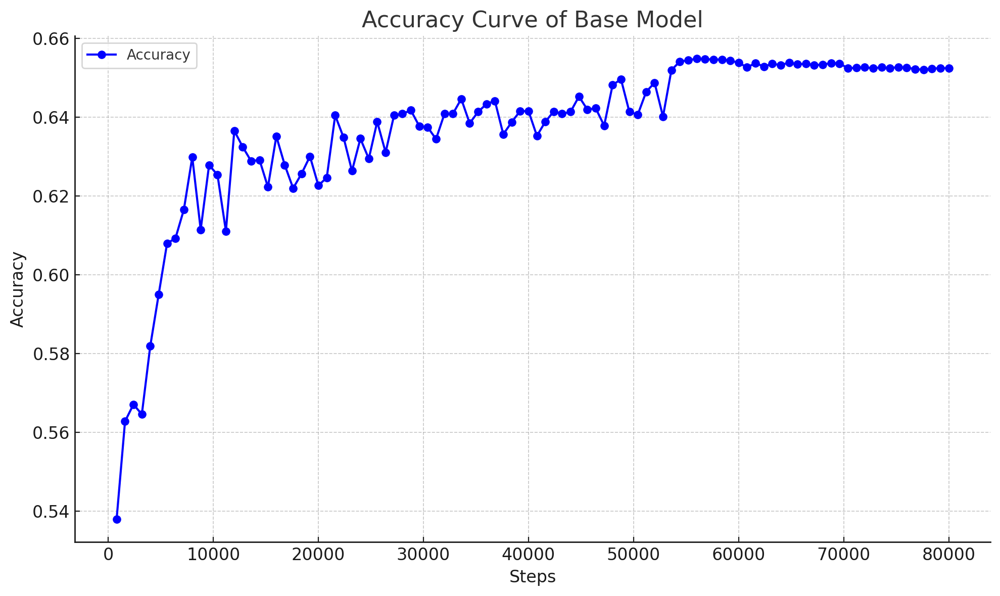

The results indicate that the basic model's performance is suboptimal, necessitating improvements through model architecture enhancements, hyperparameter tuning, or data augmentation strategies to optimize ViT's performance.

## Model Architecture

### Basic ViT Model Architecture

In the original paper, the authors used images of size 224x224 and a patch size of 16x16. Since we are using the CIFAR-10 dataset, where each image is 32x32, we did not resize the images but used the original size and set the patch size to 4x4.

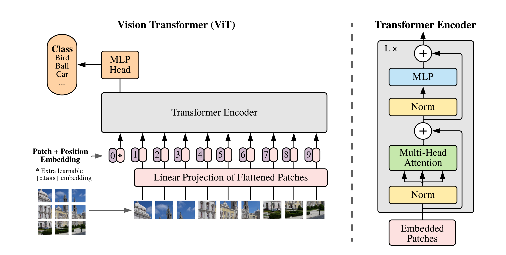

We named this model setting **ViT-Basic**.

### Hybrid Model Architecture

Referencing the integration of ViT and ResNet in the original paper, we proposed hybrid models tailored to the CIFAR-10 dataset, divided into two hyperparameter settings:
- Three downsampling operations, resulting in a feature map size of 4x4 with 256 channels, and setting ViT's patch size to 1x1.
- Two downsampling operations, resulting in a feature map size of 8x8 with 256 channels, and setting the patch size to 1x1.

We named these settings **ViT-Hybrid-1** and **ViT-Hybrid-2**, respectively.

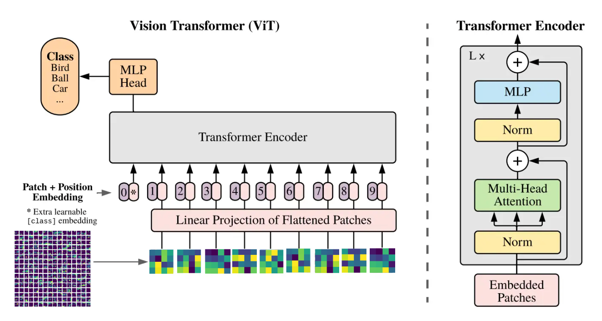

## Model Architecture Research

In this section, we explored several model settings. Specific parameter configurations and model parameter counts can be found in Appendix A.

### Impact of Number of Self-Attention Heads in Transformer

Using **ViT-Hybrid-2**, we explored the impact of the number of self-attention heads on model performance, yielding the results in the figure below.

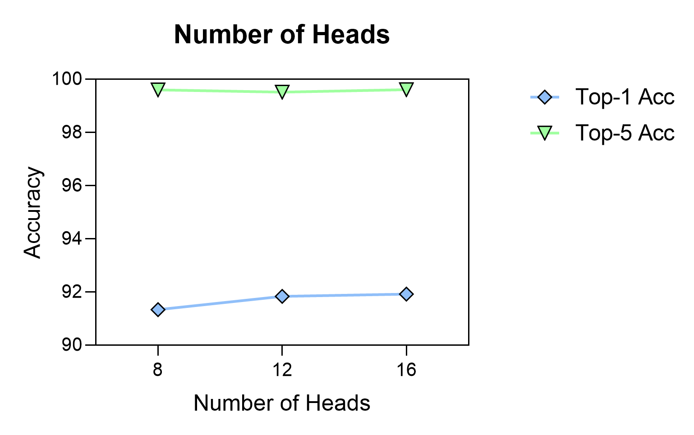

Focusing on **Top-1 Accuracy**, with other parameters at default settings, the model's performance improves as the number of heads increases. This can be understood as more heads allowing for finer understanding of input images. The performance gain from 12 to 16 heads is smaller than from 8 to 12. Thus, 12 heads is the optimal choice, balancing performance and efficiency, while 16 heads offer marginal additional benefits.

### Impact of Number of Transformer Blocks

Still using **ViT-Hybrid-2**, we explored the impact of the number of Transformer blocks on performance, as shown below.

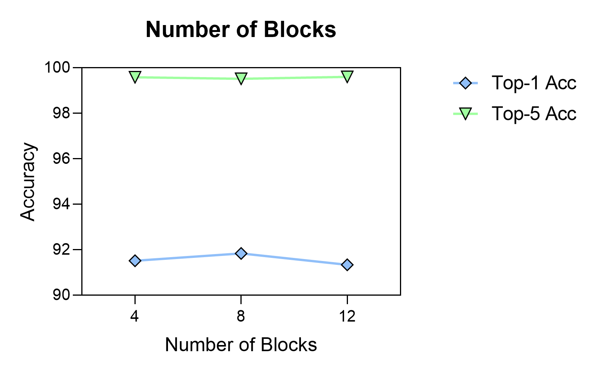

Observing **Top-1 Accuracy**, with default settings for other parameters, performance first increases and then decreases as layers increase. With 4 layers, the model may be too simple; with 12 layers, it may be too complex, leading to optimization difficulties under fixed iterations. Thus, 8 layers is optimal under the same iteration count.

### Impact of Patch Size

Using **ViT-Basic**, we explored the impact of patch size on performance.

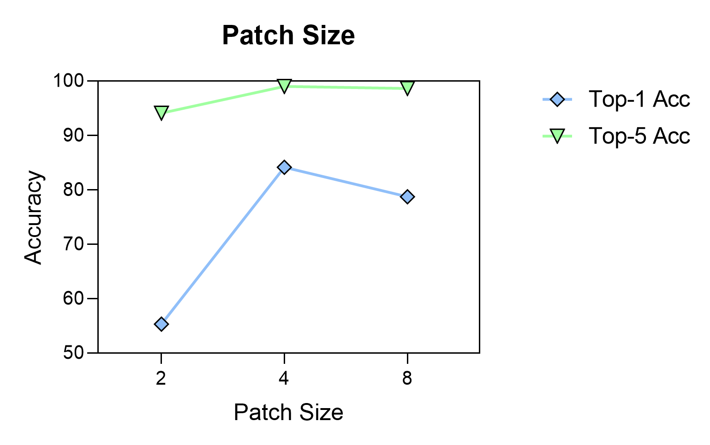

For **Top-1 Accuracy**, a patch size of 4 performs best, indicating that a moderate size effectively captures features. Sizes of 2 and 8 show significant drops, possibly due to insufficient information (too small) or loss of details (too large).

### Comparison of Hybrid and Original Models

We compared the performance of different hybrid models and the original model.

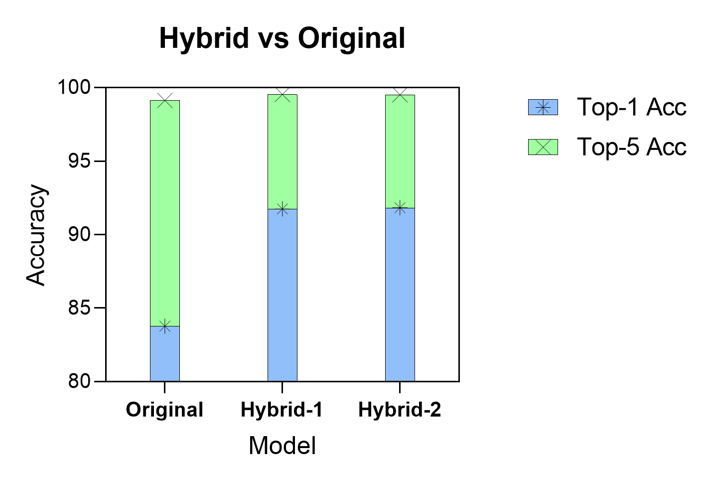

**Top-1 Accuracy** shows that both **ViT-Hybrid-1** and **ViT-Hybrid-2** outperform **ViT-Basic**, indicating that hybrid structures enhance feature extraction. The performance difference between 4x4 and 8x8 feature maps is minimal, suggesting limited impact from feature map size, possibly due to consistent channels or small original image size.

### Impact of Hidden Size and MLP Dimension

In ViT, hidden size and MLP dimension are crucial parameters. We kept MLP dim >= hidden size and conducted 5 experiments.

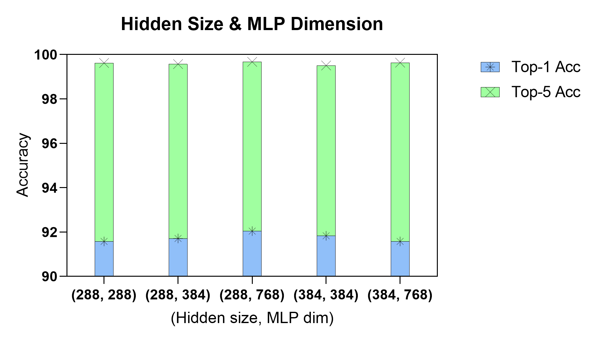

The optimal performance is at hidden size 288 and MLP dim 768. Larger values increase capacity but may cause optimization issues or overfitting on small datasets like ours.

## Regularization Exploration

Using **ViT-Hybrid-2**, we explored three basic regularization methods and the more advanced stochastic depth.

### Basic Regularization Methods

We examined **Weight Decay**, **Attention Dropout**, and **Dropout** with varying parameters.

<embed src="Figs/WD_DP_ADP_cropped.pdf" type="application/pdf" width="100%" height="600px" />

For **Weight Decay**, performance improves as λ decreases, stabilizing after 5e-4, matching no-decay levels. Large λ may over-penalize weights, leading to underfitting. The model shows strong robustness across different attention and dropout rates.

### Stochastic Depth Method

Our stochastic depth method skips blocks with probability p, as shown below. The expected number of updated blocks is:

$$ \mathbb{E}[N_{update}] = N_{block} \times (1 - p) $$

We experimented with different p values.

<embed src="Figs/SD_cropped.pdf" type="application/pdf" width="100%" height="600px" />

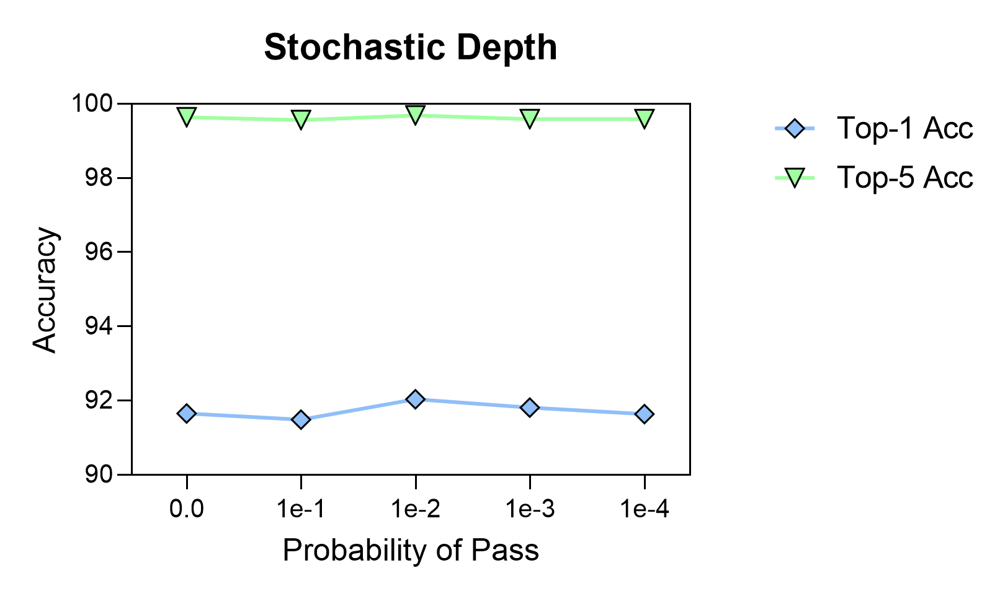

Large p slightly degrades performance due to fewer and unstable updates. Moderate p (e.g., 1e-2) improves performance, possibly aiding generalization by randomly skipping blocks.

## Data Augmentation

### Data Augmentation Methods

We combined official augmentation libraries with custom methods and used ablation studies to find optimal combinations:
- **AutoAugment**: Proposed by Google Brain in 2019, using 25 optimal sub-policies for CIFAR-10 [Cubuk et al., 2019].
- **RandAugment**: Proposed in 2020, using two hyperparameters $N$ and $M$ for unified augmentation [Cubuk et al., 2020].
- **Custom Augmentations**: CutMix, MixUp, RandomCropPaste.
  - **CutMix**: Randomly selects two images, uses $\beta$ distribution for $\lambda$, replaces a region, and weights labels.
  - **MixUp**: Mixes two images pixel-wise with $\lambda$ from $\beta$ distribution, weighting labels.
  - **RandomCropPaste**: Crops a region from the image, flips with probability, and pastes back with linear fusion.

We chose RandAugment for its ease of tuning and combined it with ['None', 'RandAugment'] + ['None', 'CutMix', 'MixUp', 'RandomCropPaste', 'Batch_Random'].

Here are some images before and after augmentation:

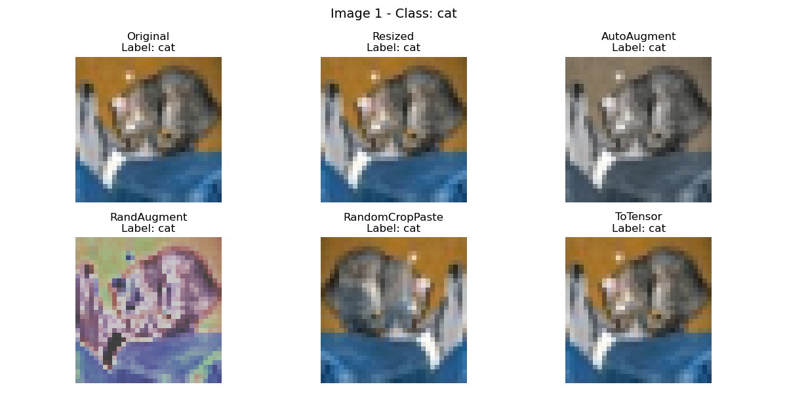 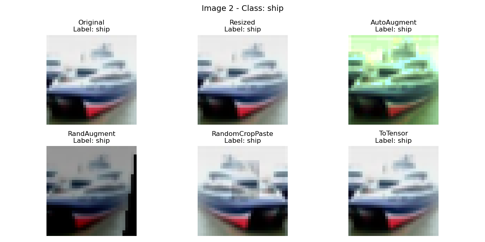  
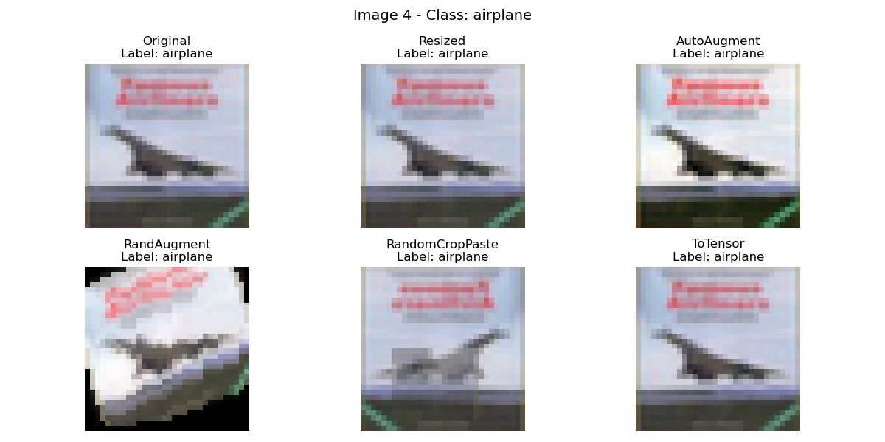 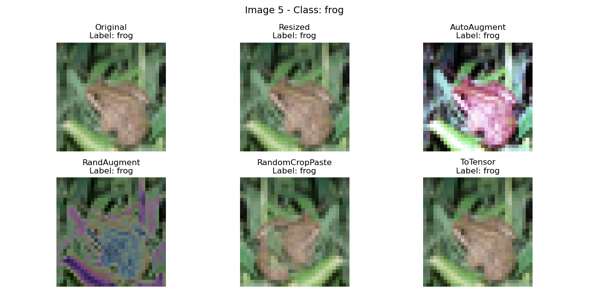  
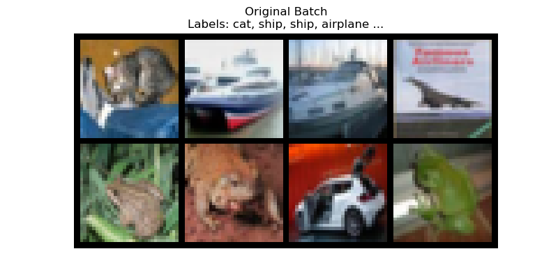   
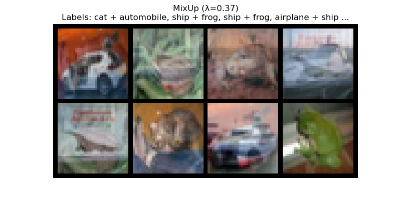 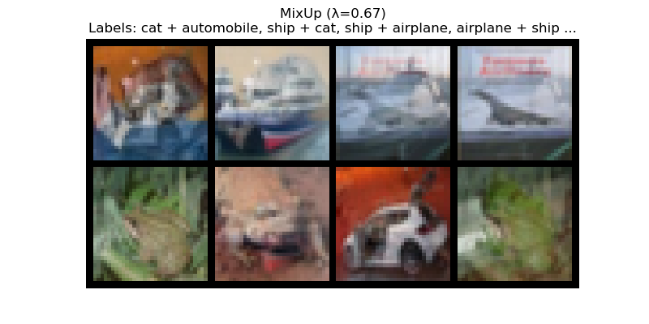  
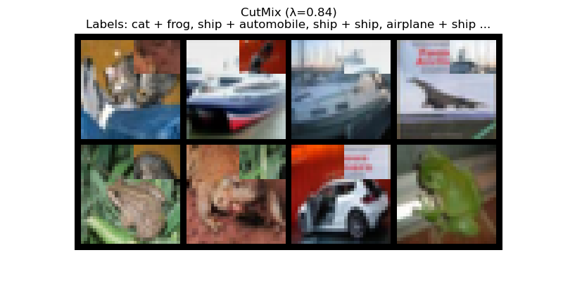 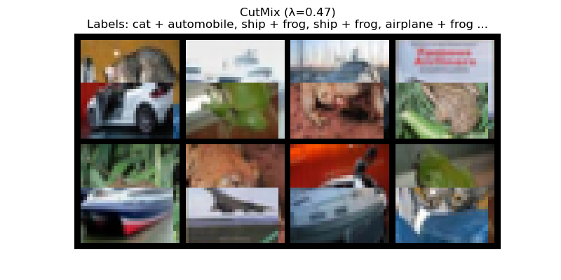

### RandAugment Effects

Ablation experiments controlling custom augmentations:

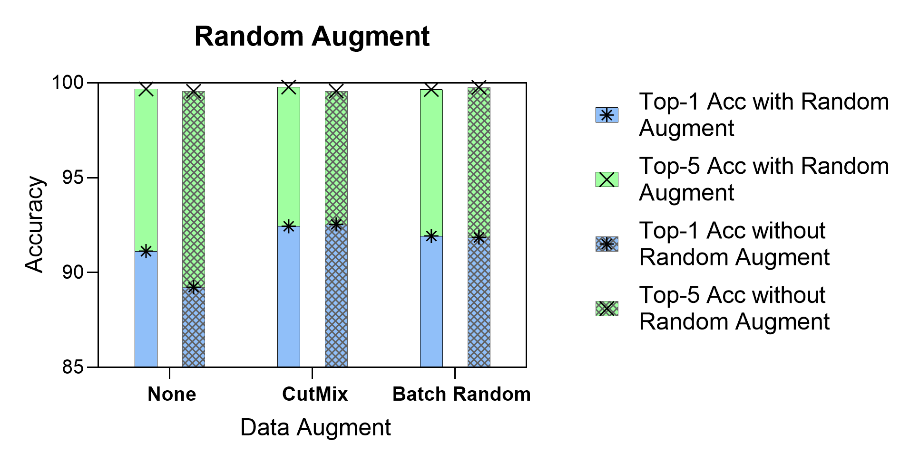

RandAugment shows good properties: it achieves solid results without complex augmentations and uses less memory (~7000 MiB vs. ~14000 MiB for CutMix/Batch Random).

### Custom Augmentation Effects

Ablation without RandAugment:

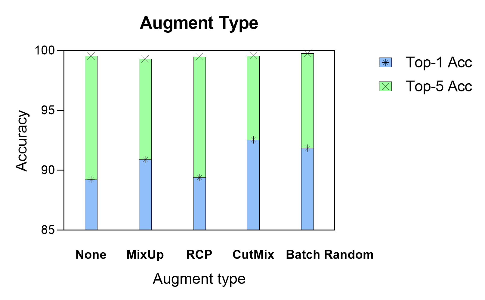

CutMix or batch-random custom augmentations yield the best training effects.

## Visualization

Following the original ViT paper, we conducted the following visualizations.

### Attention Maps

Using our optimal model, we visualized attention following [Abnar et al., 2020].

<embed src="Figs/Attention_Map.pdf" type="application/pdf" width="100%" height="600px" />

Left: Layers 1-4 from top to bottom; attention shifts with depth but focuses on class-relevant areas. Shallow layers focus locally, deeper ones globally, akin to CNN receptive fields. Right: Gradient map shows model outlines objects well, indicating strong discrimination.

### Feature Maps

To understand ResNet's contribution, we extracted features from **ViT-Hybrid-2** on the original image.

<embed src="Figs/Feature_Map_cropped.pdf" type="application/pdf" width="100%" height="600px" />

256 channels show redundancy but include maps representing contours and depth. For 32x32 images, 256 channels may be excessive, warranting further study.

### Patch Embedding Visualization

We visualized the first 28 principal components of the convolution in Patch Embedding using **ViT-Basic**.

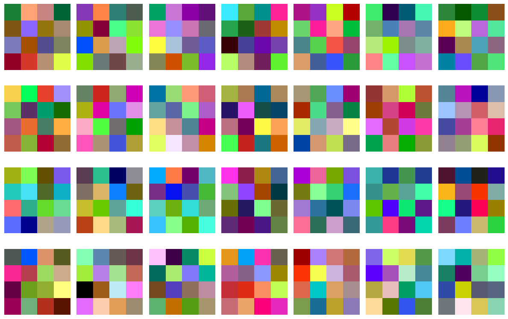

Our results lack strong interpretability compared to the original, due to small patch size from using original 32x32 images.

### Attention Distance

We observed attention distances across depths and heads.

<embed src="Figs/Attention_Distance.pdf" type="application/pdf" width="100%" height="600px" />

Average distance increases and saturates with depth, showing shallow layers capture local features, deeper ones global. Head distributions concentrate with depth, possibly due to feature refinement.

### Position Embedding Similarity

The original paper compared position encodings; we used learnable ones and examined similarities.

<embed src="Figs/position_embedding_similarity_cropped.pdf" type="application/pdf" width="100%" height="600px" />

Using optimal **ViT-Basic** and **ViT-Hybrid-2**, we found off-diagonal maxima parallel to the diagonal, suggesting strong 2D spatial representation (8x8 patches). The cls_token (patch 0) has weak correlations. In hybrids, patterns weaken due to ResNet compressing spatial info.

## Experimental Results

### Summary of Ablation Experiments

We tuned hyperparameters via ablations on architecture, regularization, and augmentation. Details in Appendix A.

### Optimal Model

Our best from-scratch model (**Cifar_No_3**) achieves 92.54% Top-1 and 99.57% Top-5 on CIFAR-10.

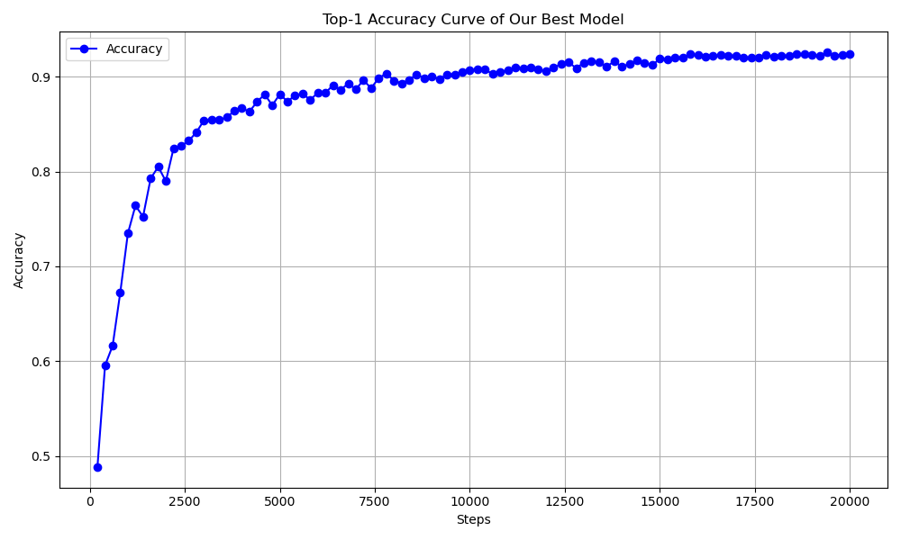 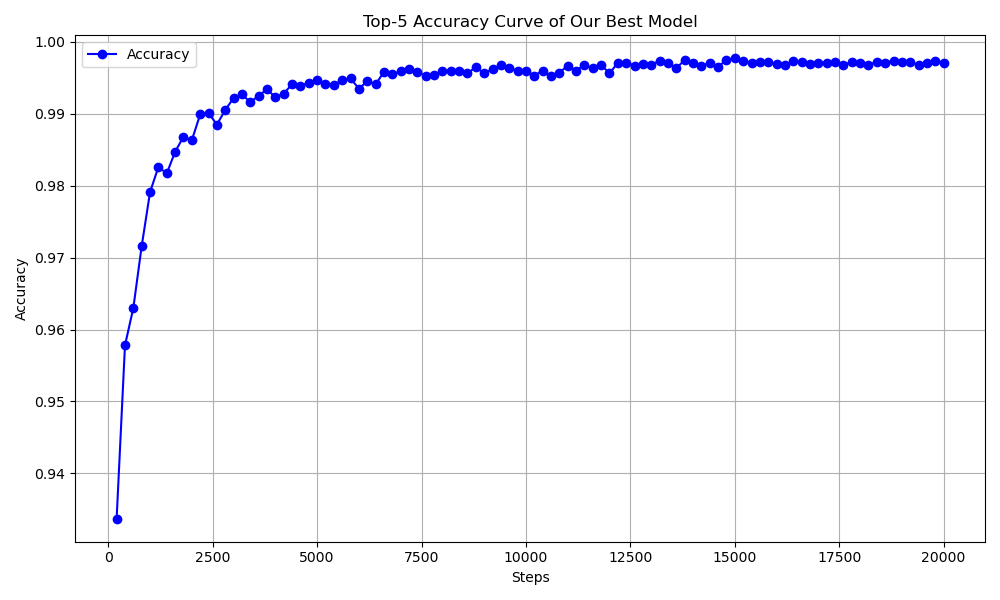  
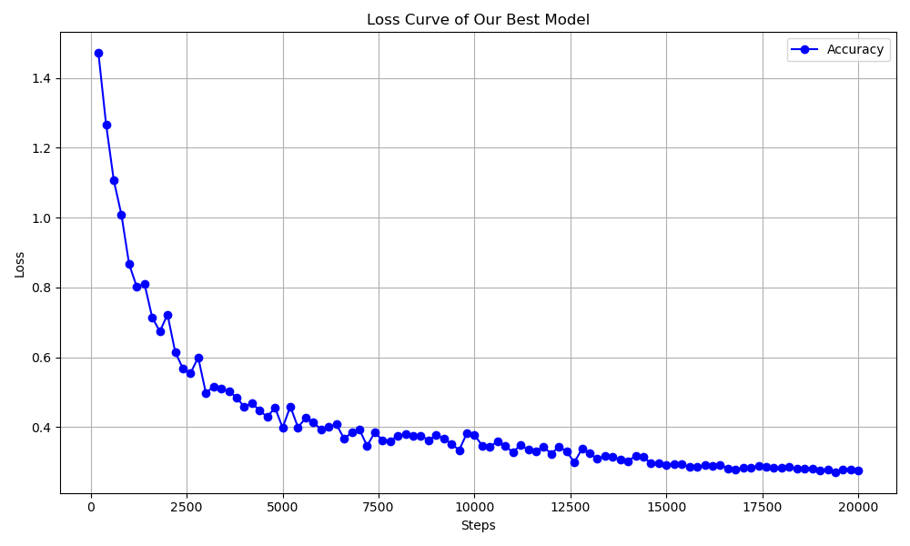 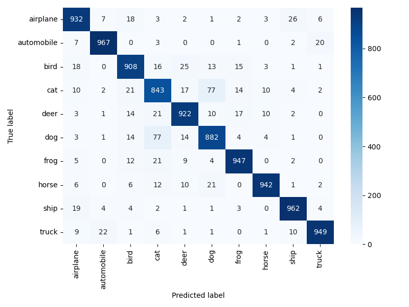

Parameters:

| LR    | WD    | DP  | ADP | SD    | RAUG | AUG    | MU  | CM  | RCP       |
|-------|-------|-----|-----|-------|------|--------|-----|-----|-----------|
| 1e-3  | 5e-5  | 0.0 | 0.0 | 1e-3  | False| cutmix | 0.2 | 0.8 | (1.0, 0.5)|

| Res | #B | #H | HS  | MD  | PS | Area | Top-1 | Top-5 | PRM |
|-----|----|----|-----|-----|----|------|-------|-------|-----|
| 2   | 8  | 12 | 384 | 384 | xx | AUG  | 92.54 | 99.57 | 9.18|

## Comparison with Traditional CNNs

To evaluate our ViT on CIFAR-10, we compared it with classic CNNs like ResNet [He et al., 2016].

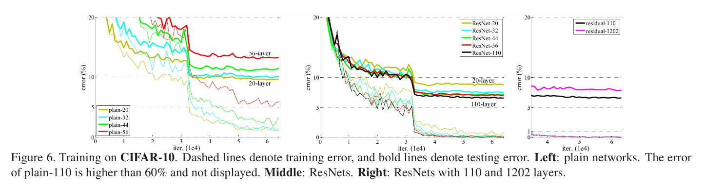  
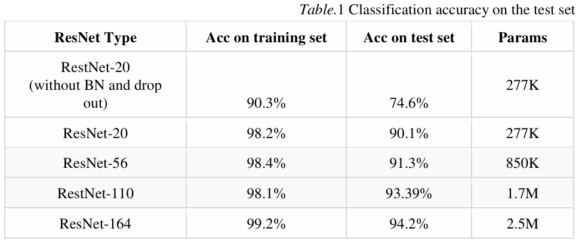

1. **Accuracy Comparison**:
   - **Top-1**: ViT outperforms ResNet-20 (+2.44 pp) and ResNet-56 (+1.24 pp) but lags ResNet-110 (-0.85 pp) and ResNet-164 (-1.66 pp).
   - **Top-5**: ViT at 99.57%, close to 100%; ResNet inferred ~99.7%, roughly equal.

2. **Parameter Efficiency**: ViT uses ~9.2M params (3.7x ResNet-164) but lower Top-1, indicating lower efficiency; reducing dimensions or sharing params could help.

3. **Convergence and Generalization**: ResNet converges after ~4e4 iterations with decay; our model after 15000 steps, showing higher efficiency.

Overall, our ViT approaches or surpasses some classic CNNs on small datasets like CIFAR-10.

## References

- Dosovitskiy et al. (2021). An Image is Worth 16x16 Words: Transformers for Image Recognition at Scale.
- Cubuk et al. (2019). AutoAugment: Learning Augmentation Strategies from Data.
- Cubuk et al. (2020). RandAugment: Practical Automated Data Augmentation with a Reduced Search Space.
- Abnar et al. (2020). Quantifying Attention Flow in Transformers.
- He et al. (2016). Deep Residual Learning for Image Recognition.

---

## Appendix

### A. Hyperparameters and Ablation Experiment Table

 **No.** | **LearningRate** | **WeightDecay** | **DropoutRate** | **AttentionDO** | **Prob_pass** | **RAUG** | **AUG** | **MixUp** | **CutMix** | **RandomCropPaste** | **Res** | **#Block** | **#Head** | **Hidden_size** | **MLP_dim** | **Patch_size** | **Area** | **Top-1** | **Top-5**|**Parameter(MB)**
------|------|------|------|------|------|------|------|------|------|------|------|------|------|------|------|------|------|------|------|------
 **0** |1e-3|5e-5|0.0|0.0|1e-3|False|**None**|0.2|0.8|(1.0, 0.5)|2|8|12|384|384|   xx   | **AUG** |89.23|99.56|9.18
 **1** |1e-3|5e-5|0.0|0.0|1e-3|False|**mixup**|0.2|0.8|(1.0, 0.5)|2|8|12|384|384|   xx   | **AUG** |90.89|99.31|9.18
 **2** |1e-3|5e-5|0.0|0.0|1e-3|False|**random_crop_paste**|0.2|0.8|(1.0, 0.5)|2|8|12|384|384|   xx   | **AUG** |89.39|99.48|9.18
 **3** |1e-3|5e-5|0.0|0.0|1e-3|False|**cutmix**|0.2|0.8|(1.0, 0.5)|2|8|12|384|384|   xx   | **AUG** |92.54|99.57|9.18
 **4** |1e-3|5e-5|0.0|0.0|1e-3|False|**batch_random**|0.2|0.8|(1.0, 0.5)|2|8|12|384|384|   xx   | **AUG** |91.86|99.77|9.18
 **5** |1e-3|5e-5|0.0|0.0|**0.0**|False|batch_random|0.2|0.8|(1.0, 0.5)|2|8|12|384|384|   xx   | **SD** |91.65|99.64|9.18
 **6** |1e-3|5e-5|0.0|0.0|**1e-1**|False|batch_random|0.2|0.8|(1.0, 0.5)|2|8|12|384|384|   xx   | **SD** |91.49|99.56|9.18
 **7** |1e-3|5e-5|0.0|0.0|**1e-2**|False|batch_random|0.2|0.8|(1.0, 0.5)|2|8|12|384|384|   xx   | **SD** |92.04|99.69|9.18
 **8** |1e-3|5e-5|0.0|0.0|**1e-3**|False|batch_random|0.2|0.8|(1.0, 0.5)|2|8|12|384|384|   xx   | **SD** |91.81|99.59|9.18
 **9** |1e-3|5e-5|0.0|0.0|**1e-4**|False|batch_random|0.2|0.8|(1.0, 0.5)|2|8|12|384|384|   xx   | **SD** |91.64|99.59|9.18
 **10** |1e-3|**0.0**|0.0|0.0|1e-3|False|batch_random|0.2|0.8|(1.0, 0.5)|2|8|12|384|384|   xx   | **WD** |90.35|99.59|9.18
 **11** |1e-3|**5e-1**|0.0|0.0|1e-3|False|batch_random|0.2|0.8|(1.0, 0.5)|2|8|12|384|384|   xx   | **WD**|31.62|86.45|9.18
 **12** |1e-3|**5e-2**|0.0|0.0|1e-3|False|batch_random|0.2|0.8|(1.0, 0.5)|2|8|12|384|384|   xx   | **WD**|39.28|89.76|9.18
 **13** |1e-3|**5e-3**|0.0|0.0|1e-3|False|batch_random|0.2|0.8|(1.0, 0.5)|2|8|12|384|384|   xx   | **WD**|85.93|99.27|9.18
 **14** |1e-3|**5e-4**|0.0|0.0|1e-3|False|batch_random|0.2|0.8|(1.0, 0.5)|2|8|12|384|384|   xx   | **WD**|91.64|99.61|9.18
 **15** |1e-3|**5e-5**|0.0|0.0|1e-3|False|batch_random|0.2|0.8|(1.0, 0.5)|2|8|12|384|384|   xx   | **WD**|91.81|99.57|9.18
 **16** |1e-3|5e-5|  **0.0**  |0.0|1e-3|False|batch_random|0.2|0.8|(1.0, 0.5)|2|8|12|384|384|   xx   | **DP**|91.62|99.65|9.18
 **17** |1e-3|5e-5|  **1e-1** |0.0|1e-3|False|batch_random|0.2|0.8|(1.0, 0.5)|2|8|12|384|384|   xx   | **DP**|91.97|99.65|9.18
 **18** |1e-3|5e-5|  **1e-2** |0.0|1e-3|False|batch_random|0.2|0.8|(1.0, 0.5)|2|8|12|384|384|   xx   | **DP**|91.80|99.60|9.18
 **19** |1e-3|5e-5|  **1e-3** |0.0|1e-3|False|batch_random|0.2|0.8|(1.0, 0.5)|2|8|12|384|384|   xx   | **DP**|91.70|99.59|9.18
 **20** |1e-3|5e-5|0.0|  **0.0**  |1e-3|False|batch_random|0.2|0.8|(1.0, 0.5)|2|8|12|384|384|   xx   | **ADP** |91.96|99.61|9.18
 **21** |1e-3|5e-5|0.0|  **1e-1** |1e-3|False|batch_random|0.2|0.8|(1.0, 0.5)|2|8|12|384|384|   xx   | **ADP** |91.74|99.65|9.18
 **22** |1e-3|5e-5|0.0|  **1e-2** |1e-3|False|batch_random|0.2|0.8|(1.0, 0.5)|2|8|12|384|384|   xx   | **ADP** |91.97|99.66|9.18
 **23** |1e-3|5e-5|0.0|  **1e-3** |1e-3|False|batch_random|0.2|0.8|(1.0, 0.5)|2|8|12|384|384|   xx   | **ADP** |91.92|99.63|9.18
 **24** |1e-3|5e-5|0.0|0.0|1e-3|False|batch_random|0.2|0.8|(1.0, 0.5)|**0**|8|12|384|384|  (4, 4)  | **Res** |83.77|99.13|7.16
 **25** |1e-3|5e-5|0.0|0.0|1e-3|False|batch_random|0.2|0.8|(1.0, 0.5)|**1**|8|12|384|384|  xx  | **Res** |91.75|99.54|9.85
 **26** |1e-3|5e-5|0.0|0.0|1e-3|False|batch_random|0.2|0.8|(1.0, 0.5)|**2**|8|12|384|384|  xx  | **Res** |91.83|99.51|9.18
 **27** |1e-3|5e-5|0.0|0.0|1e-3|False|batch_random|0.2|0.8|(1.0, 0.5)|0|8|12|384|384|  **(2, 2)**  | **PS** |55.32|94.10|7.22
 **28** |1e-3|5e-5|0.0|0.0|1e-3|False|batch_random|0.2|0.8|(1.0, 0.5)|0|8|12|384|384|  **(4, 4)**  | **PS** |84.15|99.00|7.16
 **29** |1e-3|5e-5|0.0|0.0|1e-3|False|batch_random|0.2|0.8|(1.0, 0.5)|0|8|12|384|384|  **(8, 8)**  | **PS** |78.72|98.61|7.19
 **30** |1e-3|5e-5|0.0|0.0|1e-3|False|batch_random|0.2|0.8|(1.0, 0.5)|0|**4**|12|384|384|  xx  | **NB** |91.51|99.58|5.63
 **31** |1e-3|5e-5|0.0|0.0|1e-3|False|batch_random|0.2|0.8|(1.0, 0.5)|0|**12**|12|384|384|  xx  | **NB** |91.66|99.58|12.74
 **32** |1e-3|5e-5|0.0|0.0|1e-3|False|batch_random|0.2|0.8|(1.0, 0.5)|0|8|**8**|384|384|  xx  | **NH** |91.33|99.60|9.18
 **33** |1e-3|5e-5|0.0|0.0|1e-3|False|batch_random|0.2|0.8|(1.0, 0.5)|0|8|**16**|384|384|  xx  | **NH** |91.92|99.61|9.18
 **34** |1e-3|5e-5|0.0|0.0|1e-3|False|batch_random|0.2|0.8|(1.0, 0.5)|0|8|12|**288**|**288**|  xx  | **HS&MLP_dim** |91.58|99.62|6.05
 **35** |1e-3|5e-5|0.0|0.0|1e-3|False|batch_random|0.2|0.8|(1.0, 0.5)|0|8|12|**288**|**384**|  xx  | **HS&MLP_dim** |91.71|99.57|6.49
 **36** |1e-3|5e-5|0.0|0.0|1e-3|False|batch_random|0.2|0.8|(1.0, 0.5)|0|8|12|**288**|**768**|  xx  | **HS&MLP_dim** |92.04|99.67|8.26
 **37** |1e-3|5e-5|0.0|0.0|1e-3|False|batch_random|0.2|0.8|(1.0, 0.5)|0|8|12|**384**|**768**|  xx  | **HS&MLP_dim** |91.58|99.64|11.55
 **38** |1e-3|5e-5|0.0|0.0|1e-3|False|cutmix|0.2|2.0(weak)|(1.0, 0.5)|0|8|12|384|384|  xx  | **CM** |92.21|99.74|9.18
 **39** |1e-3|5e-5|0.0|0.0|1e-3|False|cutmix|0.2|0.1(strong)|(1.0, 0.5)|0|8|12|384|384|  xx  | **CM** |92.35|99.69|9.18
 **40** |1e-3|5e-5|0.0|0.0|1e-3|False|mixup|0.8(random)|0.8|(1.0, 0.5)|0|8|12|384|384|  xx  | **MU** |91.55|99.33|9.18
 **41** |1e-3|5e-5|0.0|0.0|1e-3|False|mixup|2.5(strong)|0.8|(1.0, 0.5)|0|8|12|384|384|  xx  | **MU** |91.43|99.59|9.18
 **Best_0** |1e-3|5e-5|1e-2|1e-2|1e-2|False|cutmix|0.2|0.8|(1.0, 0.5)|0|8|12|384|384|  xx  | **Find_Best** |

### B. Parameter Tuning Table

**NO.** | **aug_type** | **cutmix** | **mixup** | **random_crop** | **rand_aug** |**(HL,MLP)**| **top_1** | **top_5** 
------|------|------|------|------|------|------|------|------
**Test_1**| **Cutmix** | 0.8 | xx | xx | **(2,9)**|xx|0.9142 | 0.9974
**Test_2**| **None** | xx | xx | xx | **(2,9)** |xx|0.8918 | 0.9941
**Test_3**| **batch_random** | 0.8 | 2.5 | (1.0,0.8) | **(4,15)**|xx|0.9193|0.9966
**Test_4**| **None** | xx | xx | xx | **(4,15)** |xx|0.9113|0.9968
**Test_5**| **None** | xx | xx | xx | **(4,15)** |xx|0.9117|0.9968
**Test_6**| **Cutmix** | 0.8 | xx | xx | **(4,15)** |xx|0.9225|0.9971
**Test_7**| **Mixup** | xx | 2.5 | xx | **(4,15)** |xx|0.9130|0.9966
**Test_8**| **Cutmix** | 0.8 | xx | xx | **(3,15)** |xx|0.9232|0.9980
**Test_9**| **Cutmix** | 0.8 | xx | xx | **(4,15)** |**(288,768)**|0.9244|0.9978
**Test_10**| **Cutmix** | 0.8 | xx | xx | **(2,15)** |xx|0.9228|0.9974
**Test_11**| **Cutmix** | 0.8 | xx | xx | False |**(288,768)**|0.9229|0.9968

### C. Symbols and Abbreviations

| Symbol/Abbrev | Meaning                  |
|---------------|--------------------------|
| LR            | Learning Rate            |
| WD            | Weight Decay             |
| DP            | Dropout Rate             |
| ADP           | Attention Dropout Rate   |
| SD            | Stochastic Depth         |
| RAUG          | RandAugment Enabled      |
| AUG           | Augmentation Strategy    |
| MU            | MixUp Parameter          |
| CM            | CutMix Parameter         |
| RCP           | Random Crop Paste Params |
| Res           | ResNet Variant           |
| #B            | Number of Blocks         |
| #H            | Number of Heads          |
| HS            | Hidden Size              |
| MD            | MLP Dimension            |
| PS            | Patch Size               |
| Area          | Ablation Study Area      |
| Top-1         | Top-1 Accuracy           |
| Top-5         | Top-5 Accuracy           |
| PRM           | Parameter Count (MiB)    |

### D. Experimental Hardware and Software Environment

- **GPU**: NVIDIA RTX 3090 × 4 (24 GB × 4)
- **CUDA**: 12.4  
- **Python**: 3.10.16
- **PyTorch**: 2.5.1  
- **TorchVision**: 0.20.1