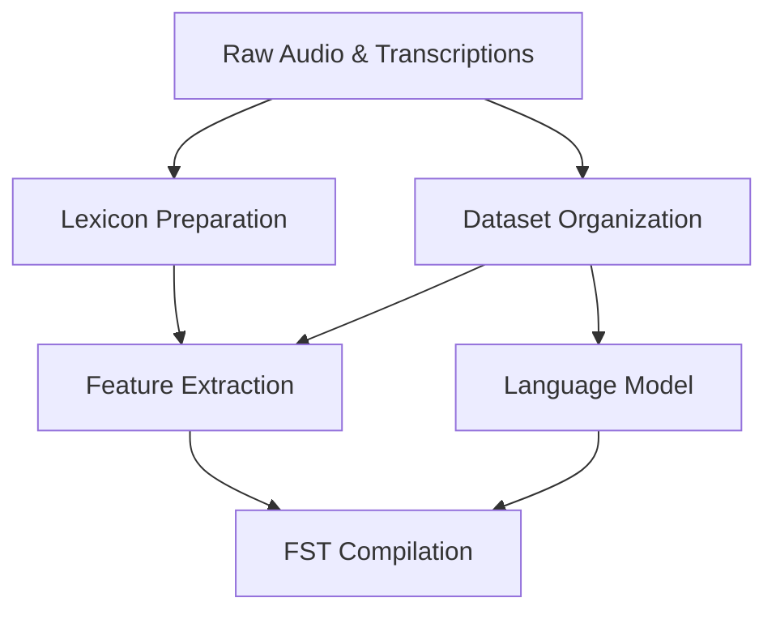
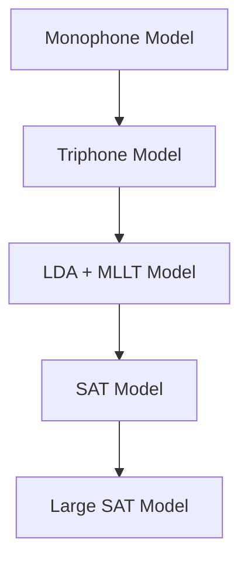

## Building an LVCSR System with Kaldi: My Hands-On Experience

Hello everyone! Recently, I dove into the world of Automatic Speech Recognition (ASR) by building a Large Vocabulary Continuous Speech Recognition (LVCSR) system using the Kaldi toolkit. I based my project on the open-source example recipe from Kaldi's [s5](https://github.com/SpringNuance/kaldi-ASR/tree/master/egs/mini_librispeech/s5) directory, tailored for Mandarin Chinese speech recognition using the AISHELL dataset. 

In this blog post, I'll share my journey, from data preparation to model training, the challenges I faced, and the results I achieved. If you're interested in ASR or just curious about speech tech, stick around! 🚀

For Chinese report, please see [this](/uploads/ASR.pdf) article.

### Project Overview

The goal was to set up an end-to-end LVCSR system capable of recognizing Mandarin speech. Kaldi is a powerful open-source toolkit for speech recognition, and the AISHELL recipe provides a solid starting point. The system follows a standard pipeline: data processing, feature extraction, acoustic modeling with Gaussian Mixture Model-Hidden Markov Models (GMM-HMM), and evaluation using Word Error Rate (WER) and Character Error Rate (CER).

Here's a high-level flowchart of the data processing and feature extraction stage (inspired by the project diagram):

### Data Preparation and Feature Extraction

#### Data Setup
I started by downloading and unpacking the AISHELL dataset from www.openslr.org/resources/33. This includes audio files, transcripts, and resources like a lexicon. The recipe scripts handle this efficiently:

1. **Lexicon Preparation**: Using `aishell_prepare_dict.sh` to generate a pronunciation lexicon stored in `data/local/dict`.
2. **Data Organization**: `aishell_data_prep.sh` formats the audio and transcripts into Kaldi-compatible directories: `data/train`, `data/dev`, and `data/test`.

In my setup, these steps were pre-done in the provided environment, so I could jump right in.

#### Language and Lexicon Handling
This part prepares the language model and lexicon for decoding:

1. **Phoneme Set Preparation**: Scripts like `utils/prepare_lang.sh` create a language directory (`data/lang`) with a non-position-dependent phoneme set to simplify initial modeling.
2. **Language Model Training**: Train an unpruned 3-gram language model using `local/aishell_train_lms.sh` based on the dataset's text.
3. **Graph Compilation**: Integrate the LM with the lexicon via `utils/format_lm.sh` to create `data/lang_test` for decoding.

#### Acoustic Feature Extraction
Features are the bridge from raw audio to models. I extracted Mel-Frequency Cepstral Coefficients (MFCC) plus pitch:

- Use `steps/make_mfcc_pitch.sh` for train/dev/test sets.
- Compute Cepstral Mean and Variance Normalization (CMVN) with `steps/compute_cmvn_stats.sh` to normalize features and reduce speaker/environment variations. The formula for CMVN is:

  \[ X'_{t,d} = \frac{X_{t,d} - \mu_d}{\sigma_d} \]

- Validate data with `utils/fix_data_dir.sh` to ensure consistency.

I ran into an issue here: During feature extraction, I got an error about missing `utt2num_frames` files. It turned out the `--write-utt2num-frames true` flag needed explicit reinforcement in the run script—problem solved!

### Model Training: GMM-HMM Approach

The acoustic modeling uses a progressive GMM-HMM training strategy, starting simple and building complexity. The flow is: Monophone → Triphone → LDA+MLLT → SAT → Larger SAT.

#### Stage 1: Monophone Model
Train a basic monophone model (`mono`) using `train_mono.sh`. It initializes with equal alignments, adds delta features, and iterates 40 times, increasing Gaussian components dynamically.

#### Stage 2: Triphone Models
Introduce context with triphones (`tri1` and `tri2`) via `train_deltas.sh`. Alignments come from previous models using `steps/align_si.sh`. This captures co-articulation effects better.

#### Stage 3: LDA+MLLT Triphone
Enhance features with Linear Discriminant Analysis (LDA) for class separability and Maximum Likelihood Linear Transform (MLLT) for covariance optimization. Train `tri3a` with `train_lda_mllt.sh`.

Key equations:
- Within-class scatter: \( S_W = \sum_{i=1}^C \sum_{x \in X_i} (x - \mu_i)(x - \mu_i)^T \)
- Between-class scatter: \( S_B = \sum_{i=1}^C N_i (\mu_i - \mu)(\mu_i - \mu)^T \)

#### Stage 4: Speaker Adaptive Training (SAT)
Train `tri4a` with `train_sat.sh` and feature-space MLLR (fMLLR) alignments via `steps/align_fmllr.sh`. fMLLR assumes speaker-adapted codebooks via linear transforms: \( SA = A \cdot x + b \).

#### Stage 5: Larger SAT Model
Scale up to `tri5a` with more leaves (3500) and Gaussians (100,000) for finer modeling.

Challenges during training:
- **Memory Issues**: Compile graphs failed with OOM kills (exit code 137). Upped memory from 32GB to 64GB per 10 cores.
- **Scoring Script Permissions**: `local/score.sh` lacked execute permissions—added them with `chmod +x`.

### Experimental Results

After training and decoding, I evaluated on the test set. Results show steady improvements:

| Model | WER (%) | CER (%) |
|-------|---------|---------|
| mono  | 45.85  | 36.65  |
| tri1  | 28.64  | 18.79  |
| tri2  | 28.50  | 18.66  |
| tri3a | 26.82  | 16.87  |
| tri4a | 23.56  | 13.70  |
| tri5a | 21.69  | 12.13  |

WER and CER drop progressively, highlighting benefits like context modeling (mono to tri1), feature transforms (tri2 to tri3a), and speaker adaptation (tri3a to tri4a). Scaling Gaussians gives marginal gains, suggesting GMM-HMM limits.

For SAT models, Speaker-Adaptive Decoding (SA) outperforms Speaker-Independent (SI):

| Model | Decoding | WER (%) | CER (%) |
|-------|----------|---------|---------|
| tri4a | SI       | 29.26  | 19.29  |
| tri4a | SA       | 23.56  | 13.70  |
| tri5a | SI       | 26.62  | 16.74  |
| tri5a | SA       | 21.69  | 12.13  |

Best performance: CER = 12.13%, WER = 21.69% with tri5a (SA-decoding).

### Final Thoughts

This project was a fantastic learning experience, demystifying ASR pipelines and Kaldi's internals. GMM-HMM provides a strong baseline, but I'm excited to explore DNN-based models next for even better accuracy. If you're starting with Kaldi, focus on debugging scripts and resource allocation—it's worth it!

Have questions or tips? Drop a comment below. **Thanks for reading!** ❤️
