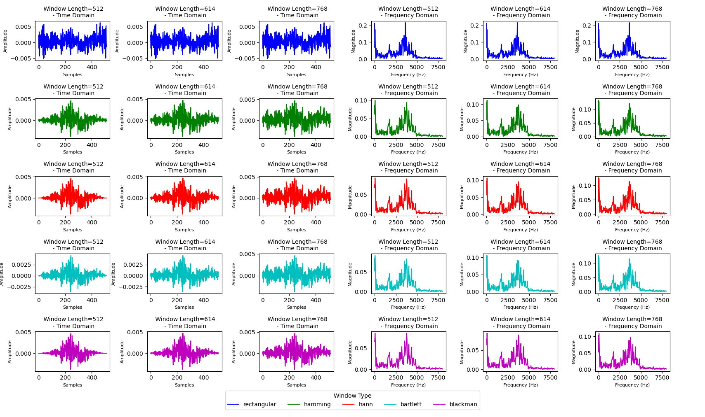
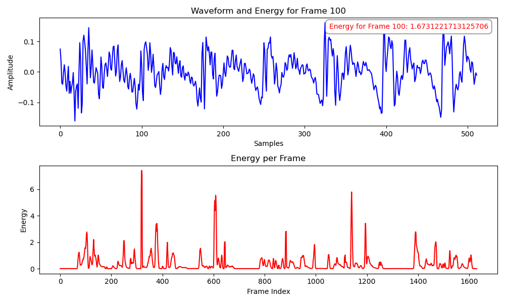
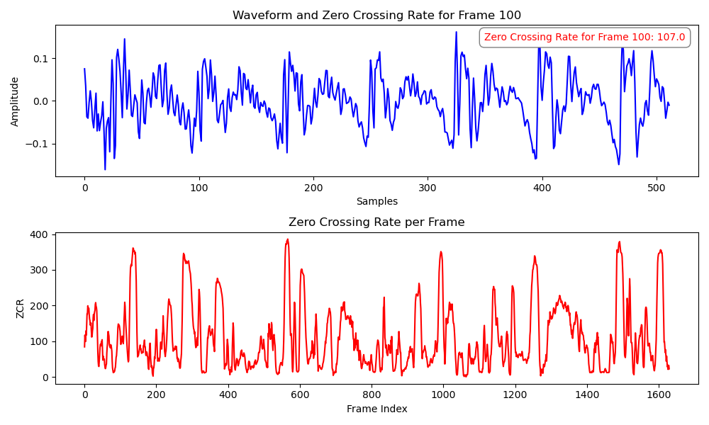
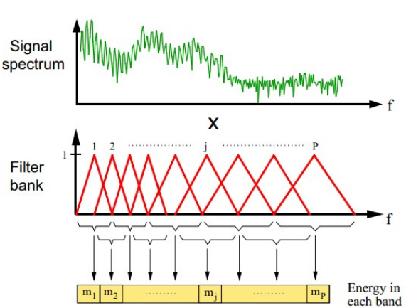
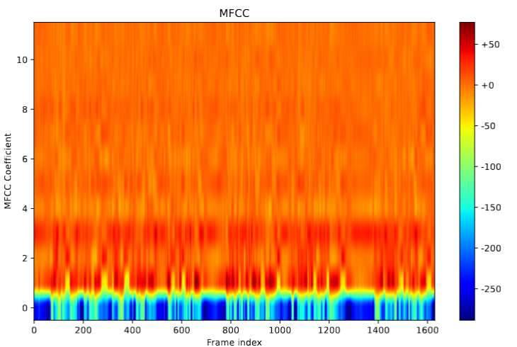
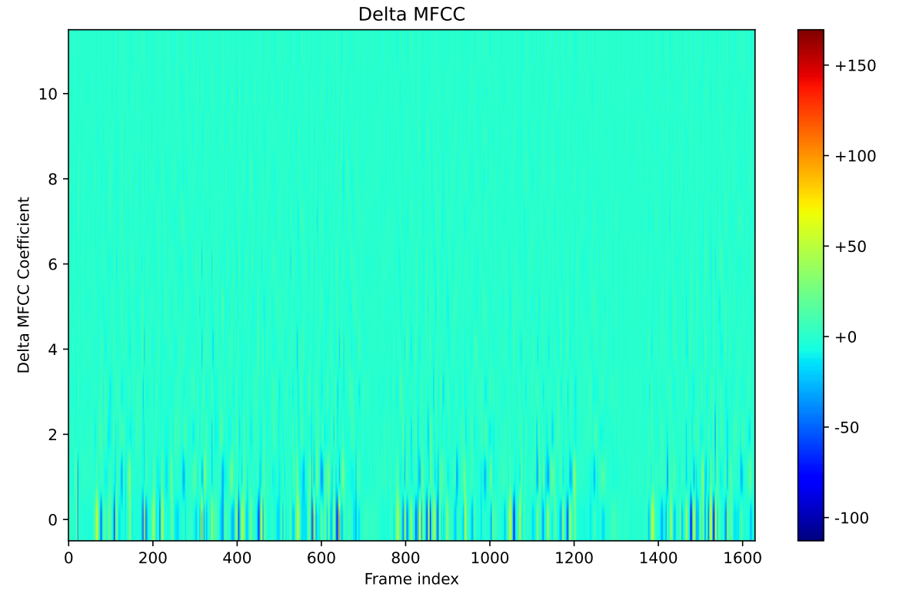
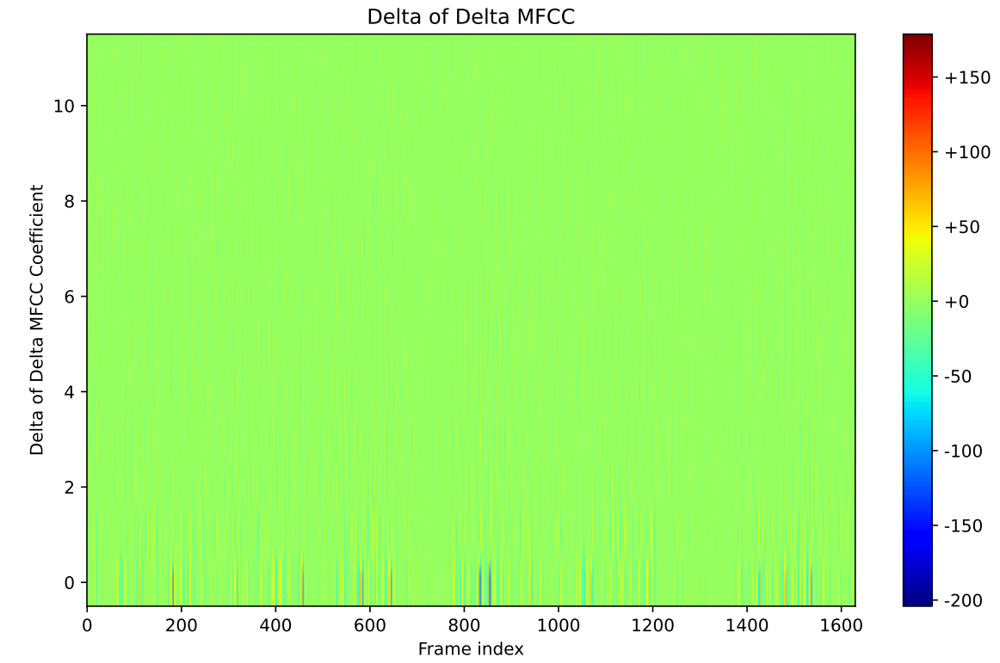
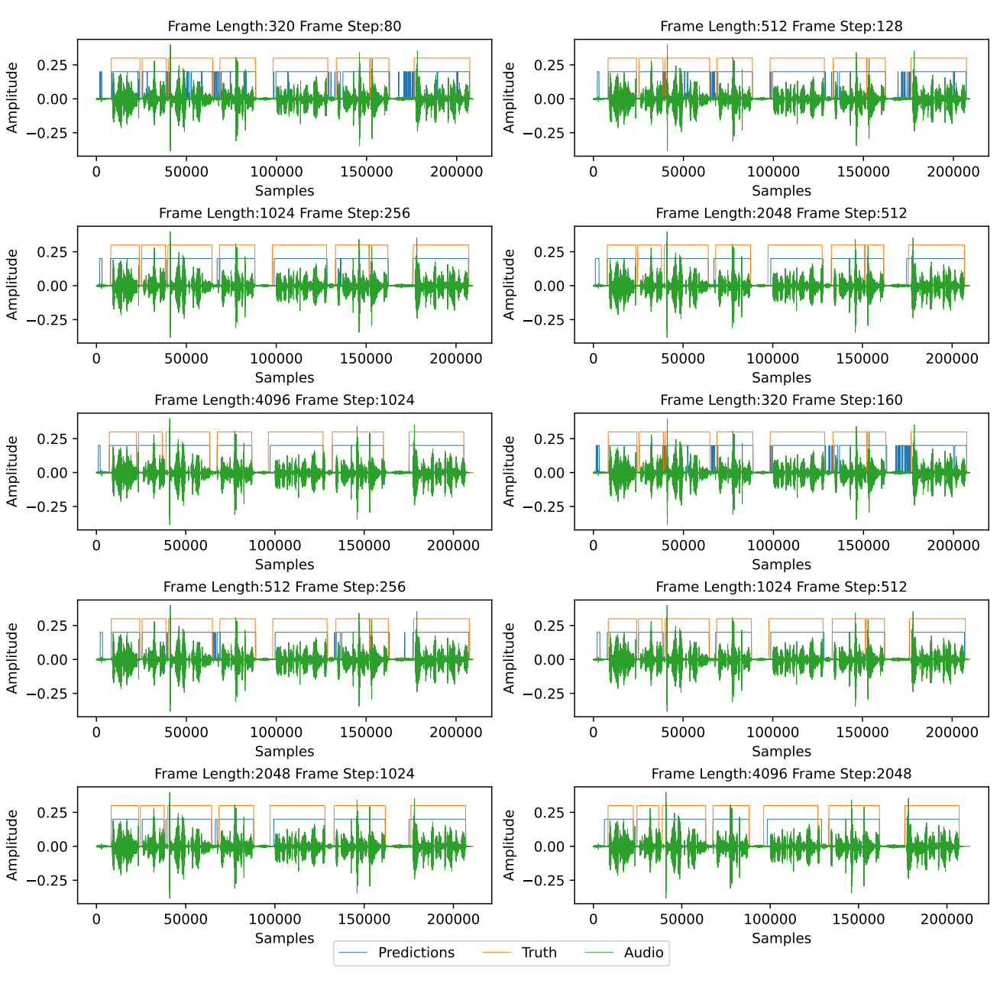

## Voice Activity Detection (VAD) Project

#### Summary

🎯 **Voice Activity Detection (VAD)**, or voice endpoint detection, identifies time segments in an audio signal containing speech. This is a critical preprocessing step for automatic speech recognition (ASR) and voice wake-up systems. This project lays the groundwork for my upcoming ASR project 🤭.

📈 **Workflow Overview**:
The VAD pipeline processes a speech signal as follows:
1. **Preprocessing**: Apply pre-emphasis to enhance high-frequency components.
2. **Framing**: Segment the signal into overlapping frames with frame-level labels.
3. **Windowing**: Apply window functions to mitigate boundary effects.
4. **Feature Extraction**: Extract a comprehensive set of features (e.g., short-time energy, zero-crossing rate, MFCCs, and more).
5. **Binary Classification**: Train models (DNN, Logistic Regression, Linear SVM, GMM) to classify frames as speech or non-speech.
6. **Time-Domain Restoration**: Convert frame-level predictions to time-domain speech segments.

🍻 **Project Highlights**:
I conducted extensive experiments comparing frame division methods (frame length and shift) and model performances, with rich visualizations. For details, see the report in `vad/latex/`. If you're interested in voice technologies, let's connect!


### Methodology


$$
\gamma_{n} = \frac{ \left | \left (\mathbf x_{n} - \mathbf x_{n-1} \right )^T \left [\nabla F (\mathbf x_{n}) - \nabla F (\mathbf x_{n-1}) \right ] \right |}{\left \|\nabla F(\mathbf{x}_{n}) - \nabla F(\mathbf{x}_{n-1}) \right \|^2}
$$


#### 1. Preprocessing
Pre-emphasis enhances high-frequency components to reduce spectral leakage.

<math xmlns="http://www.w3.org/1998/Math/MathML" display="block"><mi>y</mi><mo stretchy="false">[</mo><mi>n</mi><mo stretchy="false">]</mo><mo>=</mo><mi>x</mi><mo stretchy="false">[</mo><mi>n</mi><mo stretchy="false">]</mo><mo>−</mo><mi>α</mi><mi>x</mi><mo stretchy="false">[</mo><mi>n</mi><mo>−</mo><mn>1</mn><mo stretchy="false">]</mo></math>

where <math xmlns="http://www.w3.org/1998/Math/MathML" display=""><mi>x</mi><mo stretchy="false">[</mo><mi>n</mi><mo stretchy="false">]</mo></math> is the input signal, <math xmlns="http://www.w3.org/1998/Math/MathML" display=""><mi>y</mi><mo stretchy="false">[</mo><mi>n</mi><mo stretchy="false">]</mo></math> is the output, and <math xmlns="http://www.w3.org/1998/Math/MathML" display=""><mi>α</mi></math> (typically 0.95–0.97) controls emphasis strength.

- **Pre-emphasis Impact**: 

  Effect of pre-emphasis with varying <math xmlns="http://www.w3.org/1998/Math/MathML" display=""><mi>α</mi></math>

  

#### 2. Framing
The signal is divided into overlapping frames. For signal length <math xmlns="http://www.w3.org/1998/Math/MathML" display=""><mi>N</mi></math>, frame length <math xmlns="http://www.w3.org/1998/Math/MathML" display=""><mi>L</mi></math>, and frame shift <math xmlns="http://www.w3.org/1998/Math/MathML" display=""><mi>S</mi></math>, the number of frames <math xmlns="http://www.w3.org/1998/Math/MathML" display=""><msub><mi>n</mi><mrow><mtext>frames</mtext></mrow></msub></math> is:

- Without zero-padding (floor): 
    <math xmlns="http://www.w3.org/1998/Math/MathML" display="block"><msub><mi>n</mi><mrow><mtext>frames</mtext></mrow></msub><mo>=</mo><mrow data-mjx-texclass="INNER"><mo data-mjx-texclass="OPEN">⌊</mo><mfrac><mrow><mi>N</mi><mo>−</mo><mi>L</mi></mrow><mi>S</mi></mfrac><mo data-mjx-texclass="CLOSE">⌋</mo></mrow><mo>+</mo><mn>1</mn></math>


- With zero-padding (ceiling): 
    <math xmlns="http://www.w3.org/1998/Math/MathML" display="block"><msub><mi>n</mi><mrow><mtext>frames</mtext></mrow></msub><mo>=</mo><mrow data-mjx-texclass="INNER"><mo data-mjx-texclass="OPEN">⌈</mo><mfrac><mrow><mi>N</mi><mo>−</mo><mi>L</mi></mrow><mi>S</mi></mfrac><mo data-mjx-texclass="CLOSE">⌉</mo></mrow><mo>+</mo><mn>1</mn></math>
  Zero-padding length: 
    <math xmlns="http://www.w3.org/1998/Math/MathML" display="block"><msub><mi>n</mi><mrow><mtext>paddle</mtext></mrow></msub><mo>=</mo><mo stretchy="false">(</mo><msub><mi>n</mi><mrow><mtext>frames</mtext></mrow></msub><mo>−</mo><mn>1</mn><mo stretchy="false">)</mo><mo>⋅</mo><mi>S</mi><mo>+</mo><mi>L</mi><mo>−</mo><mi>N</mi></math>

#### 3. Windowing
A window function (e.g., Hamming) is applied to each frame.
<math xmlns="http://www.w3.org/1998/Math/MathML" display="block"><msubsup><mi>x</mi><mi>i</mi><mrow><mtext>windowed</mtext></mrow></msubsup><mo stretchy="false">[</mo><mi>n</mi><mo stretchy="false">]</mo><mo>=</mo><msub><mi>x</mi><mi>i</mi></msub><mo stretchy="false">[</mo><mi>n</mi><mo stretchy="false">]</mo><mo>⋅</mo><mi>w</mi><mo stretchy="false">[</mo><mi>n</mi><mo stretchy="false">]</mo><mo>,</mo><mstyle scriptlevel="0"><mspace width="2em" height="2em"></mspace></mstyle><mrow><mstyle mathsize="2.49em"></mstyle></mrow><mn>0</mn><mo>≤</mo><mi>n</mi><mo>&lt;</mo><mi>L</mi><mrow><mstyle mathsize="1.73em"></mstyle></mrow></math>

- **Window Type Comparison**: 

  Impact of window functions (e.g., Hamming, Hanning)

  

#### 4. Feature Extraction
Extracted features (total dimension: 69) include:

- **Short-Time Energy** (dimension: 1):

  Measures frame energy, indicating loudness:

  <math xmlns="http://www.w3.org/1998/Math/MathML" display="block"><mi>E</mi><mo>=</mo><munderover><mo data-mjx-texclass="OP">∑</mo><mrow><mi>i</mi><mo>=</mo><mn>0</mn></mrow><mrow><mi>L</mi><mo>−</mo><mn>1</mn></mrow></munderover><msubsup><mi>s</mi><mi>i</mi><mn>2</mn></msubsup></math> 
  where <math xmlns="http://www.w3.org/1998/Math/MathML" display=""><msub><mi>s</mi><mi>i</mi></msub></math> is the <math xmlns="http://www.w3.org/1998/Math/MathML" display=""><mi>i</mi></math>-th sample in the frame, and <math xmlns="http://www.w3.org/1998/Math/MathML" display=""><mi>L</mi></math> is the frame length.

  Frame-level energy plots:

  

- **Short-Time Zero-Crossing Rate** (dimension: 1):

  Counts zero crossings to distinguish voiced/unvoiced speech.

  <math xmlns="http://www.w3.org/1998/Math/MathML" display="block"><mi>Z</mi><mo>=</mo><mfrac><mn>1</mn><mn>2</mn></mfrac><munderover><mo data-mjx-texclass="OP">∑</mo><mrow><mi>i</mi><mo>=</mo><mn>0</mn></mrow><mrow><mi>L</mi><mo>−</mo><mn>1</mn></mrow></munderover><mrow data-mjx-texclass="INNER"><mo data-mjx-texclass="OPEN">|</mo><mtext>sgn</mtext><mo stretchy="false">(</mo><msub><mi>s</mi><mi>i</mi></msub><mo stretchy="false">)</mo><mo>−</mo><mtext>sgn</mtext><mo stretchy="false">(</mo><msub><mi>s</mi><mrow><mi>i</mi><mo>−</mo><mn>1</mn></mrow></msub><mo stretchy="false">)</mo><mo data-mjx-texclass="CLOSE">|</mo></mrow><mo>,</mo><mstyle scriptlevel="0"><mspace width="1em"></mspace></mstyle><mtext>sgn</mtext><mo stretchy="false">(</mo><mi>x</mi><mo stretchy="false">)</mo><mo>=</mo><mrow data-mjx-texclass="INNER"><mo data-mjx-texclass="OPEN">{</mo><mtable columnalign="left left" columnspacing="1em" rowspacing=".2em"><mtr><mtd><mn>1</mn><mo>,</mo></mtd><mtd><mi>x</mi><mo>≥</mo><mn>0</mn></mtd></mtr><mtr><mtd><mn>0</mn><mo>,</mo></mtd><mtd><mi>x</mi><mo>&lt;</mo><mn>0</mn></mtd></mtr></mtable><mo data-mjx-texclass="CLOSE" fence="true" stretchy="true" symmetric="true"></mo></mrow></math>

  Visualizing zero-crossing patterns:

  

- **Fundamental Frequency (Pitch)** (dimension: 1):

  Estimated via autocorrelation, representing the fundamental frequency. 
  
  <math xmlns="http://www.w3.org/1998/Math/MathML" display="block"><mi>R</mi><mo stretchy="false">(</mo><mi>τ</mi><mo stretchy="false">)</mo><mo>=</mo><munderover><mo data-mjx-texclass="OP">∑</mo><mrow><mi>n</mi><mo>=</mo><mn>0</mn></mrow><mrow><mi>L</mi><mo>−</mo><mn>1</mn><mo>−</mo><mi>τ</mi></mrow></munderover><mi>s</mi><mo stretchy="false">[</mo><mi>n</mi><mo stretchy="false">]</mo><mi>s</mi><mo stretchy="false">[</mo><mi>n</mi><mo>+</mo><mi>τ</mi><mo stretchy="false">]</mo><mo>,</mo><mstyle scriptlevel="0"><mspace width="1em"></mspace></mstyle><msub><mi>f</mi><mn>0</mn></msub><mo>=</mo><mfrac><msub><mi>f</mi><mi>s</mi></msub><msub><mi>τ</mi><mrow><mtext>max</mtext></mrow></msub></mfrac></math>

  where <math xmlns="http://www.w3.org/1998/Math/MathML" display=""><mi>R</mi><mo stretchy="false">(</mo><mi>τ</mi><mo stretchy="false">)</mo></math> is the autocorrelation, <math xmlns="http://www.w3.org/1998/Math/MathML" display=""><msub><mi>τ</mi><mrow><mtext>max</mtext></mrow></msub></math> is the lag maximizing <math xmlns="http://www.w3.org/1998/Math/MathML" display=""><mi>R</mi><mo stretchy="false">(</mo><mi>τ</mi><mo stretchy="false">)</mo></math>, <math xmlns="http://www.w3.org/1998/Math/MathML" display=""><msub><mi>f</mi><mi>s</mi></msub></math> is the sampling frequency (16 kHz), and <math xmlns="http://www.w3.org/1998/Math/MathML" display=""><mi>s</mi><mo stretchy="false">[</mo><mi>n</mi><mo stretchy="false">]</mo></math> is the frame signal.
  
  And I have tried many smooth methods, see it in my report.

- **Spectral Centroid** (dimension: 1):

  Indicates the spectral "center of mass"

  

- **Sub-band Energies** (dimension: 6):

  <math xmlns="http://www.w3.org/1998/Math/MathML" display="block"><msub><mi>E</mi><mi>m</mi></msub><mo>=</mo><munder><mo data-mjx-texclass="OP">∑</mo><mrow><mi>k</mi><mo>∈</mo><msub><mi>B</mi><mi>m</mi></msub></mrow></munder><mrow><mo stretchy="false">|</mo></mrow><mi>S</mi><mo stretchy="false">(</mo><mi>k</mi><mo stretchy="false">)</mo><msup><mrow><mo stretchy="false">|</mo></mrow><mn>2</mn></msup><mo>,</mo><mstyle scriptlevel="0"><mspace width="1em"></mspace></mstyle><mi>m</mi><mo>=</mo><mn>1</mn><mo>,</mo><mn>2</mn><mo>,</mo><mo>…</mo><mo>,</mo><mn>6</mn></math>
  where <math xmlns="http://www.w3.org/1998/Math/MathML" display=""><msub><mi>B</mi><mi>m</mi></msub></math> is the set of frequency bins in the <math xmlns="http://www.w3.org/1998/Math/MathML" display=""><mi>m</mi></math>-th sub-band.

  Energy in 6 frequency sub-bands

  

- **Filter Banks (FBanks)** (dimension: 23):

  <math xmlns="http://www.w3.org/1998/Math/MathML" display="block"><msub><mi>E</mi><mi>m</mi></msub><mo>=</mo><munderover><mo data-mjx-texclass="OP">∑</mo><mrow><mi>k</mi><mo>=</mo><mn>0</mn></mrow><mrow><mi>K</mi><mo>−</mo><mn>1</mn></mrow></munderover><mrow><mo stretchy="false">|</mo></mrow><mi>S</mi><mo stretchy="false">(</mo><mi>k</mi><mo stretchy="false">)</mo><msup><mrow><mo stretchy="false">|</mo></mrow><mn>2</mn></msup><msub><mi>H</mi><mi>m</mi></msub><mo stretchy="false">(</mo><mi>k</mi><mo stretchy="false">)</mo><mo>,</mo><mstyle scriptlevel="0"><mspace width="1em"></mspace></mstyle><mi>m</mi><mo>=</mo><mn>1</mn><mo>,</mo><mn>2</mn><mo>,</mo><mo>…</mo><mo>,</mo><mn>23</mn></math>

  where <math xmlns="http://www.w3.org/1998/Math/MathML" display=""><msub><mi>H</mi><mi>m</mi></msub><mo stretchy="false">(</mo><mi>k</mi><mo stretchy="false">)</mo></math> is the <math xmlns="http://www.w3.org/1998/Math/MathML" display=""><mi>m</mi></math>-th mel filter’s frequency response, and the mel scale is: 

  <math xmlns="http://www.w3.org/1998/Math/MathML" display="block"><mtext>mel</mtext><mo stretchy="false">(</mo><mi>f</mi><mo stretchy="false">)</mo><mo>=</mo><mn>2595</mn><msub><mi>log</mi><mrow><mn>10</mn></mrow></msub><mo data-mjx-texclass="NONE">⁡</mo><mrow data-mjx-texclass="INNER"><mo data-mjx-texclass="OPEN">(</mo><mn>1</mn><mo>+</mo><mfrac><mi>f</mi><mn>700</mn></mfrac><mo data-mjx-texclass="CLOSE">)</mo></mrow></math>

  Mel-scale filter bank energies

  

- **Mel-Frequency Cepstral Coefficients (MFCCs)** (dimension: 12):

  <math xmlns="http://www.w3.org/1998/Math/MathML" display="block"><msub><mi>c</mi><mi>n</mi></msub><mo>=</mo><munderover><mo data-mjx-texclass="OP">∑</mo><mrow><mi>m</mi><mo>=</mo><mn>1</mn></mrow><mrow><mi>M</mi></mrow></munderover><mi>log</mi><mo data-mjx-texclass="NONE">⁡</mo><msub><mi>E</mi><mi>m</mi></msub><mi>cos</mi><mo data-mjx-texclass="NONE">⁡</mo><mrow data-mjx-texclass="INNER"><mo data-mjx-texclass="OPEN">(</mo><mi>n</mi><mrow data-mjx-texclass="INNER"><mo data-mjx-texclass="OPEN">(</mo><mi>m</mi><mo>−</mo><mn>0.5</mn><mo data-mjx-texclass="CLOSE">)</mo></mrow><mfrac><mi>π</mi><mi>M</mi></mfrac><mo data-mjx-texclass="CLOSE">)</mo></mrow><mo>,</mo><mstyle scriptlevel="0"><mspace width="1em"></mspace></mstyle><mi>n</mi><mo>=</mo><mn>1</mn><mo>,</mo><mn>2</mn><mo>,</mo><mo>…</mo><mo>,</mo><mn>12</mn></math>
  
  where <math xmlns="http://www.w3.org/1998/Math/MathML" display=""><msub><mi>E</mi><mi>m</mi></msub><mo>=</mo><munderover><mo data-mjx-texclass="OP">∑</mo><mrow><mi>k</mi><mo>=</mo><mn>0</mn></mrow><mrow><mi>K</mi><mo>−</mo><mn>1</mn></mrow></munderover><mrow><mo stretchy="false">|</mo></mrow><mi>S</mi><mo stretchy="false">(</mo><mi>k</mi><mo stretchy="false">)</mo><msup><mrow><mo stretchy="false">|</mo></mrow><mn>2</mn></msup><msub><mi>H</mi><mi>m</mi></msub><mo stretchy="false">(</mo><mi>k</mi><mo stretchy="false">)</mo></math> is the <math xmlns="http://www.w3.org/1998/Math/MathML" display=""><mi>m</mi></math>-th filter bank energy, and <math xmlns="http://www.w3.org/1998/Math/MathML" display=""><mi>M</mi><mo>=</mo><mn>23</mn></math>.

  Cepstral coefficients from mel filter banks

  

- **Delta MFCCs** (dimension: 12):
  First-order differences of MFCCs:

  <math xmlns="http://www.w3.org/1998/Math/MathML" display="block"><mi mathvariant="normal">Δ</mi><msub><mi>c</mi><mi>n</mi></msub><mo stretchy="false">(</mo><mi>t</mi><mo stretchy="false">)</mo><mo>=</mo><mfrac><mrow><munderover><mo data-mjx-texclass="OP">∑</mo><mrow><mi>d</mi><mo>=</mo><mn>1</mn></mrow><mi>D</mi></munderover><mi>d</mi><mrow data-mjx-texclass="INNER"><mo data-mjx-texclass="OPEN">(</mo><msub><mi>c</mi><mi>n</mi></msub><mo stretchy="false">(</mo><mi>t</mi><mi>s</mi><mi>h</mi><mi>a</mi><mi>p</mi><mo>−</mo><mi>d</mi><mo stretchy="false">)</mo><mo>−</mo><msub><mi>c</mi><mi>n</mi></msub><mo stretchy="false">(</mo><mi>t</mi><mo>−</mo><mi>d</mi><mo stretchy="false">)</mo><mo data-mjx-texclass="CLOSE">)</mo></mrow></mrow><mrow><mn>2</mn><munderover><mo data-mjx-texclass="OP">∑</mo><mrow><mi>d</mi><mo>=</mo><mn>1</mn></mrow><mi>D</mi></munderover><msup><mi>d</mi><mn>2</mn></msup></mrow></mfrac><mo>,</mo><mstyle scriptlevel="0"><mspace width="1em"></mspace></mstyle><mi>n</mi><mo>=</mo><mn>1</mn><mo>,</mo><mn>2</mn><mo>,</mo><mo>…</mo><mo>,</mo><mn>12</mn></math>
  
  where <math xmlns="http://www.w3.org/1998/Math/MathML" display=""><msub><mi>c</mi><mi>n</mi></msub><mo stretchy="false">(</mo><mi>t</mi><mo stretchy="false">)</mo></math> is the <math xmlns="http://www.w3.org/1998/Math/MathML" display=""><mi>n</mi></math>-th MFCC at frame <math xmlns="http://www.w3.org/1998/Math/MathML" display=""><mi>t</mi></math>, and <math xmlns="http://www.w3.org/1998/Math/MathML" display=""><mi>D</mi></math> is the window size (typically 2–3).

  

- **Delta-Delta MFCCs** (dimension: 12):

  Second-order differences:

  <math xmlns="http://www.w3.org/1998/Math/MathML" display="block"><msup><mi mathvariant="normal">Δ</mi><mn>2</mn></msup><msub><mi>c</mi><mi>n</mi></msub><mo stretchy="false">(</mo><mi>t</mi><mo stretchy="false">)</mo><mo>=</mo><mfrac><mrow><munderover><mo data-mjx-texclass="OP">∑</mo><mrow><mi>d</mi><mo>=</mo><mn>1</mn></mrow><mi>D</mi></munderover><mi>d</mi><mrow data-mjx-texclass="INNER"><mo data-mjx-texclass="OPEN">(</mo><mi mathvariant="normal">Δ</mi><msub><mi>c</mi><mi>n</mi></msub><mo stretchy="false">(</mo><mi>t</mi><mo>+</mo><mi>d</mi><mo stretchy="false">)</mo><mo>−</mo><mi mathvariant="normal">Δ</mi><msub><mi>c</mi><mi>n</mi></msub><mo stretchy="false">(</mo><mi>t</mi><mo>−</mo><mi>d</mi><mo stretchy="false">)</mo><mo data-mjx-texclass="CLOSE">)</mo></mrow></mrow><mrow><mn>2</mn><munderover><mo data-mjx-texclass="OP">∑</mo><mrow><mi>d</mi><mo>=</mo><mn>1</mn></mrow><mi>D</mi></munderover><msup><mi>d</mi><mn>2</mn></msup></mrow></mfrac><mo>,</mo><mstyle scriptlevel="0"><mspace width="1em"></mspace></mstyle><mi>n</mi><mo>=</mo><mn>1</mn><mo>,</mo><mn>2</mn><mo>,</mo><mo>…</mo><mo>,</mo><mn>12</mn></math>

  

#### 5. Classification Models
models I trained trained:
- **Deep Neural Network (DNN)**:
  - **Architecture**: Input (69) → 64 (ReLU, Dropout 0.5) → 32 (ReLU, Dropout 0.5) → 16 (ReLU, Dropout 0.5) → 1 (Sigmoid).
  - **Loss**: Binary Cross-Entropy.
  - **Training**: 10 epochs, Adam optimizer.

- **Logistic Regression**
  - Use **sklearn()**

- **Linear Support Vector Machine (SVM)**:
  - Use **sklearn()**

- **Gaussian Mixture Model (GMM)**:
  - Construct by myself
  - Models classes as Gaussian mixtures
  - Trained with Expectation-Maximization.
  - Its performance is not so good, I will spare some time to figure it out.

#### 6. Experimental Results
Models were tested with frame lengths (320–4096) and shifts (80–2048). DNN outperformed others (frame length 4096, shift 1024):

| Model              | AUC    | EER    | Accuracy | Precision | Recall | F1 Score |
|--------------------|----------|----------|------------|-------------|----------|-------------|
| DNN                | 0.9876 | 0.0464 | 0.9603   | 0.9765    | 0.9749 | 0.9757   |
| Logistic Regression | 0.9457 | 0.1134 | 0.9432   | 0.9347    | 0.9389 | 0.9368   |
| Linear SVM | 0.8937| 0.9413| 0.1170| 0.9349| 0.9352 |0.9350|

#### 7. Visualization on time domain division
I restored the framed labels back to the time domain and visualized them as follows:


### Usage
1. Clone the repository:
   ```bash
   git clone https://github.com/xuankunyang/Voice-Activity-Detection.git
   ```
2. Install dependencies:
   ```bash
   pip install -r requirements.txt
   ```
3. Extract the features first and train a binary classifier, predict, time-domain restoration, visulize the time division. 
Considering the space limit, **I couldn't put my pre-trained models here**, but its not difficult to implement all above using this framework.
4. Explore visualizations in `vad/latex/figs/` and the report.

### Contributing
Fork the repository, create a branch, and submit pull requests. For major changes, open an issue.

### License
Licensed under the MIT License. See [LICENSE](https://mit-license.org/).

### Contact
Reach out via [email](kk-dao@sjtu.edu.cn) or GitHub issues.


# **Happy coding!** 🚀
