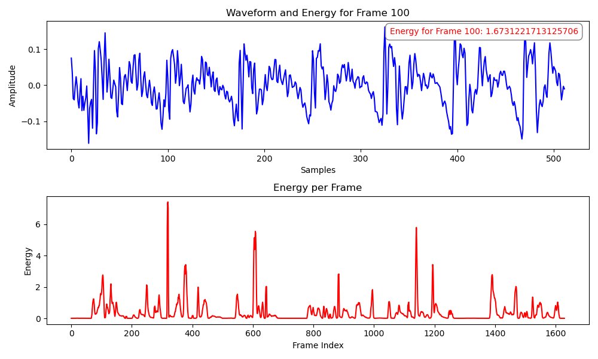
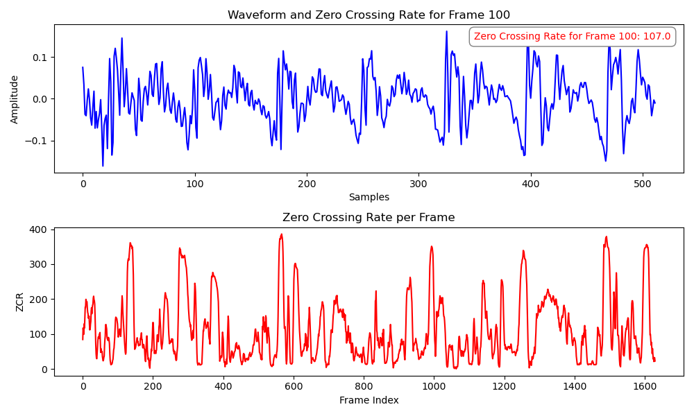
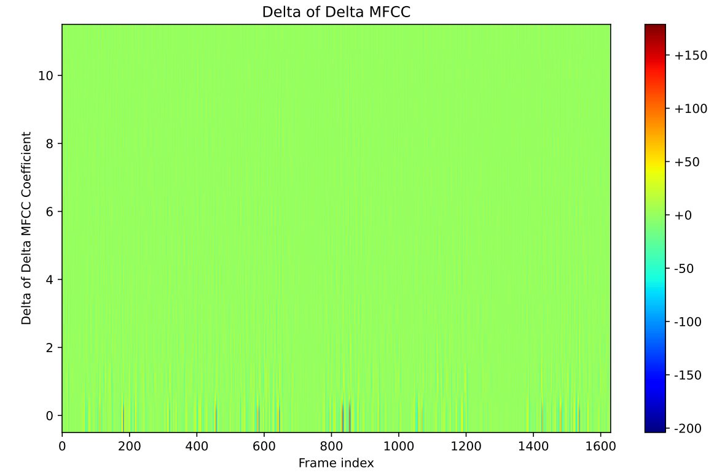

# Voice Activity Detection (VAD) Project

## Summary

🎯 **Voice Activity Detection (VAD)**, or voice endpoint detection, identifies time segments in an audio signal containing speech. This is a critical preprocessing step for automatic speech recognition (ASR) and voice wake-up systems. This project lays the groundwork for my upcoming ASR project 🤭.

📈 **Workflow Overview**:
The VAD pipeline processes a speech signal as follows:
1. **Preprocessing**: Apply pre-emphasis to enhance high-frequency components.
2. **Framing**: Segment the signal into overlapping frames with frame-level labels.
3. **Windowing**: Apply window functions to mitigate boundary effects.
4. **Feature Extraction**: Extract a comprehensive set of features (e.g., short-time energy, zero-crossing rate, MFCCs, and more).
5. **Binary Classification**: Train models (DNN, Logistic Regression, Linear SVM, GMM) to classify frames as speech or non-speech.
6. **Time-Domain Restoration**: Convert frame-level predictions to time-domain speech segments.

🍻 **Project Highlights**:
I conducted extensive experiments comparing frame division methods (frame length and shift) and model performances, with rich visualizations. For details, see the report in `vad/latex/`. If you're interested in voice technologies, let's connect!


## Methodology

### 1. Preprocessing
Pre-emphasis enhances high-frequency components to reduce spectral leakage.

<math xmlns="http://www.w3.org/1998/Math/MathML" display="block"><mi>y</mi><mo stretchy="false">[</mo><mi>n</mi><mo stretchy="false">]</mo><mo>=</mo><mi>x</mi><mo stretchy="false">[</mo><mi>n</mi><mo stretchy="false">]</mo><mo>−</mo><mi>α</mi><mi>x</mi><mo stretchy="false">[</mo><mi>n</mi><mo>−</mo><mn>1</mn><mo stretchy="false">]</mo></math>

where $x[n]$ is the input signal, $y[n]$ is the output, and $\alpha$ (typically 0.95–0.97) controls emphasis strength.

- **Pre-emphasis Impact**: 

  Effect of pre-emphasis with varying $\alpha$

  

### 2. Framing
The signal is divided into overlapping frames. For signal length $N$, frame length $L$, and frame shift $S$, the number of frames $n_{\text{frames}}$ is:

- Without zero-padding (floor): 
    $$ 
      n_{\text{frames}} = \left\lfloor \frac{N - L}{S} \right\rfloor + 1 
    $$


- With zero-padding (ceiling): 
    $$
     n_{\text{frames}} = \left\lceil \frac{N - L}{S} \right\rceil + 1 
    $$ 
  Zero-padding length: 
    $$ 
    n_{\text{paddle}} = (n_{\text{frames}} - 1) \cdot S + L - N 
    $$

### 3. Windowing
A window function (e.g., Hamming) is applied to each frame.
$$
 x_i^{\text{windowed}}[n] = x_i[n] \cdot w[n], \quad 0 \leq n < L 
$$

- **Window Type Comparison**: 

  Impact of window functions (e.g., Hamming, Hanning)

  

### 4. Feature Extraction
Extracted features (total dimension: 69) include:

- **Short-Time Energy** (dimension: 1):

  Measures frame energy, indicating loudness.

  $$ 
    E = \sum_{i=0}^{L-1} s_i^2 
  $$ where $s_i$ is the $i$-th sample in the frame, and $L$ is the frame length.

  Frame-level energy plots

  

- **Short-Time Zero-Crossing Rate** (dimension: 1):

  Counts zero crossings to distinguish voiced/unvoiced speech.

  $$ 
  Z = \frac{1}{2} \sum_{i=0}^{L-1} \left| \text{sgn}(s_i) - \text{sgn}(s_{i-1}) \right|, \quad \text{sgn}(x) = \begin{cases} 1, & x \geq 0 \ 0, & x < 0 \end{cases} 
  $$

  Visualizing zero-crossing patterns

  

- **Fundamental Frequency (Pitch)** (dimension: 1):

  Estimated via autocorrelation, representing the fundamental frequency. 
  
   $$ 
   R(\tau) = \sum_{n=0}^{L-1-\tau} s[n] s[n+\tau], \quad f_0 = \frac{f_s}{\tau_{\text{max}}} 
   $$ where $R(\tau)$ is the autocorrelation, $\tau_{\text{max}}$ is the lag maximizing $R(\tau)$, $f_s$ is the sampling frequency (16 kHz), and $s[n]$ is the frame signal.
  
  And I have tried many smooth methods, see it in my report.

- **Spectral Centroid** (dimension: 1):

  Indicates the spectral "center of mass"

  

- **Sub-band Energies** (dimension: 6):

  $$ 
  E_m = \sum_{k \in B_m} |S(k)|^2, \quad m = 1, 2, \ldots, 6 
  $$ where $B_m$ is the set of frequency bins in the $m$-th sub-band.

  Energy in 6 frequency sub-bands

  

- **Filter Banks (FBanks)** (dimension: 23):

  $$ 
  E_m = \sum_{k=0}^{K-1} |S(k)|^2 H_m(k), \quad m = 1, 2, \ldots, 23 
  $$ where $H_m(k)$ is the $m$-th mel filter’s frequency response, and the mel scale is: 
  $$
  \text{mel}(f) = 2595 \log_{10}\left(1 + \frac{f}{700}\right) 
  $$

  Mel-scale filter bank energies

  

- **Mel-Frequency Cepstral Coefficients (MFCCs)** (dimension: 12):

  $$ 
  c_n = \sum_{m=1}^{M} \log E_m \cos\left( n \left(m - 0.5\right) \frac{\pi}{M} \right), \quad n = 1, 2, \ldots, 12 
  $$ where $E_m = \sum_{k=0}^{K-1} |S(k)|^2 H_m(k)$ is the $m$-th filter bank energy, and $M = 23$.

  Cepstral coefficients from mel filter banks

  

- **Delta MFCCs** (dimension: 12):
  First-order differences of MFCCs:
  $$
  \Delta c_n(t) = \frac{\sum_{d=1}^D d \left( c_n(t shap-d) - c_n(t-d) \right)}{2 \sum_{d=1}^D d^2}, \quad n = 1, 2, \ldots, 12 
  $$ where $c_n(t)$ is the $n$-th MFCC at frame $t$, and $D$ is the window size (typically 2–3).

  

- **Delta-Delta MFCCs** (dimension: 12):

  Second-order differences:
  $$ 
  \Delta^2 c_n(t) = \frac{\sum_{d=1}^D d \left( \Delta c_n(t+d) - \Delta c_n(t-d) \right)}{2 \sum_{d=1}^D d^2}, \quad n = 1, 2, \ldots, 12 
  $$
  
  

### 5. Classification Models
models I trained trained:
- **Deep Neural Network (DNN)**:
  - **Architecture**: Input (69) → 64 (ReLU, Dropout 0.5) → 32 (ReLU, Dropout 0.5) → 16 (ReLU, Dropout 0.5) → 1 (Sigmoid).
  - **Loss**: Binary Cross-Entropy.
  - **Training**: 10 epochs, Adam optimizer.

- **Logistic Regression**
  - Use **sklearn()**

- **Linear Support Vector Machine (SVM)**:
  - Use **sklearn()**

- **Gaussian Mixture Model (GMM)**:
  - Construct by myself
  - Models classes as Gaussian mixtures
  - Trained with Expectation-Maximization.
  - Its performance is not so good, I will spare some time to figure it out.

### 6. Experimental Results
Models were tested with frame lengths (320–4096) and shifts (80–2048). DNN outperformed others (frame length 4096, shift 1024):

| Model              | AUC    | EER    | Accuracy | Precision | Recall | F1 Score |
|--------------------|----------|----------|------------|-------------|----------|-------------|
| DNN                | 0.9876 | 0.0464 | 0.9603   | 0.9765    | 0.9749 | 0.9757   |
| Logistic Regression | 0.9457 | 0.1134 | 0.9432   | 0.9347    | 0.9389 | 0.9368   |
| Linear SVM | 0.8937| 0.9413| 0.1170| 0.9349| 0.9352 |0.9350|

### 7. Visualization on time domain division
I restored the framed labels back to the time domain and visualized them as follows:


## Usage
1. Clone the repository:
   ```bash
   git clone https://github.com/xuankunyang/Voice-Activity-Detection.git
   ```
2. Install dependencies:
   ```bash
   pip install -r requirements.txt
   ```
3. Extract the features first and train a binary classifier, predict, time-domain restoration, visulize the time division. 
Considering the space limit, **I couldn't put my pre-trained models here**, but its not difficult to implement all above using this frame.
4. Explore visualizations in `vad/latex/figs/` and the report.

## Contributing
Fork the repository, create a branch, and submit pull requests. For major changes, open an issue.

## License
Licensed under the MIT License. See [LICENSE](https://mit-license.org/).

## Contact
Reach out via [email](kk-dao@sjtu.edu.cn) or GitHub issues.


# **Happy coding!** 🚀
